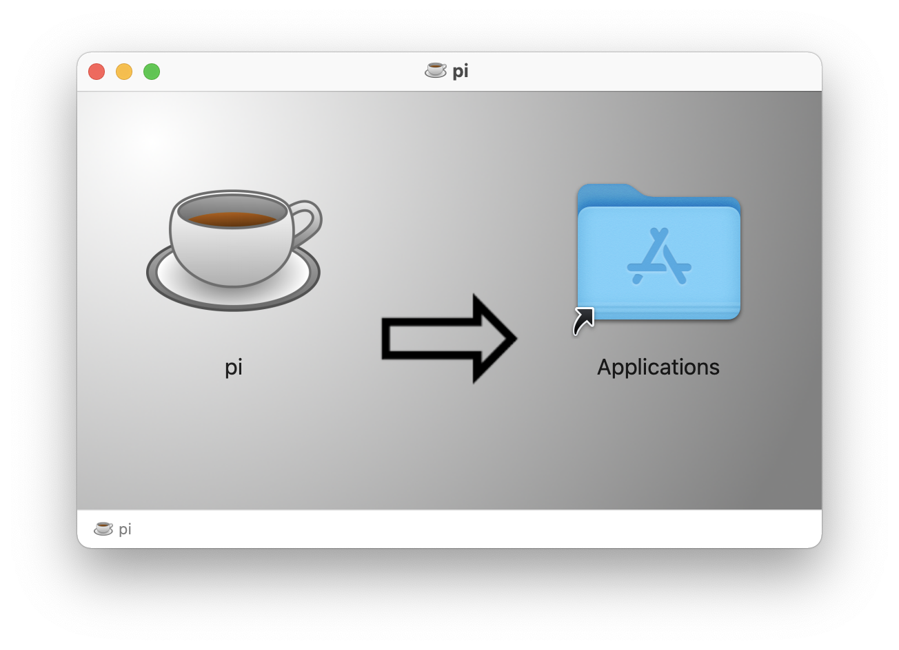

# Downloads
## Command Line Interface (CLI)

The CLI can be used to simplify working with PIPEFORCE.

### Install on Mac

If you're running a Mac, you can download and install a DMG image which contains everything out-of-the-box. Follow these steps to do so:

1. Download the DMG image from here: [https://downloads.pipeforce.io/pipeforce-cli/](https://downloads.pipeforce.io/pipeforce-cli/)

2. Double click it and drag & drop the pi tool into your ``Applications`` folder:
   
    
3. Open your terminal and execute this command in order to create a local workspace:  
    ```
    /Applications/pi.app/Contents/MacOS/universalJavaApplicationStub setup
    ```
4. Follow the setup instructions.
5. Add the path to the pi workspace to the paths variable. To do so, open the ``etc/paths`` file:

    ```bash
    $> sudo nano /etc/paths
    ```
    Add a line pointing to the pi workspace script at the end of the file and save it. The file content might finally look similar to this:
    ```
    /usr/local/bin
    /usr/bin
    /bin
    /usr/sbin
    /sbin
    /Users/you/pipeforce
    ```
6. You're done. Close and re-open your terminal. Test it by running this command in the terminal:

    ```
    $> pi status
    ```
    This should print you the status of your ``pi`` installation and your server instance without any errors. You should get an output similar to this:
    ```yaml
    result:
        value:
            cli:
                status: "OK"
                url: "https://hub-yourinstance.pipeforce.net:443/api/v3/"
                username: "yourUser"
                apiTokenCreated: "2022-12-04T07:59:27.886108Z"
                configLastUpdated: "2022-12-05T06:56:33.488201Z"
                home: "/Users/you/pipeforce"
                version: "2.24"
                lastUpdateCheck: "2022-12-05T06:56:38.021Z"
            server:
                status: "OK"
                setup: "FINISHED"
                namespace: "yourinstance"
                domain: "pipeforce.net"
                edition: "enterprise"
                stage: "PROD"
                tag: "7.5.0-9e9e386"
                build: "24"
                version: "7.5.0"
                versionMajor: 7
                versionMinor: 5
                versionBugfix: 0
      ```

### Install on other platforms

If you're running Windows or Linux, follow these steps in order to download and install the CLI.
#### Verify and install Java 8

Open your terminal and verify that you have a Java runtime version >= 1.8 installed:

```bash
$> java -version
```

You should see an output similar to this:

```bash
java version "1.8"
```

If there is a version number 1.8 or higher shown, then you have installed “Java 8” or higher.

In case you see an output like “command not found” then you probably have no Java environment installed yet. So go to the next step and download and install the environment.

#### Install Java

If you have not Java runtime yet, follow these steps to download and install:

1.  Go to [https://www.java.com/de/download/](https://www.java.com/de/download/) and download the latest Java runtime.
    
2.  Install the downloaded package.
    
3.  Open **a new console window** and try out that this command now shows the installed Java version:
    

```bash
$> java -version
```

#### Download an install the CLI

After you have made sure that Java is installed and runs correctly, you can download the latest version of the cli tool by clicking this link:

[https://downloads.pipeforce.io/pipeforce-cli/](https://downloads.pipeforce.io/pipeforce-cli/)

Select the jar file with highest version number and download it to your computer.

**Do not download the one with latest in the name since this is for auto-updates only.**

After this, open a new terminal / command line window and change to the folder where you downloaded the file to. Usually this is the Download folder as shown in this example for Mac and could differ for your operating system:

```bash
$> cd /Users/username/Downloads
```

Now install the cli tool by executing this command:

```bash
> java -jar pipeforce-cli-VERSION.jar setup
```

Replace `VERSION` by the version number of the downloaded file.

You will then be asked to install the tool. Select `yes`.

Follow the wizard to install the CLI.

#### How to update?

To update to the lastest version, simply use this command:

```bash
pi update
```

It will search for latest versions and automatically download + install it for you.

:::note
The auto-update feature is only available if you have installed the Java-Version of the CLI as described in this section.
It doesnt work with the Mac DMG image version.
:::

#### Add it to your Windows path

Optionally you can add the pi tool to your path variable in order to simplify the call to:

```bash
pi status
```

To do so, add the file `pi.bat` inside your `$USER_HOME/pipeforce` folder to the PATH variable on your Windows system.

#### Add it to your Linux path

Optionally you can add the CLI tool to your path variable in order to simplify the call to:

```bash
pi status
```

To do so, add the folder `$USER_HOME/pipeforce` to your paths file.

## BPMN Modeler

The BPMN modeler is a free tool to design BPMN diagrams and save the BPMN files offline. These files then can be deployed to PIPEFORCE using the `workflow.deploy` command or using the online workbench.

:::tip 
The PIPEFORCE portal has also an online BPMN designer built-in, so an offline tool like this is optional in this case.
:::

|     |     |     |
| --- | --- | --- |
| **CVersion** | **Plattform** | **Download** |
| 4.3.0 | Windows 64bit | [bpmn-modeler-4.3.0-win-x…](/wiki/spaces/DEVEX/pages/2151288972/Downloads?preview=%2F2151288972%2F2151288995%2Fbpmn-modeler-4.3.0-win-x64.zip) |
| 4.3.0 | Windows 32bit | [bpmn-modeler-4.3.0-win-i…](/wiki/spaces/DEVEX/pages/2151288972/Downloads?preview=%2F2151288972%2F2151288992%2Fbpmn-modeler-4.3.0-win-ia32.zip) |
| 4.3.0 | Mac OS | [bpmn-modeler-4.3.0-mac.d…](/wiki/spaces/DEVEX/pages/2151288972/Downloads?preview=%2F2151288972%2F2151288989%2Fbpmn-modeler-4.3.0-mac.dmg) |
