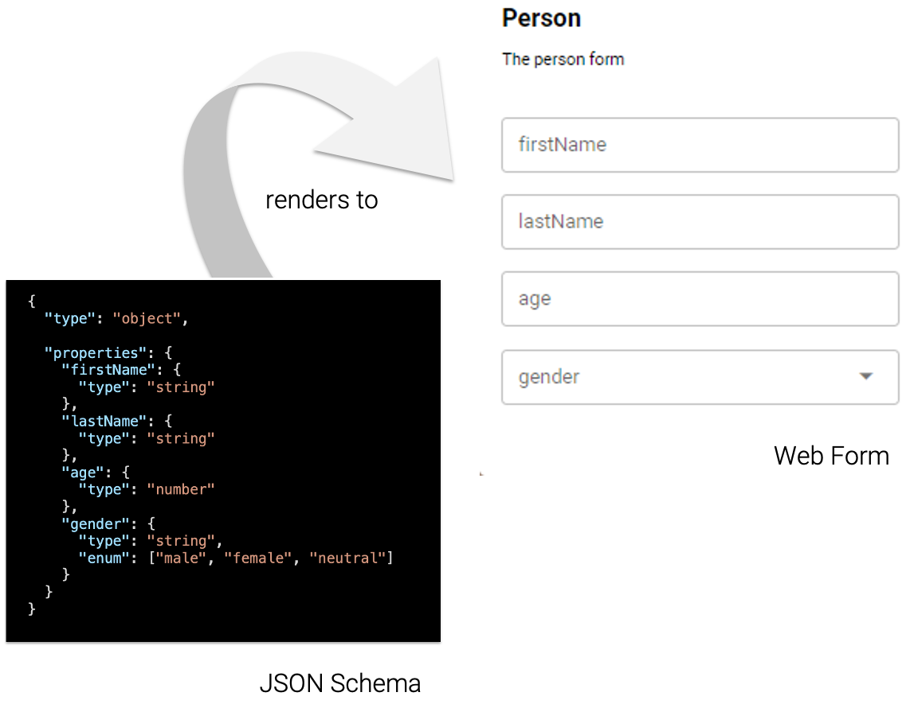
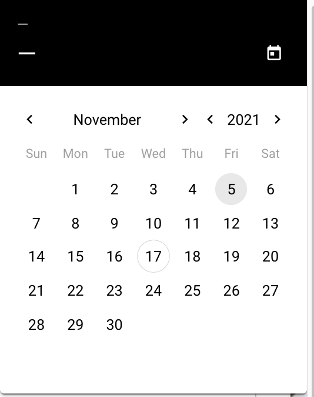
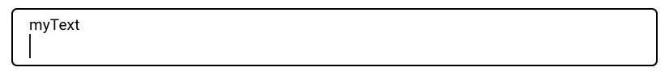
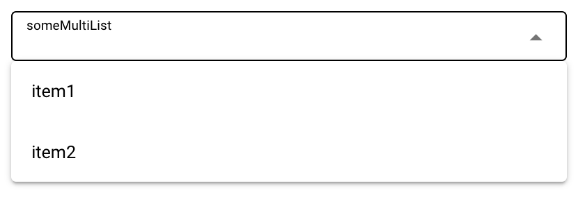
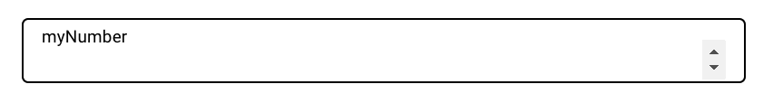
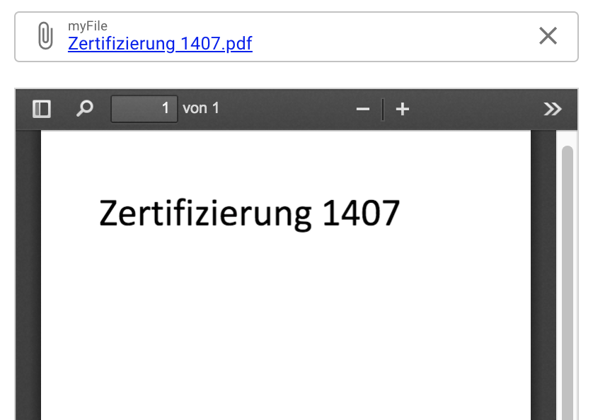

# JSON Schema

**JSON Object** in PIPEFORCE is a custom model that represent data of a specific app or process. For example, an `Invoice` or `Person` object. The structure of such objects can by defined using a Schema. Also forms need such a Schema for its field structure.

For example, before you can use a form, you need to know which “type of data” such a form produces: After a form was submitted, it creates a new dataset called an **object** and stores it into the property store. The structure of such an object (i.e. which fields it has) is defined in a JSON Schema.

**JSON Schema** is a formalized format to describe data structures in the JSON format. It is similar to XML Schema, DTD or Database Schemas.

See here for more details about the JSON schema specification: [https://json-schema.org/](https://json-schema.org/)

PIPEFORCE Forms are built on top of JSON schema. Therefore, the first step to create a form is always to create a JSON schema configuration or using an existing one.

But, also in other areas besides forms, it is meaningful to define a JSON Schema first before you start working with data models in your application.

Here is an example of how such a JSON schema can look like defining an `person` object:

```json
{
  "type": "object",

  "properties": {
    "firstName": {
      "type": "string"
    },
    "lastName": {
      "type": "string"
    },
    "age": {
      "type": "number"
    },
    "gender": {
      "type": "string",
      "enum": ["male", "female", "neutral"]
    }
  }
}
```

You can see that it defines four fields of different types: The `firstName`, `lastName`, `age` and `gender` of a person. Within your application, you can then refer to it at any place as the model with a clearly defined structure.

By default, a JSON schema which describes an object within PIPEORCE is placed in a property using this key path:

```bash
global/app/<APP>/object/<NAME>/v1/schema
```

Where `<APP>` is the name of the app, the object belongs to. `<NAME>` is the name of the object. In the example of a person which is part of the app `myApp`, you could use this path to access the object schema in a unique way from within the overall PIPEFORCE instance:

```bash
global/app/myApp/object/person/v1/schema
```

## Schema Types

The ``type`` attribute, inside a JSON schema, defines the data type of an element.  


:::info 
Based on the basic type set in the schema, the form engine tries to guess a default form field automatically for you. 
You can overwrite this behaviour and set additional configurations for form fields or other form fields in the form configuration.
:::

:::caution
In order to have a clear separation between data structure and form layout, make sure that all layout specific settings go into the form configuration.
:::

Here is an example how such a JSON schema is rendered to a default form:



If such a default rendering is not sufficient for you, you can adjust the form layout in the form configuration.

### Date

```json
"myDate": 
  {
    "type": "string",  
    "format": "date"
  }
```

By default, this shows-up as a date picker in the form.

   

### Text

```yaml
"myText": 
  {
    "type": "string"
  }
```
This is meant for small amount of text. 
By default, it renders to a single-line input field in the associated form.
 
 

### List

```json
"mySingleList": 
  {
    "type": "string",
    "enum":["male", "female"]
  }
```

This is Meant for lists where only one element can be selected.  
By default, it renders to a single-select drop-down in the associated form.

 

### Multi-List

```json
"someMultiList": 
  {
    "type": "array",
    "items": {
      "type": "string",
      "enum": ["item1", "item2"]
    }
  }
```

This is meant for lists where multiple elements can be selected.  
By default, it renders to a multi-select drop-down in the form.



### Yes/No

```json
"myYesNo": {
  "type": "boolean"
}
```  

This is meant for yes/no (true/false) values.  
By default, it renders to a checkbox in the form.  

:::tip
You can overwrite the default layout and set the attribute `"render":"button"` in the form config in order to display this as a clickable button instead of a checkbox.
:::


### Number

```json
"myNumber": {
  "type": "number"
}
``` 
This is meant for number values.  
By default, it renders to a number field in the form.

   

### File

```json
"myFile": {
  "type": "object",
  "properties": {
    "filename": {
      "type": "string"
    },
    "contentLength": {
      "type": "number"
    },
    "contentType": {
      "type": "string"
    },
    "contentEncoding": {
      "type": "string"
    },
    "content": {
      "type": "string"
    }  
  }
}
```

This is meant for file attachments to an object.  
By default, it renders to a file picker in the form.

:::tip
You can change the default render type by using one of `"render":"filepicker"` or `"render":"pdfpreview"` in the form configuration.
:::

               

## Schema Validation Rules


### Length

```json
{
  "type": "string",
  "minLength": 2,
  "maxLength": 3
}
```

Valid: `hi`

### Regular expression

```json
{
   "type": "string",
   "pattern": "^(\\([0-9]{3}\\))?[0-9]{3}-[0-9]{4}$"
}
```

Valid: `555-1212`

### Date and Time

```json
{
   "type": "string",
   "format": "date-time"
}
```

Valid: `2018-11-13T20:20:39+00:00`

### Time (draft)

```json
{
   "type": "string",
   "format": "time"
}
```

Valid: `20:20:39+00:00`

### Date (draft)

```json
{
   "type": "string",
   "format": "date"
}
```

Valid: `2018-11-13`

### Email

```json
{
   "type": "string",
   "format": "email"
}
```

Valid: `my@email.de`

### Hostname

```json
{
   "type": "string",
   "format": "hostname"
}
```

Valid: `google.com`

### Uri

```json
{
   "type": "string",
   "format": "uri"
}
```

Valid: `https://google.com`

### Required fields

```json
{
  "type": "object",
  "properties": {
    "name":      { "type": "string" },
    "email":     { "type": "string" },
    "address":   { "type": "string" },
    "telephone": { "type": "string" }
  },
  "required": ["name", "email"]
}
```

## Validation via Command

It's possible to validate a given JSON by applying a given JSON Schema using the command [`json.validate`](../api/commands#jsonvalidate-v1). For example:

```yaml
pipeline:
  - json.validate:
      schema: {
          "type": "object",

          "properties": {
            "firstName": {
              "type": "string"
            },
            "lastName": {
              "type": "string"
            },
            "age": {
              "type": "number"
            },
            "gender": {
              "type": "string",
              "enum": ["male", "female", "neutral"]
            }
          }
        }
      input: {
          "firstName": "Max", 
          "lastName": "Smith", 
          "age": 23, 
          "gender": "male"
        }
```

The values for `schema` and `input` can also come from a dynamic input like the property store for example. Here is an example to load the schema inline from the [property store](../guides/propertystore/propertystore-basics) using a [Custom URI](../api/uris):

```yaml
pipeline:
  - json.validate:
      schema: "uri:property:global/app/myapp/object/person/v1/schema"
      input: {
          "firstName": "Max", 
          "lastName": "Smith", 
          "age": 23, 
          "gender": "male"
        }
```