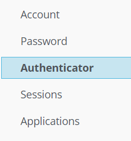
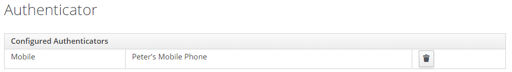
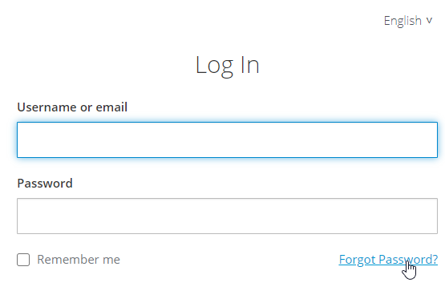

# Identity and Access Management (IAM)

PIPEFORCE comes with a powerful identity and access management service (IAM). With this service you can:

*   Create and manage users, groups, roles
    
*   Define user credentials
    
*   Select required user actions (for example verification or password reset requests)
    
*   Connect to external LDAP services like Active Directory
    
*   OAuth2 authentication
    
*   Two Factor Authentication (2FA)
    
*   Social Login
    
*   Kerberos Broker
    
*   Single Sign On
    
*   User Self Registration
    

If you have sufficient permissions, you can reach the service via this url:

```yaml
https://iam-<NAMESPACE>.pipeforce.net
```

Or by clicking IAM on the portal menu:


## Two Factor Authentication

Security related actions such as **resetting password** or **logging** **in** can be made more secure by setting up 2-factor authentification. It is switched off be default, but all users are allowed to switch it on for theirselves easily. The user is required to follow these steps:

### Setup 2FA

1.  Login to https://**NAMESACE**.pipeforce.net
    
2.  Click on “My Profile”
    


3\. Click on “Authentification” (in German: Multiauthentifizierung)



4\. Follow the steps written there. When you have downloaded Google Authenticator, scanned the QR-Code and entered the OTP (One-Time-Password) you will see this success result:



### Log-in with 2FA

When the user is entering both his username and password for login, another form will appear:


When seeing this, the user needs to open his Google Authentificator App and lookup the one-time password for his setup account. Note that this code is changing every 30 seconds. If you miss to enter in that time-window you can simply use the next 30 second time window.

### Reset password with 2FA
 
Use “Forgot password” function in the login form:



1.  Wait for the reset link sent to your account email. Click on it.
    
2.  Authenticator Setup is showing - there you need to copy the QR code again to reconfigure 2 factor authentification. **Attention**: Google Authenticator App will ask you to overwrite your former configuration. You need to confirm it.

