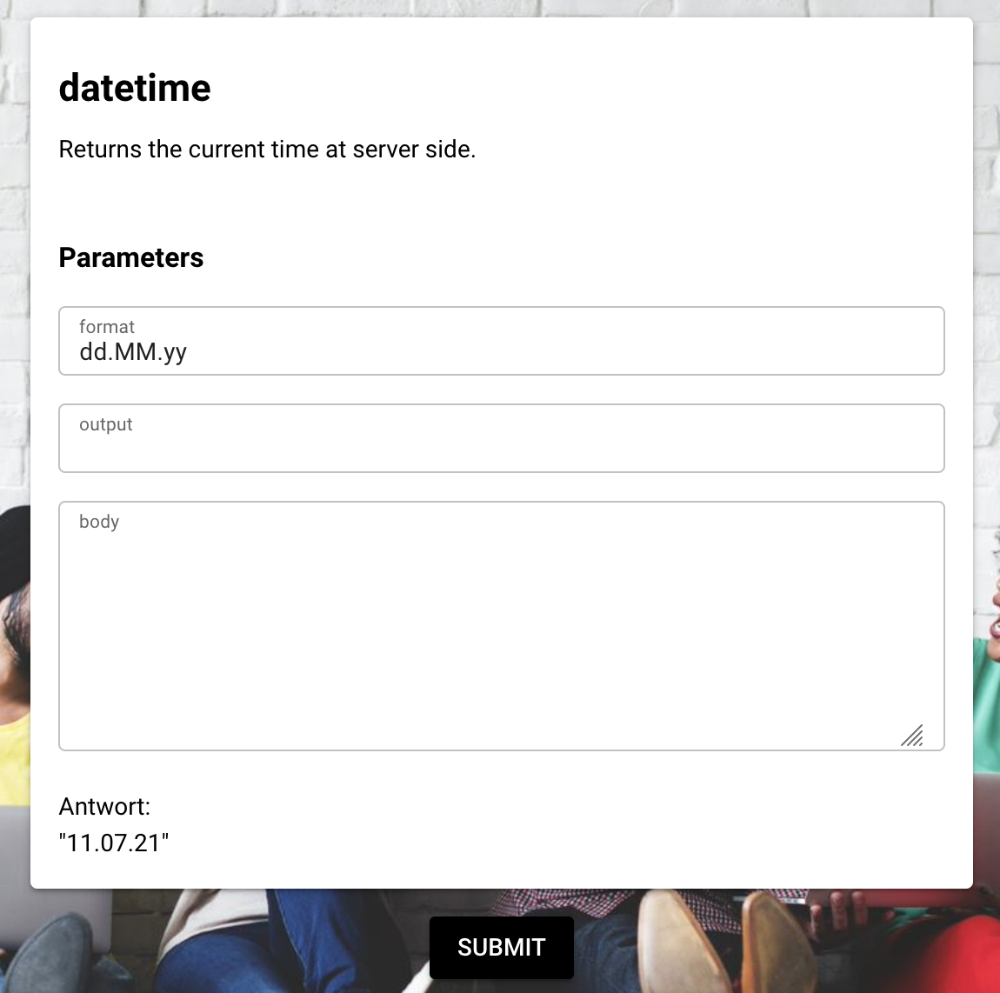

# Authentication

One of the most important parts in PIPEFORCE is the **command**. Easily spoken, a command is a single server side endpoint similar to a REST endpoint which executes a certain task of your business solution. 

The concept of PIPEFORCE commands is in its base a combination of the [command pattern](https://en.wikipedia.org/wiki/Command_pattern) and [function as a service](https://en.wikipedia.org/wiki/Function_as_a_service) approach. 

All built-in commands and their parameters are documented in the [commands reference](../api/commands).

### Unique Command Name
Each command has a unique name which is always written in lower case and follows the dot notation. Here is an example of such a command name:

```
mail.send
```

## Executing a Command

Commands can be executed in three different ways, called ***execution contexts***:

- As single requests via HTTP GET, POST or PUT
- Embedded as part of a [Pipeline](../guides/pipeline.md)
- As a command line command using the [Command Line Interface (CLI)](../guids/../api/cli.md)

### Parameters
Commands can have zero to many parameters. Whereas each parameter is a name-value pair. The parameters can be passed in different ways to the command, depending on the execution context you're working in. 


#### As HTTP GET
Here is an example to set the `message` parameter to a `log` command using a HTTP GET request:

```
http://yourserver/api/v3/command/log?message=HELLO
```
:::note
Authentication is not considered here for simplicity reaasons.
:::

#### As HTTP POST
Here is an example to set the `message` parameter to a `log` command using a HTTP POST request and `curl`:

```
curl -H "Authorization: Bearer <YOUR_TOKEN>" \
  -X POST "https://hub-acme.pipeforce.net/api/v3/command/log" -d "message=HELLO"
```

:::note
Authentication is done here by using the `Authorization` header.
:::

### Input and Output Documents
Beside its parameters, each command is also capable to take optionally a document as input. 

This document can be provided by the optional parameter `input`:

```
encrypt?input=TEXT
```

Or the input is placed in the body of the execution context (for example in the body of a HTTP POST call in case it is executed inside the HTTP context).


Finally, the result of a command is by default written to the output body. 

Dealing with documents in the body is similar to the request and response body of a HTTP request. How such a document can be provided to and consumed from the command depends on the execution context, the command is running in.


## Command Execution Contexts

### Via HTTP request

You can execute any command similar to rest-like endpoints using HTTP GET or POST requests by executing an HTTP endpoint.

See this example using the terminal and `curl` to call the `datetime` command using the url `https://hub-acme.pipeforce.net/api/v3/command/datetime`:

```
curl -H "apitoken: <YOUR_TOKEN>" \
  -X GET "https://hub-acme.pipeforce.net/api/v3/command/datetime"
```

By default, the response of this command will look like this:

```
{
  "result": "2020-08-07T15:14:02.471"
}
```

Note the url prefix for the command: `https://hub-acme.pipeforce.net/api/v3/command/` followed by the command `datetime`.

Any HTTP **request parameter** will be mapped to **command parameter**. See below an example with parameters:

```
curl -H "apitoken: <YOUR_TOKEN>" \
  -X GET "https://hub-acme.pipeforce.net/api/v3/command/log?message=HELLO"

```

The same also works, if you do a POST instead of a GET call:

```
curl -H "apitoken: <YOUR_TOKEN>" \
  -X POST "https://hub-acme.pipeforce.net/api/v3/command/log" -d "message=HELLO"
```

:::info
Even if many commands do have a similar resource-based semantic for HTTP GET, POST or PUT as REST do, they do not follow this approach 100% since commands
can be used also outside of the HTTP context. Therefore, the operation type of a command is often defined by its name. For example: `property.put` or
`config.get` to name just a few.
:::


Here are some examples of such commands (whether these commands are also available in your instance depends on your license and your settings):

|     |     |
| --- | --- |
| **Command** | **Description** |
| `config.get` | Returns the configuration from the backend. |
| `datetime` | Returns the date and time from the backend. |
| `decrypt`, `encrypt` | Encrypts and decrypts data using AES-256 and other algorithms. |
| `delivery.send` | Creates and sends a digital delivery with attachments via email. |
| `docusign` | Starts a docusign process from inside a pipeline. |
| `drive.save`, `drive.read` | Uploads and downloads files from your online cloud drive. |
| `event.send`, `event.listen` | Sends or listens to events in a pipeline. |
| `website.scrap` | Opens a website and extracts data from it or clicks links on it. |
| `iam.*` | A lot of commands to manage users, groups and permissions. |
| `mail.send` | Sends an email to one or more recipients. |
| `pdf.stamp` | Puts a stamp or watermark on a PDF. |
| `http.get`, `http.post`, … | Commands to do external HTTP / REST calls. |
| `salesforce.create`, … | Creates a given entity in Salesforce and others. |
| `slack.send` | Sends a message to Slack. |
| `transform.word2pdf` | Transforms a MS Word document to PDF. |
| `workflow.start` | Starts a BPMN workflow. |
| `zip`, `unzip` | Zips and un-zips files. |


It supports input parameters, an input message and can optionally produce an output message:


Any command can be configured using its input parameters. What type of parameters a command supports, depends on its implementation an can be looked up in its documentation.

**Fast link to command documentation**  
The documentation of all commands available in your instance can be found here:  
`https://portal-<NAMESPACE>.pipeforce.net/#/commands`

Make sure to replace `<NAMESPACE>` by the real name of your instance.

Or use the CLI to list the documentation of all available commands on your terminal:

`pi help command`

In order to get the documentation of a single command, you can use this CLI call:

`pi help command log`

This shows the documentation of the `log` command.

When you use the Online Workbench you will get auto-completion for each command and its parameters.

Here are some examples of such commands (whether these commands are also available in your instance depends on your license and your settings):

|     |     |
| --- | --- |
| **Command** | **Description** |
| `config.get` | Returns the configuration from the backend. |
| `datetime` | Returns the date and time from the backend. |
| `decrypt`, `encrypt` | Encrypts and decrypts data using AES-256 and other algorithms. |
| `delivery.send` | Creates and sends a digital delivery with attachments via email. |
| `docusign` | Starts a docusign process from inside a pipeline. |
| `drive.save`, `drive.read` | Uploads and downloads files from your online cloud drive. |
| `event.send`, `event.listen` | Sends or listens to events in a pipeline. |
| `website.scrap` | Opens a website and extracts data from it or clicks links on it. |
| `iam.*` | A lot of commands to manage users, groups and permissions. |
| `mail.send` | Sends an email to one or more recipients. |
| `pdf.stamp` | Puts a stamp or watermark on a PDF. |
| `http.get`, `http.post`, … | Commands to do external HTTP / REST calls. |
| `salesforce.create`, … | Creates a given entity in Salesforce and others. |
| `slack.send` | Sends a message to Slack. |
| `transform.word2pdf` | Transforms a MS Word document to PDF. |
| `workflow.start` | Starts a BPMN workflow. |
| `zip`, `unzip` | Zips and un-zips files. |

And many more…

By default, there are > 150 commands available out-of-the-box.

If you are missing a command for your purpose, please let as know using the support portal.

## Execution of a single command

There are many possibilities to execute a single command. This makes sure that for any purpose you can use the best matching approach.

### Via Online Workbench

Only: ENTERPRISE, CORPORATE

Since version 7.0 of PIPEFORCE, the Online Workbench is available. This is an advanced online editor with full code completion support where you can write pipelines and commands to be executed and then run them online. This is the easiest and most preferred way to ad-hoc execute commands in pipelines. Here you can see the log command as an example to be executed there:


### Via Command Line Interface (CLI)

Another approach to execute a single command is by using the [Command Line Interface (CLI)](https://pipeforce.github.io/docs/api/cli) (CLI). For example there is a built-in command `datetime` which returns the current date time. A call of this command using the CLI would look like this:

```
pi command datetime 
```

Which will return a result similar to this:

```
06.03.2020
```

In order to pass parameters to such a command, you can add them after the command name:

```
pi command datetime format=dd-MM-YYYY
```

Another, more advanced possibility to run a command is within a so called “pipeline uri”:

```
pi pipeline uri "datetime?format=dd-MM-YYYY"
```

This allows you to combine commands to a **pipeline** using the pipe `|` character on the command line:

```
pi pipeline uri "datetime|log?message=HELLO"
```

Note: Since different terminals handle characters like ? or | for example differently, make sure you wrap the pipeline uri inside quotation marks (`"` and `"`). Furthermore, make sure that your terminal also doesn't interpret `?` and `|` inside the quotation marks. If so, consult the documentation of your terminal on how to escape these special characters so that they do not get interpreted by the terminal.

### Via HTTP GET and POST

You can execute any command also as a rest-like endpoint using HTTP GET or POST calls. See this example using `curl` to call the `datetime` command:

```
curl -H "apitoken: <YOUR_TOKEN>" \
  -X GET "https://hub-acme.pipeforce.net/api/v3/command/datetime"
```

By default, the response will look like this:

```
{
  "result": "2020-08-07T15:14:02.471"
}
```

The **request parameters** will be automatically mapped to **command parameters**. See below an example with parameters:

```
curl -H "apitoken: <YOUR_TOKEN>" \
  -X GET "https://hub-acme.pipeforce.net/api/v3/command/log?message=HELLO"
```

### Via online documentation

Only: ENTERPRISE, CORPORATE

There is a web UI available in the portal in order to document any command enabled for your instance. Furthermore you can also execute commands for testing purposes using this web interface. By default the url to the command form looks like this:

`https://portal-<NAMESPACE>.pipeforce.net/#/command?name=<NAME>`

Whereas `<NAME>` needs to be replaced by the name of the command. Here’s an example of the default command form for the `datetime` command:



### Documentation via CLI

An alternative to see the documentation of all available commands is to use the CLI tool:

```
pi help command
```

This lists the documentation of all available commands.

```
pi help command log
```

This lists the documentation of a single command which is the `log` command in this example. Here is the example documentation output of this:

```
log:
  type: "object"
  description: "Logs the given input message without changing it. Sets the log message\
    \ in the body in case body is empty. Doesn't overwrite any existing content in\
    \ the body."
  inputType: "JsonNode"
  outputType: "JsonNode"
  properties:
    message:
      type: "number"
      description: "The message to log. Can be a string or a pipe expression. If null\
        \ or empty, the full pipe message will be logged."
      default: null
    level:
      type: "string"
      description: "The log level. Can be one of DEBUG, TRACE, INFO, WARN, ERROR.\
        \ If null or empty, INFO will be used."
      default: "INFO"
  required:
  - "message"
```

## Summary

A command **has a unique name** it can be called with. The available commands in your instance depend on the license you’re using. You can find them in the documentation.

A command **can have one or more parameters**. The parameters and their meaning is documented in the command docs.

A single command can be executed by using one of these ways:

*   Via Online Workbench of the portal (Only: ENTERPRISE, CORPORATE)
    
*   Via Command Line Interface (CLI)
    
*   Via HTTP GET / HTTP POST
    
*   Via online command documentation (Only: ENTERPRISE, CORPORATE)
    

# What is a Pipeline?

Two or more **commands** can be combined to a **pipeline**. If such a pipeline gets executed, the commands in it will be executed by their serial ordering within the pipeline. The output message of the first command will become the input message of the next command and so on. By default, such a pipeline is written in a [YAML](https://en.wikipedia.org/wiki/YAML) format.


Here is an example which uses two simple commands: The `datetime` command to produce the current date and time and after this the `log` command to log the result at server side:

```
pipeline:
  - datetime
  - log
```

In the YAML a pipeline is defined using the `pipeline:` list. Inside this list each command to be executed is defined as an element (after an indent and a dash `-`) by its name and optional parameters. The body output of the first command (`datetime`) will automatically become the body input of the next command (`log`).

Here is a more sophisticated example which uses three commands: The first loads a PDF file from cloud drive (which is a built-in archive and dropbox in PIPEFORCE), the second puts a stamp on this document and the third saves the PDF with the stamp back to drive:

```
pipeline:
 - drive.read:
     path: /my.pdf
 - pdf.stamp:
     text: "Hello World!"
 - drive.save:
     path: /my-stamped.pdf
```

The PDF file `my.pdf` is the output from the command `drive.read` and will become the input for `pdf.stamp`. After `pdf.stamp` was executed and has put the stamp on the file, it will send it as output to `drive.save` which stores it to the data room. Instead of a PDF file, the message body can also be of any other format like JSON, string or a like.

It's also possible to write your pipeline script in a JSON format. But we recommend using YAML since it is less “noisy”. The pipeline from above rewritten as a JSON would look like this:

```
{
  "pipeline": [
    {
      "drive.read": {
        "path": "/my.pdf"
      }
    },
    {
      "pdf.stamp": {
        "text": "Hello World!"
      }
    },
    {
      "drive.save": {
        "path": "/my-stamped.pdf"
      }
    }
  ]
}
```

## Execution of a pipeline

Similar to a single command, a pipeline of commands is executed by sending it to server. Its a more advanced version of the “Function as a Service” approach since it can execute a bunch of commands in a predefined order.

### Via Online Workbench

Only: ENTERPRISE, CORPORATE

Since version 7.0 of PIPEFORCE, the Online Workbench is available. This is an advanced online editor with full code completion support where you can write pipelines and commands to be executed and then run them online. This is the easiest and most preferred way to ad-hoc execute a command or pipelines. Here you can see a simple pipeline after its ad-hoc execution as an example:


### Via CLI

Another approach to execute a pipeline is by using the CLI: [Command Line Interface (CLI)](https://pipeforce.github.io/docs/api/cli).

#### Local file

Lets assume you have a local pipeline file stored at `src/global/app/myapp/pipeline/test.pi.yaml` inside of your PIPEFORCE workspace, then you can execute it via this CLI call:

```
pi pipeline file src/global/app/myapp/pipeline/test.pi.yaml
```

This will load the local pipeline file and execute its content by sending it to the server. The result will be printed out to your terminal if there is any.

Note: A pipeline file must end in suffix to be detected correctly by your workspace `.pi.yaml`.

#### Remote

In case you have stored your pipeline at server side in the property store ([Property Store](https://pipeforce.github.io/docs/guides/propertystore)), then you can execute it using this call:

```
pi pipeline remote global/app/myapp/pipeline/test
```

This command searches for a property in the property store with key `global/app/myapp/pipeline/test` and executes it plus sends any results back to your terminal.

#### Pipeline URI

A third option to execute a pipeline is by using a **pipeline uri** which is an inline version of a pipeline. You can rewrite any pipeline YAML fromat also as a pipeline uri. Lets assume this example:

```
pipeline:
  - datetime
      format: dd.MM.YYYY     
  - log
```

You can rewrite this pipeline YAML as an inline pipeline uri which looks like this:

```
datetime?format=dd.MM.YYYY|log
```

Such a pipeline uri you can then execute using this CLI call in one line:

```
pi pipeline uri "datetime?format=dd.MM.YYYY|log"
```

This is handy especially for smaller pipelines which you want to execute ad-hoc for example.

### Via HTTP

You can execute a pipeline also by sending it via HTTP POST to the server. See this example:

```
POST /api/v3/pipeline HTTP/1.1 
Host: hub-acme.pipefore.net

pipeline:
 - drive.read:
     path: /my.pdf
 - pdf.stamp:
     text: "Hello World!"
 - drive.save:
     path: /my-stamped.pdf
```

This will do by default a synchron execution of the pipeline at server side and returns with the response status code `200 OK` and the result in the response body once finished.

Here is the PDF pipeline example from above, now executed using the `curl` tool which is available on all Linux, Mac and Windows systems:

```
curl -X POST "http://hub/api/v3/pipeline" 
  -H "Content-Type: application/yaml" 
  --data-binary @- << EOF
pipeline:
 - drive.read:
     path: /my.pdf
 - pdf.stamp:
     text: "Hello World!"
 - drive.save:
     path: /my-stamped.pdf
EOF
```

With this flexibility you can for example define a bash script and store it locally to execute this pipe with a single command and not much configuration, setup or coding required.

# Pipeline scopes

Every pipeline script may consist of four main sections, called **scopes**:

*   headers
    
*   vars
    
*   pipeline
    
*   body
    

Here is an example of a pipeline script which defines all of these scopes:

```
headers:
  contentType: "text/plain"
  
vars:
  counter: 0

pipeline:
  - log:
      message: "HELLO WORLD!"
      
body: "This is text in the body"
```

All scopes except `pipeline` are optional in a pipeline script. Even if not explicitly defined in the pipeline script, each scope exists implicitly. That means you can access it and read / set values from / on it without declaring it in the pipeline. For example by using a pipeline expression (PE).

## headers

The headers section is optional. A header is a name value pair to define "global configuration" hints and configurations for the given pipeline. Only text is allowed as content, no complex objects. Not meant to be changed during pipeline processing.

It depends on the pipeline and its commands whether and which headers are required. Read the documentation of the commands of the pipeline.

It is similar to HTTP Request headers: [https://en.wikipedia.org/wiki/List\_of\_HTTP\_header\_fields](https://en.wikipedia.org/wiki/List_of_HTTP_header_fields)

You can set values in the headers scope using the Pipeline Expression Language (PEL). See here: [Pipeline Expression Language (PEL)](https://pipeforce.github.io/docs/guides/pel).

## vars

The vars section is optional and contains transient variables as name value pairs. It is meant as a transient scope for states during the pipeline processing.

Values can also be complex objects and documents.

Values can be changed during pipeline processing.

You can access values in the vars scope using the Pipeline Expression Language (PEL). See here: [Pipeline Expression Language (PEL)](https://pipeforce.github.io/docs/guides/pel).

## pipeline

The pipeline section is mandatory and lists all commands which must be executed in given order.

See your instance portal for a reference of available commands.

You can set dynamic parameter values on commands using the Pipeline Expression Language (PEL). See here: [Pipeline Expression Language (PEL)](https://pipeforce.github.io/docs/guides/pel).

## body

The body section is optional. It defines a single object to be used as “data pool” or transformation data during the pipeline processing.

In case commands return a value, by default they will write this value to the body implicitly. Whereas a previous commands value in the body will be overwritten by the command which comes next.

You can access values in the body scope using the Pipeline Expression Language (PEL). See here: [Pipeline Expression Language (PEL)](https://pipeforce.github.io/docs/guides/pel).

# Content Object

In order to process documents and other files using a pipeline, you first need to load such a file into the pipeline. After loaded, the file is automatically converted into a so called content object format. This is a wrapper around a document which provides all required information for such a document like its name size, mime type aso., for easier processing inside the pipeline. The content object provides these attributes:

|     |     |     |
| --- | --- | --- |
| **Attribute** | **Type** | **Description** |
| `name` | string | The name of the document. |
| `created` | long | The unix timestamp in millis when this document was created. |
| `lastUpdated` | long | The unix timetsmap in millis when this document was last modified. |
| `mimeType` | string | The mime type of this document. If `null`, it assumed to be t`ext/plain` by default. See here for a list of official mime types: [https://www.iana.org/assignments/media-types/media-types.xhtml](https://www.iana.org/assignments/media-types/media-types.xhtml) |
| `size` | long | The size of the document in bytes or -1 in case the size cannot be determined. |
| `data` | object | The data of the document. Which format the data has, depends on its mime type. For example if mime type is `application/json` then the data object returns here is a JSON document. |

Here is an example to load a file from the drive service into the body scope and access its attributes of the content object afterwards from there:

```
pipeline:
  # Load document from drive and set it as content object in the body
  - drive.read:
      path: "invoice.pdf"
  # Access the attributes of the content object in the body
  - log:
      message: "Name: #{body.name}, Size: #{body.size}" 
```

## Content Object Collection

In case multiple documents are loaded into a pipeline, such documents are grouped together in a so called content object collection. Such a collection has a similar meaning like a folder in a local file system.

|     |     |     |
| --- | --- | --- |
| **Attribute** | **Type** | **Description** |
| `parent` | ContentCollection | Returns the parent collection if this is a nested collection or null in case this is the root collection. |
| `path` | string | Returns the path to this collection whereas `/` is returned in case it is the root collection. Example: `/rootCol/subCol`. |
| `children` | ContentObject | Returns a list of all content objects which are contained in the collection. This can be a document but also another content collection in case they are nested. |

A Content Collection is also a Content Object and therefore it also has all attributes of the Content Object.

# Uploading a file

In order to upload a file and use it inside a command or pipeline you have different possibilities.

##Upload a single file to a single command

In case a command expects a file as input message in its body, you can execute the command from the client using HTTP POST and put the file content in the body of the request. It will be loaded from the body and provided as input to the command’s body. Here’s an example request using the command `transform.word2pdf` which takes a `.docx` document as input converts it to PDF and sends back the result as response to the client:

```
POST /api/v3/pipe:transform.word2pdf HTTP/1.1 
Host: hub-acme.pipefore.net

BINARY DATA OF my.docx
```

##Upload one or more files to a pipeline

In order to upload one or multiple files to be executed by a pipeline, you can make a HTTP POST request with header `Content-Type: multipart/form-data` to the pipeline endpoint. This will create a HTTP request with multiple parts in the HTTP request body, whereas the very first part is the pipeline YAML and all other parts are one or more files to be uploaded and used inside this pipeline.

Here’s an example of the body of such an HTTP multipart request as defined by the HTTP specification:

```
POST /api/v3/pipeline HTTP/1.1 
Host: hub-acme.pipefore.net
Content-Type: multipart/form-data;boundary="boundary" 

--boundary 
Content-Disposition: form-data; name="pipeline.yaml" 

pipeline:
 - pdf.stamp:
     text: "Hello World!"
 - drive.save:
     path: /my-stamped.pdf 
--boundary 
Content-Disposition: form-data; name="my.pdf"; filename="my.pdf" 

BINARY DATA OF my.pdf
--boundary--
```

This example defines a pipeline and a file upload in the multipart body. It uploads the file `my.pdf,` ads a stamp to it and then stores the result in the built-in data room called drive.

**The very first part in the body must be the pipeline definition.** Any subsequent part is then treated as a file to be uploaded and gets passed into the pipeline for processing.

### Uploading a file base64 encoded

Another way to upload a file to be used inside a pipeline is to “embed” the file base64 encoded inside the pipeline and upload this pipeline using HTTP POST:

```
POST /api/v3/pipeline HTTP/1.1 
Host: hub-acme.pipefore.net
Content-Type: "application/yaml"  

pipeline:
 - pdf.stamp:
     text: "Hello World!"
 - drive.save:
     path: /my-stamped.pdf 

body: "THE BASE64 ENCODED FILE CONTENT GOES HERE..."
```

The downside of this approach is that the base64 encoding of a file increases its size by about **33% percent**. Therefore you should avoid this approach if possible and use the multipart/form-data upload instead.

# Auto-completion support for pipeline scripts

**Note: This is experimental.**

In order to enable auto-completion support for pipeline configuration files in your local development editor, you need to add the pipeline schema file to your IDE.


# Support in IntelliJ

To enable auto-completion in IntelliJ, open preferences and navigate to JSON Schema Mappings:

`Preferences → Languages & Frameworks → Schemas & DTDs → JSON Schema Mappings`

Add a new schema mapping with these values:

*   Name: `pipeline-schema`
    
*   Schema URL: `https://hub-<NS>.pipeforce.net/api/v3/command:pipe.schema.v7`
    
*   Schema version: `JSON Schema version 7`
    

Add new file path patterns for : `*.pi.yaml`

Now try it out: Create a new file `foo.pi.yaml` and start typing. You should get support for any file ending in `*.pi.yaml`.

Note: A YAML pipeline script should always end in suffix **.pi.yaml** which stands for **p**ipe**l**ine **y**aml script.

## Support in Visual Studio Code

To enable auto-completion in Visual Studio Code, open `Preferences → Settings` and search for section `json.schemas` and add a new mapping entry like this:

```
    "json.schemas": [
        {
            "fileMatch": [
                "/*.pi.json"
            ],
            "url": "https://hub-<NS>.pipeforce.net/api/v3/command:pipe.schema.v7"
        }
    ],
```

Now try it out: Create a new file `foo.pi.json` and start typing. You should get support for any file ending in `*.pi.json`. Note: .**pi.json** stands for pipeline scripts written in JSON.

Note: Visual Studio Code doesn't have built-in schema support for yaml files. If you want to also enable code-completion for your pipeline yaml files, you need to install the YAML language support plugin from Red Hat first: [https://marketplace.visualstudio.com/items?itemName=redhat.vscode-yaml](https://marketplace.visualstudio.com/items?itemName=redhat.vscode-yaml)

Then open `Preferences → Settings` and add this line to your configuration **settings.json**:

```
"yaml.schemas": { 
  "https://hub-NAMESPACE.pipeforce.org/api/v3/pipe:pipe.schema.v7": ["/*.pi.yaml"] 
}
```
