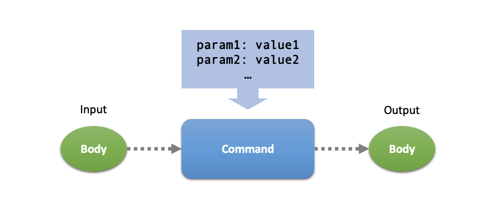
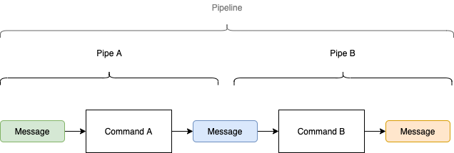
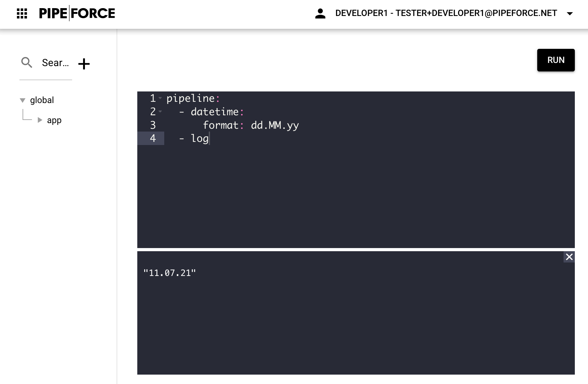
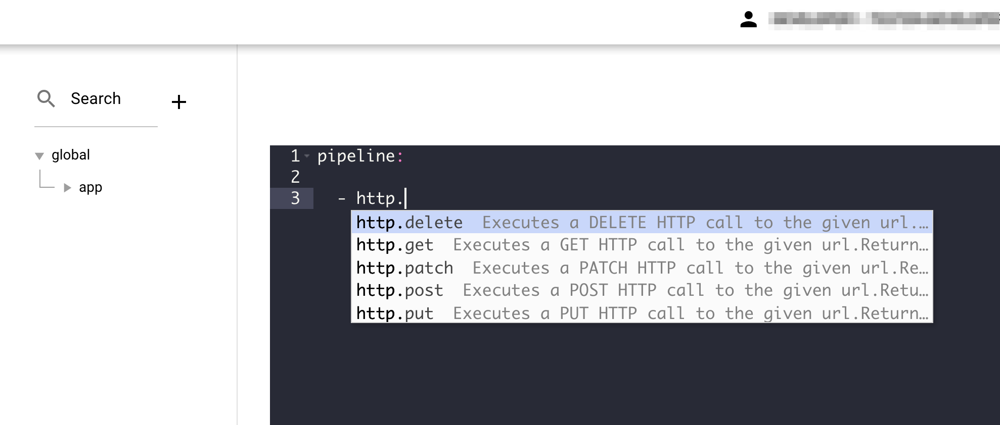

<p class="theme-doc-version-badge badge badge--secondary">Since Version: 1.0</p>

One of the most important parts in PIPEFORCE are Commands and Pipelines. Using them, you can define  **flows** using **low-code** in order to execute workflows, to create, read, update and delete data, to transform it or to send messages to just name a few options here. 

<a id='command'></a>

## What is a Command? 

Let's first start with the atomic part of a flow: The Command. A Command is a server-side component, which can be called remotely via HTTP using its [unique name](api/commands). It takes an optional input  body, optional parameters, processes a certain task, and finally produces an optional output which is the response to the caller. Similar to HTTP and REST endpoints.

The main difference of Commands compared to REST is, that multiple Commands can optionally be connected like "LEGO" bricks. They will be called one after another at serverside, whereas the output of one command becomes the input of the next command, aso. If you would like to learn more about this approach, see the concept of a [Pipeline](#pipeline) below. 

Commands can be seen as a combination of the [command pattern](https://en.wikipedia.org/wiki/Command_pattern) and [function as a service](https://en.wikipedia.org/wiki/Function_as_a_service) approach. 

There are many different commands for different tasks in PIPEFORCE available. For example, commands can 
- upload and download files
- encrypt and decrypt data 
- save data into a database or read from it 
- transform and map data
- connect to other systems, and read / write data 
- and much more...

You can find a all built-in commands in the [commands reference](api/commands).

### Command Name
Each command has a unique name which is always written in lower case and follows the dot notation. Here are some examples of valid command names:

 - [`barcode.create`](api/commands#barcodecreate-v1)
 - [`data.list.iterate`](api/commands#datalistiterate-v1)
 - [`log`](api/commands#log-v1)
 - [`mail.send`](api/commands#mailsend-v1)   
 - [`property.put`](api/commands#propertyput-v1)


As you can see, the command name is usually structured like this:
```python
<group1>.<groupN>.<verb>
```

These are for example invalid command names:

 - `data_convert`
 - `dataEntity`
 - `my command`

The full list of available commands and their names can be found in the [commands reference](api/commands).

:::tip Command Names vs. REST Resource Names
Even if many command names do have a similar resource-based semantic like HTTP GET, POST or PUT as REST do, they do not follow this approach 100%, since a Command is not always bound do a single resource and can be bound to actions or can be chained instead. Therefore, the operation type of a command is defined by its name, not by a method header. For example: `property.put` or `config.get` to name just a few.
:::

### Command Parameters
Commands can have zero to many parameters. Whereas each parameter is a name-value pair. The parameters can be passed in different ways to the command, depending on the execution context you're working in. See [Executing a Command](#executing-a-command) below. Here is an example to set parameters to a command as part of a [Pipeline](#pipeline) flow:

```bash
pipeline:
  - mail.send:
      to: "some@email.com"
      subject: "Hello"
      message "Hello World!"
```

Command parameters can be primitive types (`integer`, `decimal`, `boolean`, `string`) or complex types like YAML or JSON. Here is an example to set a JSON as paremeter:

```yaml
pipeline:
  - log:
      message: {"key": "value"}
```


### Executing a Command

A single Command can be executed by sending it as HTTP GET or POST request using the endpoint `/api/v3/command`. The full url structure of this endpoint is always like this:

```yaml
https://HUB/api/v3/command/<command.name>?<param1>=<value1>&<paramN>=<valueN>
```
:::tip Note
- Replace ``HUB`` by the hub host name of your instance (for example `hub-mycompany.pipeforce.net`).
- Replace ``<command.name>`` by the [name](api/commands) of the command you would like to execute.
- Replace ``<param1>``,``<value1>`` and ``<paramN>``,``<valueN>`` by the optional [parameters](api/commands) of your command.
:::

##### GET

Here is an example to execute the [`log`](api/commands#log-v1) command as HTTP GET request, and set its [`message`](api/commands#log-v1) parameter to a string value using a HTTP request parameter:

```yaml
https://hub-trial.pipeforce.org/api/v3/command/log?message=HELLO
```
:::tip Note
- [Authentication](guides/security/authorization) is not considered here for simplicity reasons.
- Replace ``http://hub-trial.pipeforce.org`` by the url of your target system.
- In case you would like to use special characters like spaces, umlauts, `?` or `=` for example in your parameter value, you need to URL encode the URL as you would do with any such HTTP request. See Wikipedia for details: https://en.wikipedia.org/wiki/Percent-encoding 
:::

See [HTTP Execution Reference](#http-execution-reference) for an summary of all supported HTTP options here.

##### POST

Here is an example to execute a single command as HTTP POST request, and set the `message` parameter to a [`log`](api/commands#log-v1) command using a HTTP POST data body in `curl`:

```bash
curl -u "username:password" \
  -X POST "https://hub-trial.pipeforce.org/api/v3/command/log" -d "message=HELLO"
```

:::tip Note
- Authentication is done here by using basic authentication in the `Authorization` header. See [Authorization](api/headers) and the `-u` switch of the `curl` terminal command for details.
- Replace ``http://hub-trial.pipeforce.org`` by the url of your target system.
:::

See [HTTP Execution Reference](#http-execution-reference) for an summary of all supported HTTP options here.

#### Execute in CLI
You can also use the [PIPEFORCE CLI](cli) in order to execute a single Command. Here is an example to call the [`log`](api/commands#log-v1) command and set the `message` parameter accordingly:

```bash
pi command log message=HELLO
```

### Command Body

Beside **parameters**, a command can also consume and produce a **body**, similar to a HTTP POST request and response.



Differently to parameters, the input body is typically a more complex document and/or bigger data stream which must be modified in some way. Therfore, it is passed-in and written-out via the body by default. 

Here is an example to pass JSON data via body to a [`cache.put`](api/commands#log-v1) command using a HTTP POST request and the `curl` tool:

```bash
curl -X POST 'https://hub-trial.pipeforce.org/api/v3/command/cache.put?key=someKey' \ 
  -u 'username:password' \
  -H 'Content-Type: application/json' \
  -d '{"productId": 123, "quantity": 10}'
```

As you can see, the command parameter `key` has been set as request parameter here and in the HTTP POST body a JSON string is set using the `-d` switch of `curl`. This JSON will become the input body (data) for the `cache.put` command. In order to automatically parse this JSON string into a JSON instance and use it as such in the command, you can optionally specify the `Content-Type: application/json` header.

:::tip Note
- Authentication is done here by using the `Authorization` header. See [Authorization](api/headers#authorization) for details.
- Replace ``http://hub-trial.pipeforce.org`` by the url of your target system.
:::

See [HTTP Execution Reference](#http-execution-reference) for an summary of all supported HTTP options here.

<a id='pipeline'></a>

## What is a Pipeline?

Two or more [Commands](#command) can be chained to a flow, called a **Pipeline**. If such a pipeline gets executed, each command in it will be executed one after another, whereas the output message of the first command will become the input message of the next command, and so on. 



By default, such a pipeline is written in the [YAML](https://en.wikipedia.org/wiki/YAML) format which you can then manage by your preferred source code management tool like Git for example.

Here is an example, which connects two simple commands: The `datetime` command produces the current date and time and the `log` command finally logs it:

```yaml
pipeline:
  - datetime
  - log
```

In the YAML, a pipeline definition starts with the `pipeline:` element, followed by a list of commands. Each command to be executed is defined as an list element by its name using an indent and a dash `-`. 

By default, the body output of the first command (`datetime` in this example) will automatically become the body input of the next command (`log` in this example), aso. Therefore no declaration and exchange of variables is required here.

### Parameters

In case you need to specify parameters for commands in a pipeline, you can do so by writing them below the command as name-value pairs with an additional tab indent or a at least two spaces as indent:

```yaml
pipeline:
  - datetime:
      format: dd-MM-YYYY
  - log
```

As long as you do not use any [Pipeline Expression Syntax](guides/commands_pipelines/pel), you can write parameter values also without any quotes. Optionally, you can use single quotes for parameter values:

```yaml
pipeline:
  - datetime:
      format: 'dd-MM-YYYY'
  - log
```

or double quotes:

```yaml
pipeline:
  - datetime:
      format: "dd-MM-YYYY"
  - log
```

Parameters can also be multiple lines long:

```yaml
pipeline:
  - datetime:
  - log:
      message: This is a 
        multiline log 
        message. Line breaks 
        wont be preserved.
```

In case you need to pass multi-line parameter values, with the line breaks to be preserved, you can do so by using the pipe `|` character:

```yaml
pipeline:
  - datetime
  - log:
      message: |
        This is a 
        multiline log 
        message. All line 
        breaks are preserved.
```

There are much more options on how to format line breaks in YAML. For full details, see the YAML specification: https://yaml.org/spec/1.2.2/ 

### JSON Parameters

Furthermore, it is possible to specify a JSON document as parameter, like this example shows:

```yaml
pipeline:
  - log:
      message: {"text": "Hello World!"}
```

As you can see, there is no need to espace or convert the JSON to a string. It can be placed as JSON 1:1 inside the YAML. Cool, eh?

### Executing a Pipeline

In order to execute a Pipeline, you have to send its YAML script in the body of a HTTP POST request to the server using the API endpoint `/api/v3/pipeline` and the header `Content-Type: application/yaml`.

Let's assume a more sophisticated pipeline like this, with different parameter value formats:

```yaml
pipeline:
 - drive.read:
     path: /my.pdf
 - pdf.stamp:
      text: |
        Hello World!
 - drive.save:
     path: '/my-stamped.pdf'
```

This example loads a PDF file, sets a text on it and stores it back. In order to execute this Pipeline YAML, you can send it to the server using `curl` for example:

```bash
curl -X POST "https://hub-ns.pipeforce.net/api/v3/pipeline" \
  -H "Content-Type: application/yaml" \
  -u "username:password" \
  --data-binary @- << EOF
pipeline:
 - drive.read:
     path: /my.pdf
 - pdf.stamp:
     text: "Hello World!"
 - drive.save:
     path: /my-stamped.pdf
EOF
```

The `EOF` syntax is required here in order to preserve the intends of the YAML script. Optionally, you can write the YAML in a local file an pass this file as argument for the body. See the example below, where the pipeline is specified in a file with name `mypipeline.yaml`: 

```bash
curl -X POST "https://hub-ns.pipeforce.net/api/v3/pipeline" \
  -H "Content-Type: application/yaml" \
  -u "username:password" \
  -d "@mypipeline.yaml"
```

:::tip Info
A Pipeline is a kind of the “Function as a Service” pattern, since it can execute a bunch of commands in a predefined order.
:::

See [HTTP Execution Reference](#http-execution-reference) for an summary of all supported HTTP options here.

##### Send the Body

You can also send the pipeline body using this approach. See this example:

```yaml
pipeline:
  - log:
      message: "BODY: #{body.text}"

body: {"text": "Hello World!"}
```

Note that the value of the body can be a primitive or a JSON without additional escaping required.

Here is an example how to send this using `curl`:

```bash
curl -X POST "https://hub-ns.pipeforce.net/api/v3/pipeline" \
  -H "Content-Type: application/yaml" \
  -u "username:password" \
  --data-binary @- << EOF
pipeline:
  - log:
      message: "BODY: #{body.text}"

body: {"text": "Hello World!"}
EOF
```

The log output will be:

```
BODY: Hello World!
```

#### Execute in Online Workbench

Since version 7.0 of PIPEFORCE was released, the Online Workbench is available. This is an advanced online editor with syntax highlighting, code completion and debugging support, where you can write pipelines and commands to be executed and then run them online. This is the easiest and most preferred way to ad-hoc execute a command or pipeline. Here you can see a simple pipeline after its ad-hoc execution as an example:



#### Execute in CLI

Another approach to execute a pipeline is by using the CLI: [Command Line Interface (CLI)](cli).

##### Execute local pipeline file

Lets assume you have a local pipeline file stored at `src/global/app/myapp/pipeline/test.pi.yaml` inside of your PIPEFORCE workspace, then you can execute it via this CLI call:

```bash
pi pipeline src/global/app/myapp/pipeline/test.pi.yaml
```

This will load the local pipeline file and execute its content by sending it to the server. The result will be printed out to your terminal if there is any.

:::tip 
A pipeline file must end in this suffix to be detected correctly by your workspace: `.pi.yaml`.
:::

##### Execute persisted remote pipeline

In case you have stored your pipeline at server side in the [Property Store](propertystore), then you can execute it using this call:

```bash
pi pipeline remote global/app/myapp/pipeline/test
```

This command searches for a property in the property store with key `global/app/myapp/pipeline/test` and executes it before sending any results back to your terminal.

### Pipeline Sections

Every pipeline script may consist of four main sections:

*   **headers**
    
*   **vars**
    
*   **pipeline**
    
*   **body**
    

Here is an example of a pipeline script which defines all of these sections:

```yaml
headers:
  contentType: "text/plain"
  
vars:
  counter: 0

pipeline:
  - log:
      message: "HELLO WORLD!"
      
body: "This is text in the body"
```

All sections except `pipeline` are optional in a pipeline script. Even if not explicitly defined in the pipeline script, each scope exists implicitly. That means, you can access it and read / set values from / on it without declaring it in the pipeline. For example, by using a pipeline expression (PE).

### `headers`

The headers section is optional. A header is a name-value pair to define "global configuration" hints and configurations for the given pipeline. Only text is allowed as content i.e. no complex objects like JSON. It is not meant to be changed during pipeline processing, even this is possible for rare cases.

Whether and which headers are required depends on the pipeline and its commands. There are some default headers in order to configure the pipeline processing. See the [headers reference](api/headers) for details.

It is similar to [HTTP Request Headers](https://en.wikipedia.org/wiki/List\_of\_HTTP\_header\_fields).

You can read and set values in the headers section using the [Pipeline Expression Language (PEL)](guides/commands_pipelines/pel).

### `vars`

The vars section is optional and contains transient variables as name value pairs. It is meant as a transient scope for states during the pipeline processing.

Values can also be complex objects and documents like JSON for example.

Values can be changed during pipeline processing.

You can access values in the vars scope using the [Pipeline Expression Language (PEL)](guides/commands_pipelines/pel).

### `pipeline`

The pipeline section is mandatory and lists all commands which must be executed in given order.

See the [commands reference](api/commands) for details about the default commands.

You can set dynamic parameter values on commands using the [Pipeline Expression Language (PEL)](guides/commands_pipelines/pel).

### `body`

The body section is optional. It defines a single object to be used as “data pool” or transformation data during the pipeline processing.

In case a command returns a value, by default, it will write this value to the body implicitly. Whereas a previous command's value in the body will be overwritten by the command which comes next.

It's also possible to define an initial value for the body in the pipeline. If no such initial value is set, the body is initally `null`.

You can access values in the body scope using the [Pipeline Expression Language (PEL)](guides/commands_pipelines/pel).

### Pipeline as JSON

Sometimes it is necessary to use JSON as the pipeline definition language instead of YAML. Let's assume a pipeline written in YAML like this:

```yaml
headers:
  apiVersion: v2
vars:
  age: 23
  name: "Max"
pipeline:
  - datetime:
      format: dd-MM-YYYY
  - log:
      message: "Hello World!"
body: "Some input"
```

You can rewrite this YAML pipeline as JSON pipeline like this:

```json
{
  "headers": {
    "apiVersion": "v2"
  },
  "vars": {
    "age": 23,
    "name": "Max"
  },
  "pipeline": [
    {
      "datetime": {
        "format": "dd-MM-YYYY"
      }
    },
    {
      "log": {
        "message": "Hello World!"
      }
    }
  ],
  "body": "Some input"
}
```

In order to execute such a JSON pipeline, you can send it to the same POST endpoints as you would do with YAML pipelines, but with header changed to `Content-Type: application/json`.

:::tip Note
Since YAML is the default definition for pipelines and it is much easier to read, you should prefer it over JSON whenever possible. The JSON variant is mainly meant for cases, where YAML is not possible or hard to use.
:::

### Pipeline as URI

Beside YAML and JSON, a third option to define a pipeline is by using a **pipeline uri** which is an inline version of a pipeline.

You can rewrite any pipeline YAML as a pipeline URI. Let's assume this pipeline YAML:

```yaml
pipeline:
  - datetime
      format: dd.MM.YYYY     
  - log
```

You can rewrite this pipeline YAML as an inline pipeline URI, which looks like this:

```bash
datetime?format=dd.MM.YYYY|log
```
You can then execute such a pipeline URI using the CLI:

```bash
pi pipeline uri "datetime?format=dd.MM.YYYY|log"
```

This is handy especially for smaller pipelines which you want to execute ad-hoc from your terminal.


### Auto-completion support

**Note: This is experimental.**

In order to enable auto-completion support for pipeline scripts in your local development editor, you need an editor which supports YAML schema validation. Then, you can have auto-completion which shows all available commands and their parameters:


#### IntelliJ

To enable auto-completion in IntelliJ, open preferences and navigate to JSON Schema Mappings:

`Preferences → Languages & Frameworks → Schemas & DTDs → JSON Schema Mappings`

Add a new schema mapping with these values:

*   Name: `pipeline-schema`
    
*   Schema URL: `https://hub-<NS>.pipeforce.net/api/v3/command:pipe.schema.v7`
    
*   Schema version: `JSON Schema version 7`
    
Add new file path patterns for : `*.pi.yaml`

Now, try it out: Create a new file `foo.pi.yaml` and start typing. You should get support for any file ending in `*.pi.yaml`.

Note: A YAML pipeline script should always end in suffix **.pi.yaml** which stands for stands for pipeline scripts written in YAML.

#### Visual Studio Code

To enable auto-completion in Visual Studio Code, open `Preferences → Settings`, and search for section `json.schemas`. Then, add a new mapping entry like this:

```yaml
    "json.schemas": [
        {
            "fileMatch": [
                "/*.pi.json"
            ],
            "url": "https://hub-<NS>.pipeforce.net/api/v3/command:pipe.schema.v7"
        }
    ],
```

Now, try it out: Create a new file `foo.pi.json` and start typing. You should get support for any file ending in `*.pi.json`.
 Note: .**pi.json** stands for pipeline scripts written in JSON.

Note: Visual Studio Code doesn't have built-in schema support for yaml files. If you want to also enable code-completion for your pipeline yaml files, you need to install the YAML language support plugin from Red Hat first: [https://marketplace.visualstudio.com/items?itemName=redhat.vscode-yaml](https://marketplace.visualstudio.com/items?itemName=redhat.vscode-yaml)

Then open `Preferences → Settings` and add this line to your configuration **settings.json**:

```yaml
"yaml.schemas": { 
  "https://hub-NAMESPACE.pipeforce.org/api/v3/pipe:pipe.schema.v7": ["/*.pi.yaml"] 
}
```

#### Online Workbench

The built-in online workbench in the PIPEFORCE portal supports pipeline script completion out-of-the box. 

To start completion simply press ``[Ctrl]`` + ``[Space]``. 



Beside completion for available commands and their parameters, it also supports completion for other parts like utilities and variables for example:


## Report an Issue
:::tip Your help is needed!
In case you're missing something on this page, you found an error or you have an idea for improvement, please [click here to create a new issue](https://github.com/pipeforce/pipeforce.github.io/issues/new). Another way to contribute is, to click **Edit this page** below and directly add your changes in GitHub. Many thanks for your contribution in order to improve PIPEFORCE!
:::