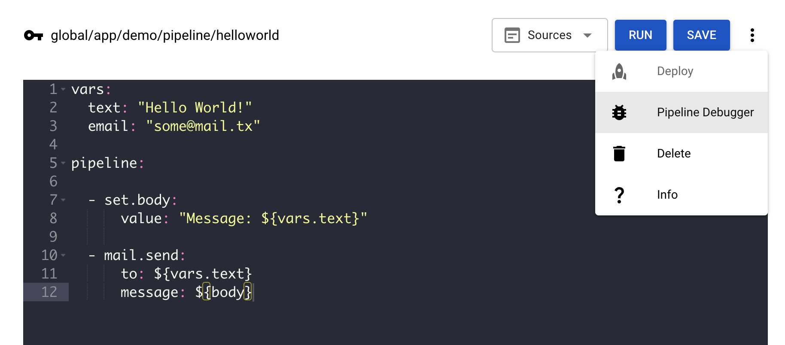

# Pipeline Debugger

Since Version: 9.0

Sometimes it is necessary to see the flow of data thru a pipeline for bugfixing and optimization tasks.

For this, you can use the Pipeline Debugger.

It records all input and output data of the commands of a given pipeline.

This way you can see where an error happened and / or which data has been passed into and produced by which command.

Before you can use the debugger in order to record pipeline calls, you have to first enable it for a certain pipeline.

You can do so by opening the pipeline you would like to monitor in the pipeline editor in the online portal and then select "Pipeline Debugger" in the menu at the top right corner:

The debugger view opens in a new tab.

From this time on execution of the pipeline now creates a new record entry in the debugger view. You can then step into all variables, commands and bodies and see, how these values change during the flow thru the pipeline:

:::tip Note
The Pipeline Debugger tab must stay opened in order to keep the debugging session alive. As soon as the tab was closed, the debugging session gets closed, too.
:::

## Report an Issue
:::tip Your help is needed!
In case you're missing something on this page, you found an error or you have an idea for improvement, please [click here to create a new issue](https://github.com/pipeforce/pipeforce.github.io/issues/new). Another way to contribute is, to click **Edit this page** below and directly add your changes in GitHub. Many thanks for your contribution in order to improve PIPEFORCE!
:::