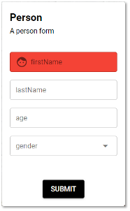
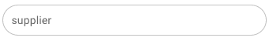
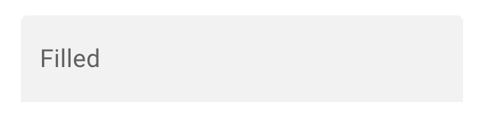
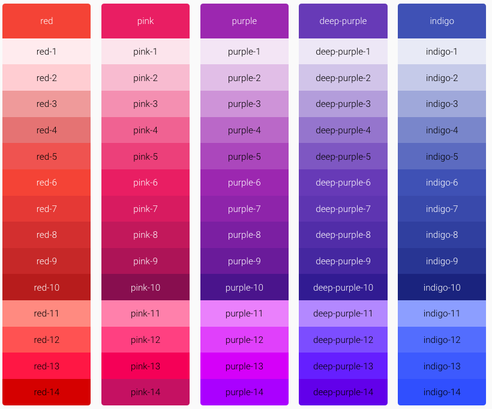
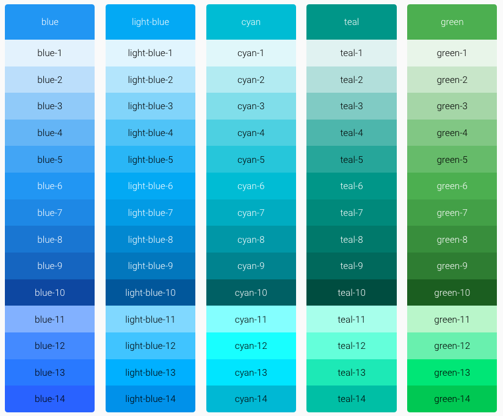
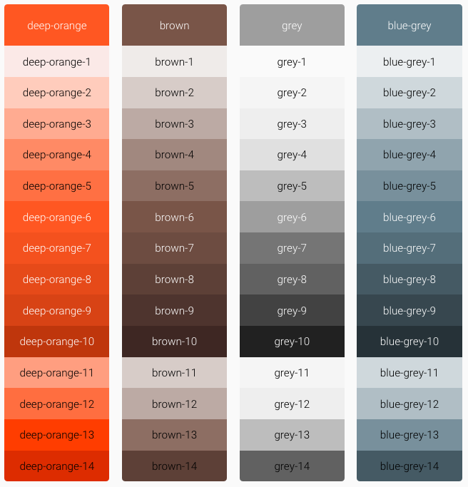
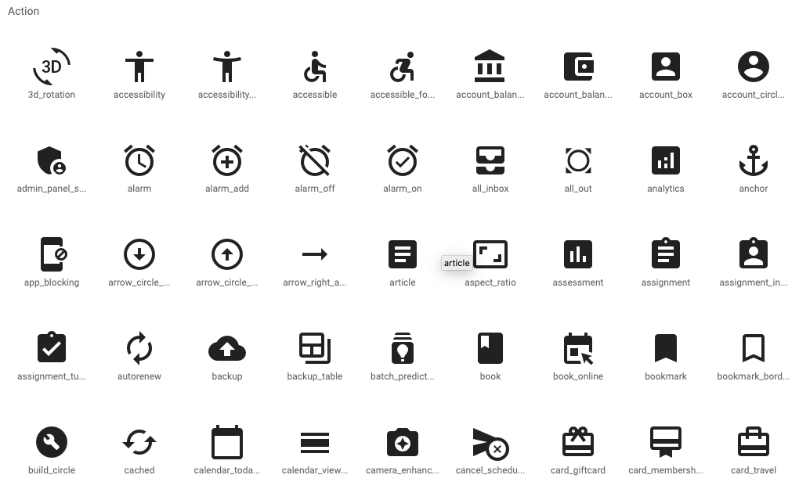

# Look & Feel   

The appearance attributes allow you to change the look and feel of your form elements like color, height, weight or borders for example.

To do so, you need to add those look & feel attributes to the field in the form configuration. For example:

```
{
  "title": "Person",
  "description": "A person form",  ...
  "layout": {
    "items": [
      {
        "field": "firstName", 
        "bgColor": "red",
        "icon":"face"
      },
      ...
    ]
  }
}
```

This would change the look and feel of the form like this:



# Types

**By default the field type is detected from the JSON Schema so there is no requirement to change this.** But you can customize it using these type attributes, if required.

|     |                                                                                                                      |
| --- |----------------------------------------------------------------------------------------------------------------------|
| **Type** | **Description**                                                                                                      |
| `type="password"` | Hides the input since it is sensitive data.                                                                          |
| `type="email"` | Renders the field using the browsers native email widget (depends on the browser whether this is supported).         |
| `type="search"` | Renders the field using the browser native search widget  <br/>depends on the browser whether this is supported).    |
| `type="url"` | Renders the field using the browser native url widget  <br/>depends on the browser whether this is supported).       |
| `type="tel"` | Renders the field using the browser native phone widget  <br/>(depends on the browser whether this is supported).    |
| `type="textarea"` | Renders the field using the browser native textarea widget  <br/>(depends on the browser whether this is supported). |

# Attributes

These are are the attributes you can set to change the appearance of a field:

|     |                                                           |                                                                                                                                                                          |
| --- |-----------------------------------------------------------|--------------------------------------------------------------------------------------------------------------------------------------------------------------------------|
| **Name** | **Value**                                                 | **Description**                                                                                                                                                          |
| `bgColor` | One of the color names of the default palette. See below. | Changes the background color of an element. For example `red`, `green`, `blue` or `indigio-5`.                                                                           |
| `color` | One of the color names of the default palette. See below. | Changes the color of the element label and its border.                                                                                                                   |
| `height` | Integer. For example `200`.                               | Sets the fixed height of the element.<br/><br/>(use `min-height`, `max-height` to set half limits)                                                                       |
| `icon` | The name of the material icon.                            | Shows an icon in the element. See the material icons for a reference of available icon names: [https://material.io/resources/icons](https://material.io/resources/icons) |
| `width` | Integer. For example `500`.                               | Sets the fixed width of an element.<br/><br/>(use `min-width`, `max-width` to set half limits)                                                                           |
| `readonly` | `true` or `false`.                                        | Makes an element read only so no value can be set there.                                                                                                                 |
| `rounded` | Example:  <br/>`"rounded":""`                             |                                                                                                                                     |
| `filled` | Example:  <br/>`"filled":""`                              |                                                                                                                                                    |
| `autogrow` | Example:  <br/>`"autogrow":""`                            | The field automatically grows while user is typing more text.                                                                                                            |
| `suffix` | Example: `"suffix":"@email.de"`                           | Shows a suffix for example `@email.de` inside the field.                                                                                                                 |
| `prefix` | Example:  <br/>`"prefix":"EUR"`                           | Shows a prefix for example `EUR` inside the field.                                                                                                                       |

# Default color palette

In order to change the color of an element use one of the color names from these default palettes.



# Material icons

Below you can find a preview of icons. To get the full list and name of all possible icons go to [https://material.io/resources/icons](https://material.io/resources/icons) and search for the icon you need.


