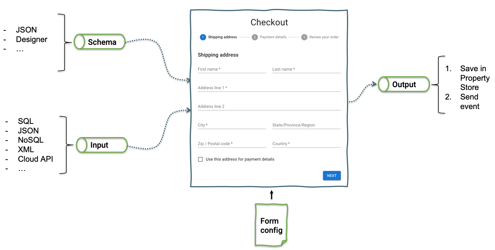

In order to define a form in PIPEFORCE, you need a **JSON schema** and the **form configuration**.



The JSON **schema** (also called the “object schema”) defines the structure of a dataset and “tells” the form which fields to display that a user can fill-out. Learn more about the JSON Schema in this chapter: [Schema & Objects](../../guides/forms/schema-and-objects).md).

The **input** data is used in case an existing dataset needs to be edited. The form is pre-filled with some data, so the user can make changes, and save again.

After a form was submitted, the **output** is automatically saved into the property store. So, you do not need to care about where the data is stored.

After this, an event is send, depending on what the form did with an object/property:

*   `property.created`: If a new object was created by submitting the form.
    
*   `property.changed`: If an existing object has been changed by submitting the form.
    
*   `property.deleted`: If an existing object has been deleted by submitting the form.
    

Any pipeline can then listen to such events using the command `event.listen`, and do additional logic afterwards using the submitted data. For example, sending notification emails, doing data integration, or alike. Such a pipeline could look like this:

```yaml
pipeline:
  - event.listen:
      key: "property.created"
  - ...
```

The glue of all this is the **form configuration**, which defines how the form should use the schema and display the fields. Additionally, any information about layouting a form’s fields goes into the form configuration.

## How to handle the form output

By default, after a submit, the data of a form is automatically stored into the property store under a new property having this key path:

```bash
global/app/<APP>/object/<NAME>/v1/instance/<UUID>
```

Where `<APP>` is the name of your app. `<NAME>` is the name of the object, the schema of the form belongs to, and `<UUID>` is a unique identifier for the dataset, created automatically for each new entry.

In the person example above, after a form is submitted with new data, this data could be stored in a new property with a key path which looks like this:

```bash
global/app/myApp/object/person/v1/instance/133a11f6-8011-47d3-b6eb-1376cca5e6b6
```

The output of the form, which is the value of this instance property, could look like this:

```json
{
  "firstName": "Bart",
  "lastName": "Simpson",
  "age": 12,
  "gender": "male"
}
```

You can easily query existing instances using the command `property.list`. For example, using the pi tool:

```bash
pi pipeline uri "property.list?filter=/**/global/app/myApp/object/person/v1/instance/*"
```

In case you have more than one object type in your app, and you want to list all instances of all objects of your app, you could use this list filter:

```bash
pi pipeline uri "property.list?filter=/**/global/app/myApp/object/*/v1/instance/*"
```

**Note**: Be careful, since in this example it would return the instances from all objects of myApp. Learn more about filtering properties from the property store in this section [Property Store](propertystore).

## How to load and edit input data in a form

After a form has been submitted, for each submit, a new instance property is created in the instance path of an object, for example:

```bash
global/app/myApp/object/person/v1/instance/133a11f6-8011-47d3-b6eb-1376cca5e6b6
```

In case you want to edit such an instance, first you need to load it into the form using the request parameter `input`, when calling the form:

```bash
?input=property.list?filter=global/app/myApp/object/person/1/instance/133a11f6-8011-47d3-b6eb-1376cca5e6b6
```

Now, form renders initial values from the input, but will still save into new `global/app/myApp/object/person/v1/instance/{somenewrandomuid}`

To save to the same record, additional form `output` parameter needs to be added to overwrite default behaviour.

```bash
...&output=global/app/myApp/object/person/v1/instance/133a11f6-8011-47d3-b6eb-1376cca5e6b6
```

This all is automatically done for you in case you call a form using a list.

## The form configuration

The last step to create and configure a new form is to create a form configuration file. This is a configuration file in JSON format, which defines important attributes of a form like its title or layout information.

Here’s an example how such a file could look like:

```json
{
  "title": "Person",
  "description": "The person form.",
  "schema": "property.list?filter=global/app/myApp/object/person/v1/schema",
  "output": "global/app/myApp/object/person/v1/instance/%23%7Bvars.property.uuid%7D"
}
```

The `title` defines the title of the form to be displayed in the web ui, for example.

The `description` is optional and describes the intention of the form.

The `schema` defines a command which is called to retrieve the JSON schema for this form.

The `output` defines the path in the property store where to store the data. The part `%23%7Bvars.property.uuid%7D` is the url encoded version of `#{vars.property.uuid}`, which is a PE to return the uuid of the property to form its path.

Note: In version >= 7.0, it is no longer required to specify the attributes `schema` and `output`, since the form will automatically detect these values.

By default, the form configuration is stored inside the form folder as a JSON file:

```bash
global/app/myApp/form/personForm
```

After you have created a JSON Schema file and a form configuration, and pushed them to the property store using pi push, the form is listed in the forms section and is ready to be used.

For all schema properties, there is a web input control rendered - filed. By default, all fields are displayed using the default - single column layout i.e. every field in its own row.

To reach custom layout, fields behaviour, file uploads, custom buttons, and more, additional `layout` attribute of the form configuration file needs to be used. Layout uses different approach to define which fields to show. Only fields referenced in this structure are rendered. For details, see following sections.

### Change orientation of form fields

You can change this default by configuring orientation of the layout in the form configuration.

See this section for more details: [Form - Orientation](../docs/guides/forms/forms-orientation)

### Change appearance of form fields

Besides the orientation (vertical, horizontal) of form fields, the appearance (color, border, icons, aso) can also be changed inside the layout section.

See this section for more details: [Form - Look & Feel](../docs/guides/forms/forms-lookandfeel)

### Custom buttons

Replacements for the default Submit button can be defined by `render` attribute of boolean field in the layout section.

See this section for more details:[Form - Buttons](../docs/guides/forms/forms-buttons)

### File upload

In the layout section, it is also possible to configure the set of schema properties defining form upload.

See this section for more details: [Form - Upload](../docs/guides/forms/forms-upload)

## Report an Issue
:::tip Your help is needed!
In case you're missing something on this page, you found an error or you have an idea for improvement, please [click here to create a new issue](https://github.com/pipeforce/pipeforce.github.io/issues/new). Another way to contribute is, to click **Edit this page** below and directly add your changes in GitHub. Many thanks for your contribution in order to improve PIPEFORCE!
:::