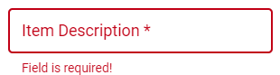
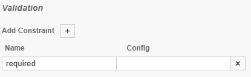

# Validation

Basic validations regarding data types will be specified by the underlying [JSON schema](../guides/schema-and-objects) of the form.

In order to create more specific custom validation rules for form fields, you can add the validation attribute to each field in the form configuration. For example:

```json
{
  "title": "Person",
  "description": "A person form",  
  ...
  
  "layout": {
    "items": [
      {
        "field": "firstName", 
        "validation":[
          { "type":"js", "rule":"!!val", "message": "Field is required!" }
        ]
      },
      ...
    ]
  }
}
```

You can define as many validation rules as you want. All of them will be executed in the order they are specified in the list. The first one, which fails, will be shown to the user as a validation message.

Each validation rule has this format:

```json
{ "type":"TYPE", "rule":"EXPRESSION", "message": "MESSAGE" }
```

Where `type` defines the type of the validation engine. This is, by default, `js` which validates using a JavaScript expression. In future, there will be different validation engines available here.

`rule` defines the rule expression to be applied. The return value of this rule must be `true` in order to have a valid field value.

`message` defines the message to be displayed in case this validation has failed.

## Validation Engine: JavaScript (js)

This validation engine is the default engine. It takes a JavaScript expression using the `rule` attribute and evaluates it. In case it evaluates to `false`, the message given by attribute `message` is shown.

The field value is provided as variable `val` and can be used inside the rule expression.

### Some examples

The given field is a required one. Therefore, make sure this field has a value. In case it has not value, `!val` will return `true`. So we have to negate it with an additional `!` in order activare the validation rule and show the message: 

```json
{ 
  "type":"js", 
  "rule":"!!val", 
  "message": "Field is required!" 
}
```

This will produce the `Field is required!` message if the respective field is not given, as seen below: 




Make sure that the given input has not more than 150 characters:

```json
{ 
  "type":"js", 
  "rule":"val.length <= 150", 
  "message": "Field may not contain more than 150 characters!" 
}
```

Make sure the given input contains the word `Hello`:

```json
{ 
  "type":"js", 
  "rule":"val.includes('Hello')", 
  "message": "Field must contain word Hello!" 
}
```

Make sure the given input is an email (simple approach):

```json
{ 
  "type":"js", 
  "rule":"val.indexOf('@'') > 0", 
  "message": "Field must contain a valid email!" 
}
```

Make sure the given input is an email (advanced approach with regex):

```json
{ 
  "type":"js", 
  "rule":"/\S+@\S+\.\S+/.test(val)", 
  "message": "Field must contain a valid email!" 
}
```


If the form is created using workflow form, then one of the following are ways which can be used to implement the "required" validation rule:

1. Local Camunda Modeler:



2. BPMN in Online Workbench:

```xml
<camunda:formField id="v1" label="v1" type="string">
  <camunda:validation>
    <camunda:constraint name="required" />
  </camunda:validation>
</camunda:formField>
```

Here, we used `<camunda:constraint name="required" />` to implement the "required" validation rule.