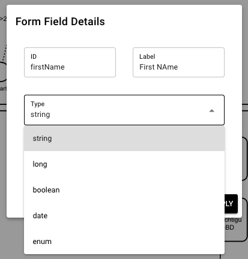
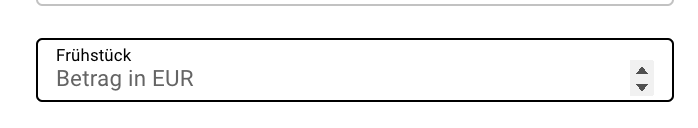
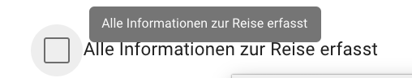

# Forms fields

## Form fields for trigger forms

Form fields of a Trigger-Form are determined by the respective schema defined for your app. The type inside a JSON schema defines the data format of a field. Furthermore, based on its type, form fields are rendered automatically in order to fit the defined format. The supported format types are listed in the section [Schema - Types](../schema-and-objects) .

To create a trigger form, you have to create a schema, and afterwards, create the form as a new property. How to do this is described here: [Tutorial: Create a new form](../../tutorials/create-form) .In the form, you can just refer to your schema. All fields and types (including file upload functionality) will be taken over from the schema. See example of the form description below:

```json
{
  "title": "person",
  "description": "",
  "schema": "property.list?filter=global/app/MY_App/object/person/v1/schema",
  "output": "global/app/MY_APP/object/person/v1/instance/%23%7Bvar.property.uuid%7D"
}
```

## Form fields for task forms

When working with task forms via the Online-Workflow-Modeler, you can select the form type directly from a dropdown list. In this list, there are same options for schema.



## Field Attributes

For defining title of the field, we use the "title" attribute. For defining the message directly in form field like "Betrag in EUR", we use the `placeholder` attribute:

**In schema:**

```yaml
  "Field": {
    "title": "Frühstück"
    "type": "number"
    "placeholder": "Betrag in EUR"
  }
```



For defining the message as tooltip like "Alle Informationen zur Reise erfasst", we use the `description` attribute:

**In schema:**

```yaml
  "Field": {
    "title": "Alle Informationen zur Reise erfasst",
    "description": "Alle Informationen zur Reise erfasst",
    "type": "boolean"
  }
```



## Static drop down values for form fields

In case you want to show a dropdown list in a field of a trigger form, you have the following options:

1.  Refer to a fix list with any values
    
2.  Refer to a group of users from IAM
    

### Fix list of entries

To refer to a fix list of entries, you have to define "enum" in schema. Below you find an easy example for this.

```yaml
"account": {
      "title": "Kostenstelle *",
      "type": "string",
      "enum": [
        "1000",
        "2000",
        "3000",
        "4000",
        "5000"
      ]
    }
```

If you refer to this field “account” in the form section, you will see a dropdown list of the values entered (1000, 2000, 3000, 4000, 5000).

### Group of users in IAM

To refer to a group of user in IAM, you have to adapt your schema and your form definition.

In your schema, you have to define the respective filed as indicated below.

**In schema:**

```yaml
"user": {
      "type": "string",
      "title": "User",
      "enum": []
    }
```

Afterwards, you have to enhance your form definition by an easy pipeline definition as specification for the field, which gives you some values back from IAM. In the example below, all user from group “Employee (Standard)” will be shown in the dropdown list.

**In form:**

```json
{
  "field": "user",
  "visibleColumns": [
    "username"
  ],
  "values": "pipeline:iam.group.members?name=Employee (Standard)"
}
```

## Dynamic drop down values for form fields

In case you want to filter values in a dropdown list based on specific entries in the form, you have to enhance your schema and your form definition.

**Example**

When a specific value for a budget is exceeded, the list of potential reviewer is directly filtered to members of a specific group in IAM.

|     |     |
| --- | --- |
| **Can sign > 10k** | **Can sign <10k** |
| All members of group “C-Level” | All members of group “Department Head” |

**In schema:**

```yaml
"user": {
  "type": "string",
  "title": "User",
  "enum": []
},
"canSign": {
  "type": "number",
  "title": "Can sign"
}
```

**In form definition:**

```json
{
  "title": "f1",
  "description": "",
  "schema": "property.list?filter=global/app/a1/object/f1/v1/schema",
  "output": "global/app/a1/object/f1/v1/instance/%23%7Bvar.property.uuid%7D",
  "script": {
    "onblur": "var response; if (form.canSign > 10000) { response = await pi.pipeline('iam.group.members?name=C-Level') } else { response = await pi.pipeline('iam.group.members?name=Department Head') }; if (response) { schema.properties.user.enum = response }"
  },
  "layout": {
    "orientation": "vertical",
    "items": [
      {
        "field": "user",
        "visibleColumns": [
          "username"
        ]
      },
      {
        "field": "canSign"
      }
    ]
  }
}
```

## Dynamic calculation of values in a form

You have the option to show calculated values in a trigger form. To do so, you have to enhance the schema and the form definition. Below, you will find an example how to show a sum of two entries (value1 and value 2) in a third field.

**In schema:**

```yaml
"value1": {
  "type": "number",
  "title": "value1"
},
"value2": {
  "type": "number",
  "title": "value2"
},
"value3": {
  "type": "number",
  "title": "value3"
}
```

**In form definition:**

```json
{
  "title": "f1",
  "description": "",
  "schema": "property.list?filter=global/app/a1/object/f1/v1/schema",
  "output": "global/app/a1/object/f1/v1/instance/%23%7Bvar.property.uuid%7D",
  "script": {
    "onblur": "form.value3 = form.value1 + form.value2"
  },
  "layout": {
    "orientation": "vertical",
    "items": [
      {
        "field": "value1"
      },
      {
        "field": "value2"
      },
      {
        "field": "value3",
        "readonly": true
      }
    ]
  }
}
```

## Add attachments in a task form

You have the option to upload a file with a task form. To do so, you have to enhance your schema and your form definition. Below, you will find an example.

**In schema:**

```yaml
"myFile": {
  "type": "object",
  "properties": {
    "filename": 
      {"type": "string"},
    "contentLength": 
      {"type": "number"},
    "contentType": 
      {"type": "string"},
    "contentEncoding": 
      {"type": "string"},
    "content": 
      {"type": "string"}
  }  
}
```

**In form:**

```yaml
"layout": {    
        "orientation": "vertical",
        "items": 
       [
          {
            "field": "myFile",
            "height": "628",
            "render": "pdfviewer",
            "validation": [
              {
                "type": "js",
                "rule": "!!val",
                "message": "Field is required"
        }
      ]
    }
  ]
}
```

Tip: Be aware, that you have to configure a layout for your form in order to show the file picker as expected.

## Show attachments in a task form

This functionality will be available with PIPEFORCE Version 8.0. Documentation will be added after release.

## Report an Issue
:::tip Your help is needed!
In case you're missing something on this page, you found an error or you have an idea for improvement, please [click here to create a new issue](https://github.com/pipeforce/pipeforce.github.io/issues/new). Another way to contribute is, to click **Edit this page** below and directly add your changes in GitHub. Many thanks for your contribution in order to improve PIPEFORCE!
:::