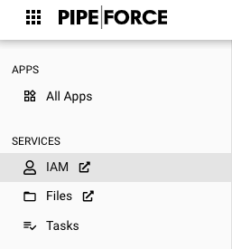

# Identity and Access Management (IAM)

PIPEFORCE comes with a powerful identity and access management service (IAM). With this service you can:

*   Create and manage users, groups, roles
    
*   Define user credentials
    
*   Select required user actions (for example verification or password reset requests)
    
*   Connect to external LDAP services like Active Directory
    
*   OAuth2 authentication
    
*   Two Factor Authentication (2FA)
    
*   Social Login
    
*   Kerberos Broker
    
*   Single Sign On
    
*   User Self Registration
    

If you have sufficient permissions, you can reach the service via this url:

```
https://iam-<NAMESPACE>.pipeforce.net
```

Or by clicking IAM on the portal menu:


