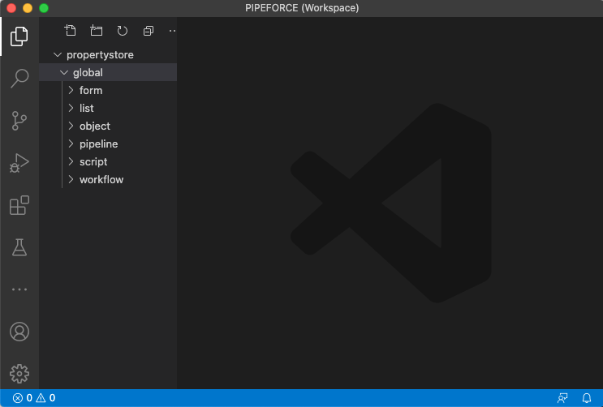
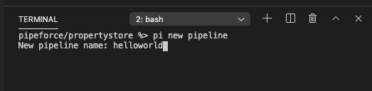
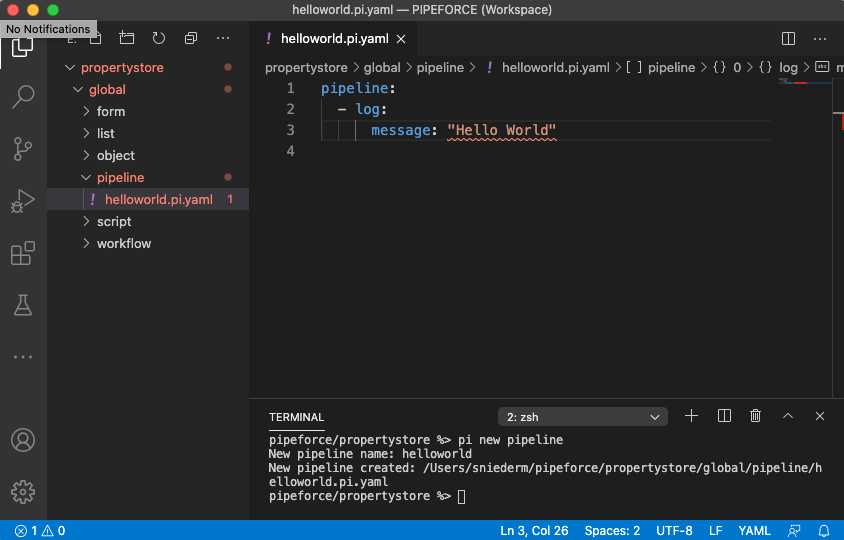
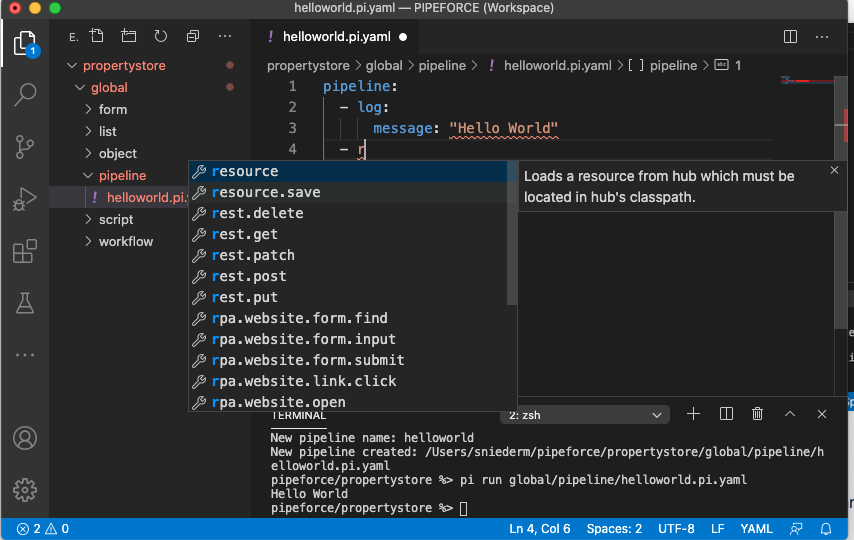

# Local Workspace

## What is it?

The local low-code workspace is a folder on your local machine where you can store and edit all of your low-code configuration files and scripts and then sync them with the PIPEFORCE property store with a single call of `pi publish`.

In its most raw case you could manage all properties in the property store with the `property.*` commands and the CLI using `pi pipeline`.

This might be useful for small changes. But if you want to develop and customize full business applications, we recommend you to use the local low-code workspace. This way you can track changes more easily and be prepared for a good change management process.

The low-code workspace will mirror the property store properties as a local hierarchy of folders and files. Any configuration and script file created locally inside this workspace can then easily be uploaded to the property store with a single command line. For example:

```bash
pi publish src/global/app/myapp/*
```

This scans the folder `myapp` inside the workspace and uploads only those resources which have been changed since last upload or have been created since then.

You can also use the short form of the command:

```bash
pi publish 
```

This will publish any new or changes resources inside the `src` folder to the server.

## Prerequisites

To setup your local low-code workspace, at first you need to download and install the CLI as described here: [Downloads](../guides/downloads)

Furthermore, we recommend you to download and install the free source code editor Visual Studio Code from here: [https://code.visualstudio.com/download](https://code.visualstudio.com/download)

Even if you have a different favorite editor, we recommend you to start with this one, since it is easier to follow all examples. Later, you can switch to a different editor, if you want.

After you did setup the local workspace, you should read the chapter about working with Visual Studio Code to learn how you can optimize your customization steps: [Visual Studio Code](../guides/vs-code)

## Create a new workspace

After you have installed the CLI ([Command Line Interface (CLI)](../api/cli)), you can create a new workspace by using this command line call:

```bash
pi setup
```

This will ask you a few questions to setup the workspace correctly.

```bash
Namespace [None]:
```

Here, you need to type-in the namespace of your PIPEFORCE instance which is typically the name of your company. If you’re not sure what your namespace is, ask [support@pipeforce.io](mailto:support@pipeforce.io).

Typically the namespace is the **NAMESPACE** part of your instance url (not the full url!):  
https://**NAMESPACE**.pipeforce.net

For example if your instance url is [https://**acme**.pipeforce.net](https://acme.pipeforce.net), then your namespace would be **acme**.

Type this name in an press enter.

```bash
Username [None]:
```

Type-in your username to login into the system.

```bash
Password []:
```

Type-in your password to login into the system.

:::note 
Your password is never stored as such by the CLI for security reasons. Instead, the CLI automatically exchanges this password with an API access token and stores this access token. This token is valid for 30 days. That means: If you did not login into PIPEFORCE for longer than 30 days, you need to re-generate this access token. You can do so by simply calling `pi setup` later which asks again for credentials and creates and stores a new access token for you in case the login was successful.
:::

Congratulations! A new property store workspace was been created for you under  
`$USER_HOME/pipeforce`

:::note 
Replace `$USER_HOME` by the path of your user home folder which differs depending on your current operating system.

*   For Windows this is typically: `C:\Users\YOUR_USERNAME`
    
*   For Mac this is typically: `/Users/YOUR_USERNAME`
:::
    

## Using Visual Studio Code

Visual Studio Code (in short: VS Code) is a free resource editor which works nicely together with the pi tool and simplifies customizing PIPEFORCE. You can also use a different editor but we recommend to use this one at least for the starting phase.

### Download and Installation

You can download Visual Studio Code for free here: [https://code.visualstudio.com/download](https://code.visualstudio.com/download)

### Loading the workspace in VS Code

After you have created a new PIPEFORCE customization workspace, navigate to its location which looks similar to this (could differ depending on your operating system):

```bash
cd /Users/USERNAME/pipeforce/
```

Inside this folder there is a file called `PIPEFORCE.code-workspace`. Double click this file in order to start Visual Studio Code. Note: Visual Studio Code needs to be installed beforehand.

This will start Visual Studio Code with everything already setup, so you can immediately start to create and deploy customizations in PIPEFORCE:



### Show the terminal

Its comfortable to also show the terminal inside of VS Code. To do so, in the top menu click `Terminal → New Terminal`. This opens a new terminal at the bottom of VS Code:


### Create a new resource

You can now use the terminal to create for example a new pipeline by typing in this command line in the VS Code terminal:


After pressing enter, you will be asked for a name of the new pipeline. Type-in `helloworld` and press again enter.



After this a new pipeline file was created for you with name `helloworld.pi.yaml`:


If you open this file, you can see it contains a simple hello world demo pipeline which logs “Hello World” into the server log and writes it into the body.



### Execute a pipeline in the terminal

To run the pipeline right from within your VS Code use this command line:

```bash
pi pipeline file src/global/pipeline/helloworld.pi.yaml
```

You should then see the output of this pipeline in the terminal.

## Enable code completion for pipelines

In order to enable code completion for pipelines inside of VS Code, you can optionally install the free YAML plugin from the Microsoft VS Code marketplace.

Open this url in your browser:  
[https://marketplace.visualstudio.com/items?itemName=redhat.vscode-yaml](https://marketplace.visualstudio.com/items?itemName=redhat.vscode-yaml)

Click install. Allow to open this link with VS Code if requested.

Now you should be able to use pipeline code completion.

To test it, add a new command in the `helloworld.pi.yaml` file. After you started typing you should get a suggestion list of all available pipeline commands including inline documentation:



## Upload a resource

After you have created a resource locally, you can upload it to the property store with a simple command line inside your VS Code terminal:

```bash
pi publish
```

After the command was executed, you can see that your pipeline has been successfully created into the property store.

Anytime you change a resource in the workspace, calling `pi publish` afterwards will create or update only those resources which have been changed after last publish. This way you can work in an very effective way.
