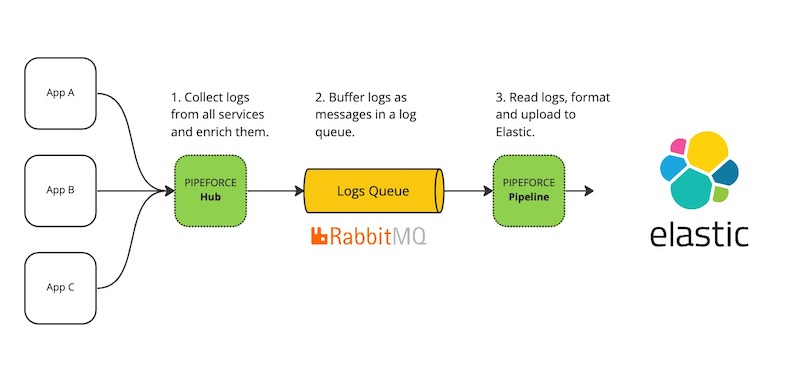

# Elasticsearch

Since Version: 8.5

PIPEFORCE comes with an "out-of-the-box" integration into Elasticsearch. There is no need to install and maintain agents or toolings like Logstash or Filebeat for example to monitor services, manged by PIPEFORCE. Though, you can if you have the requirements to do so.

If setup correctly, any microservice managed by PIPEFORCE is reagurily scanned for new logs and other metrics. These data will then be provided to a log queue. Finally, this queue will be consumed by a pipeline which uploads the logs to Elasticsearch. The pipeline can be customized to fit your needs.

Furthermore, any process and business messages can also be forwarded to Elastic this way in order to build powerful dashboards and to perform extensive analyses inlcuding machine learning approaches.

## Prerequisites

To get started, you must meet these requirements:

 1. You have an Elasticsearch server up and running and you're able to access its API endpoint. Doing so is out of the scope of this documentation. The easiest way to start here from scratch, in case you do not want to maintain the Elastic stack yourself: Go and sign up for an [Elastic Cloud](https://cloud.elastic.co/registration) account.
 2. You have the credentials and permission to access the Elastic endpoints.

## Setup

1. Open your PIPEFORCE Portal and go to **Marketplace**. Search for the app `app-elastic-integration` there and
   click **Install**.
2. Create a new **Secret** of format `bearer` and with name `elastic-token` and copy and paste the bearer token of your
   elastic documents API endpoint into the secret field (see your Elastic documentation for details from where to get this token).
   Click **ADD**.
3. Copy the url of your document indexing API endpoint from your Elastic installation. Go to Workbench and open
   `global/app/elastic-integration/pipeline/shovel-logs` and paste the url there. Click SAVE.

Done. From now on, any of your microservices in PIPEFORCE will send its logs automatically into your Elasticsearch
server for indexing and further processing.

## Report an Issue
:::tip Your help is needed!
In case you're missing something on this page, you found an error or you have an idea for improvement, please [click here to create a new issue](https://github.com/pipeforce/pipeforce.github.io/issues/new). Another way to contribute is, to click **Edit this page** below and directly add your changes in GitHub. Many thanks for your contribution in order to improve PIPEFORCE!
:::