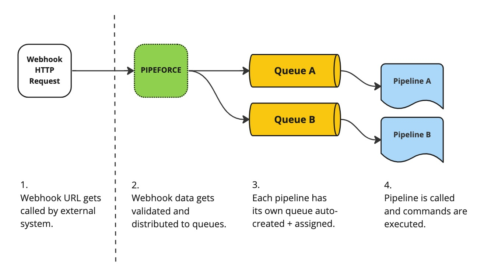
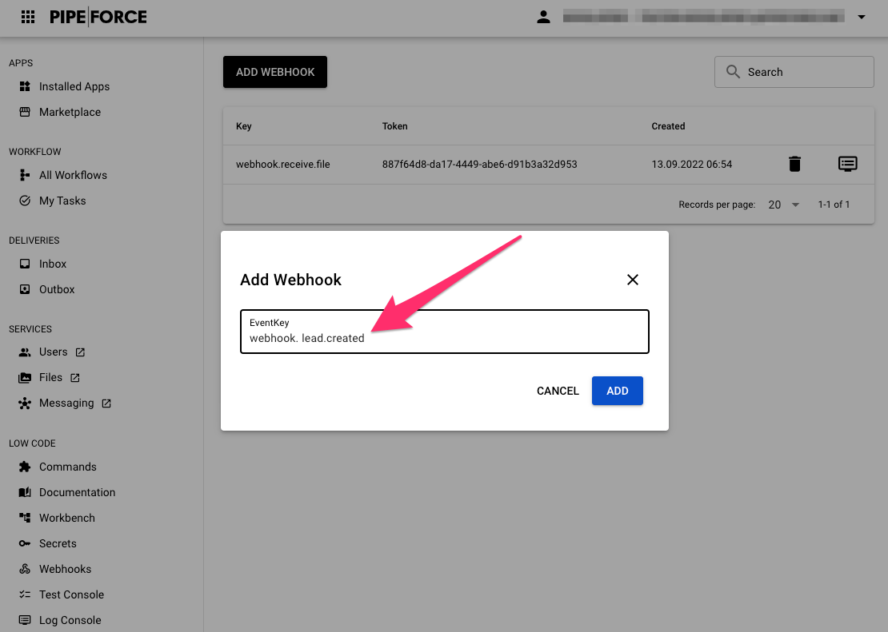
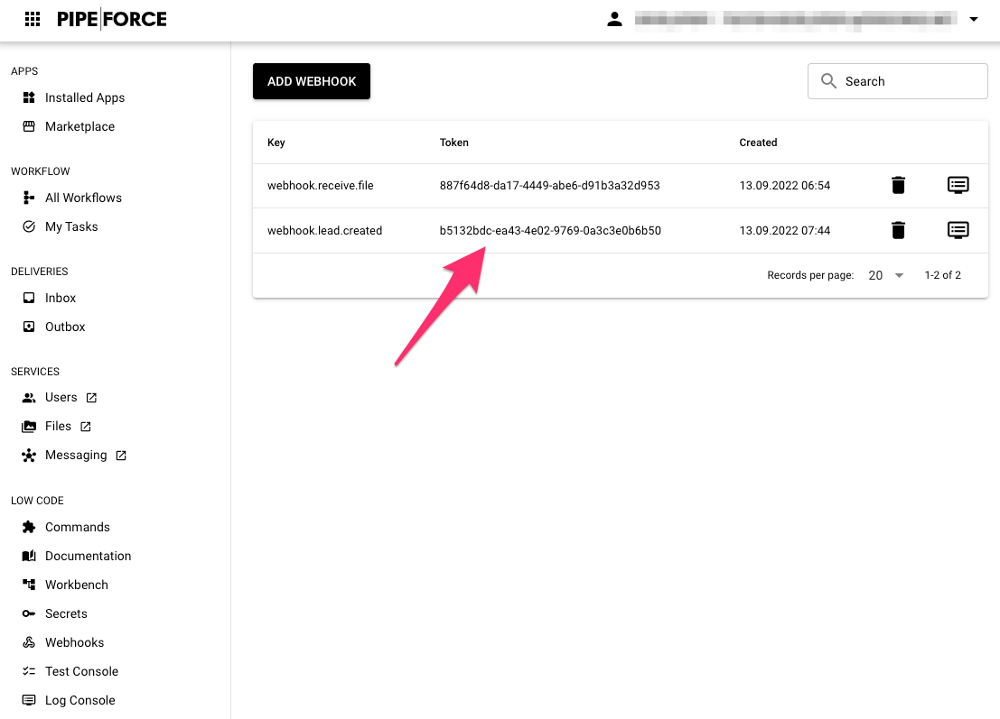

# Webhooks

<p class="theme-doc-version-badge badge badge--secondary">Since Version: 6.0</p>

A webhook is a unique HTTP URL in PIPEFORCE which can be called by an external system. In case the external system calls the webhook url, this will trigger any custom action inside PIPEFORCE.

This is a very effective and straight forward possibility to integrate external systems into PIPEFORCE using a push / listening approach, with a very low requirements barrier to the caller system. Nearly every modern system can be integrated this way.

The URL of such an webhook, which gets called by the external system, has a format similar to this:

```
https://hub-<your-domain>/api/v3/command/webhook.receive?token=<token>
```
:::info
*   Replace `<token>` by the token of your webhook. See below to get such an token.
*   The token is sometimes also referred to as the **uuid**, the unique id, of a webhook. 
*   It's also possible to place the `token` param as request header instead (recommended, because it is more secure).
:::

You can create and manage multiple **custom** webhooks and URLs each with individuall settings. When called, a webhook will be validated first and then an internal message gets produced, pipelines can listen to using [`event.listen`](/docs/api/commands#eventlisten-v1) or [`message.receive`](/docs/api/commands#messagereceive-v1). This way you can make sure, webhooks comply with a given set of rules before they will be passed across multiple pipelines,queues and optional microservices:



## Create a Webhook

Before some external service can call your webhook, you have to create and endpoint for it. You can create such a webhook using the command [`webhook.put`](/docs/api/commands#webhookput-v1). Here is an example using it in a pipeline:

```yaml
pipeline:
  - webhook.put:
      eventKey: "webhook.lead.created"
```

Or you can use the CLI to create the Webhook:

```
pi command webhook.put eventKey=webhook.lead.created
```

The possible parameters to create a webhook are:

- `eventKey` = The key, the pipelines will listen to (required).
- `payloadType` = (optional) What to do with the payload, before it is send to the messaging queues. Possible values are:
  - `raw` = The payload will be send without any conversion.
  - `base64` = The payload will be encoded to base64 (default).
  - `ignore` = No payload will be send with the webhook message even if specified in the request.
- `maxPayloadLength` = (optional) The max allowed number of bytes in the payload (body) of the webhook. If bigger, the webhook will be rejected. Default value is `512000` (500KB). The maximum possible value for this is `4194304` (4MB).

As `eventKey` define the internal unique name of the webhook. It's good practise that this name is lower case, grouped by periods and starts with prefix `webhook.`. The result after executing the [`webhook.put`](/docs/api/commands#webhookput-v1) command is a JSON document like this:

```json
{
  "eventKey": "webhook.lead.created",
  "webhookUrl": "https://hub-try.pipeforce.org/api/v3/webhook.receive?token=a29a4f16-989d-48c8-ab54-7b6150733ba1",
  "uuid": "a29a4f16-989d-48c8-ab54-7b6150733ba1",
  "payloadType": "base64",
  ...
}
```
The `uuid` (also called **token**) is the unique identifier of your webhook. Since it is very hard to guess this token, it is used to secure your webhook. The external services can use the `webhookUrl` in order to call your webhook.

:::warning
 * Make sure you keep the `uuid` (token) secure and only communicate it to the external partners via a secure channel.
 * Once created, **the uuid cannot be changed afterwards** since it is the link of external services to your internal actions.
:::

In case you're using the PIPEFORCE Developer Portal, you can create a Webhook with a few clicks:


Define an event key in the creation dialog and click "Add":



Finally, the Webhook gets listed and you can get its token from the list:



## Trigger a Webhook

After you have setup the Webhook successfully, it can be triggered (called) from the outside. To do so, send a GET or POST HTTP request to the webhook url which was returned when you created it:

`https://hub-try.pipeforce.org/api/v3/command/webhook.receive?token=abcdef`

:::warning
In order to secure the **token** in your url, you should always prefer a **HTTPS** connection between the two systems (which is by default always the case in PIPEFORCE), and send the `token` parameter in the body of a **POST** request, or as **HTTP Header** instead of a request parameter. PIPEFORCE supports all three methods. But it depends on the caller of the webhook, whether it is capable of supporting this.
:::

## Link a Webhook to a Pipeline

After you have successfully setup the webhook, any time the webhook url is triggered (called) from the outside, a new message is produced inside PIPEFORCE, which can then be consumed by any pipeline. To do so, use the [`event.listen`](/docs/api/commands#eventlisten-v1) or [`message.receive`](/docs/api/commands#messagereceive-v1) command to listen for such new event messages. Here’s an example which sends an email whenever a new lead was created using a webhook with the `eventKey` =`webhook.lead.created`:

```yaml
pipeline:
 - event.listen:
     eventKey: webhook.lead.created
 - mail:
     to: name@company.tld
     subject: "New lead was created!"
     body: "#{@convert.fromBase64(body.payload.origin)}"
```

The input body of the [`event.listen`](/docs/api/commands#eventlisten-v1) command is the payload of the event message submitted from the outside caller.

In case the sender has sent some payload in the body of the webhook request, this payload is made available for you by default as base64 encoded string in the `origin` field of the event. To access this data, you have to convert this value as shown in this example:

```
#{@convert.fromBase64(body.payload)}
```

In case the payload is a serializable format like a string or a JSON document for example, you can set `payloadHandling` to `raw` for the webhook. In this case, it is not needed to convert the payload from base64, so you can use it directly:

```yaml
pipeline:
 - event.listen:
     eventKey: webhook.lead.created
 - mail:
     to: name@company.tld
     subject: "New lead was created!"
     body: "#{body.payload}"
```

For security reasons, by default, the webhook pipeline is executed with very limited `anonymousUser` privileges. So, make sure that you use only commands in your pipeline which can be executed by this user. In case you need more privileges, you can use the [`iam.run.as`](/docs/api/commands#iamrunas-v1) command to switch to the privileges of the given user before executing the command. See the IAM portal for the permissions (or roles) of a given user. Also see [Groups, Roles, and Permissions](/docs/guides/security/permissions) for more details on user privileges / permissions.

:::caution Some words about security and webhooks

Since a Webhook triggers the execution of pipelines, they can be very powerful. This power also comes with **additional responsibility** for you, the app developer. Make sure you have sufficient security testings in place, and you have secured your webhook pipelines accordingly.

:::

## Show existing Webhooks

To list all existing webhooks, you can use the [`webhook.get`](/docs/api/commands#webhookget-v1) command:

```
pi command webhook.get
```

You will see a JSON / YAML list with details about all existing webhooks.

In order to get the details of a single webhook, use the [`webhook.get`](/docs/api/commands#webhookget-v1) with the param `uuid`, where uuid is the token of the webhook you want to list:

```
pi command webhook.get uuid=<yourWebhookUuid>
```

You can also list all existing Webhooks in the Portal:


## Edit a Webhook

In order to edit an existing webhook, you can use the [`webhook.put`](/docs/api/commands#webhookput-v1) command, and set the uuid (= token) of the webhook to edit. For example:

```
pi command webhook.put uuid=abcdef eventKey=webhook.changed.key
```

## Delete a Webhook

In order to delete an existing webhook, you can use the command [`webhook.delete`](/docs/api/commands#webhookdelete-v1):

```
pi command webhook.delete uuid=abcdef
```

And then, set the uuid of the webhook you want to delete.

You can also delete a Webhook by using the Portal in the "Webhooks" section.

## Receiving Files via Webhook

It is also possible to send files as a playload with a webhook. To do so, execute the request as multipart POST with the body formatted as `multipart/form-data`. For example:

```
POST /api/v3/command/webhook.receive HTTP/1.1 
token: abcdefgh
Host: hub-<your-domain>
Content-Type: multipart/form-data;boundary="boundary" 

--boundary 
Content-Disposition: form-data; name="file"; filename="fileA.pdf" 

CONTENT OF FILE fileA.pdf GOES HERE...
--boundary 
Content-Disposition: form-data; name="file"; filename="fileB.pdf" 

CONTENT OF FILE fileB.pdf GOES HERE...
--boundary--
```

:::note
Make sure to set the `name` parameter to `file` for each `Content-Disposition` part. Otherwise, the backend will ignore the part.
:::

:::warning
The maximum length of a webhook payload is limited to 4MB overall! So if you need to send a bigger payload consider to use one of the authorized commands instead or the secure delivery feature.
::: 

More information about multipart POST requests can be found here: [https://developer.mozilla.org/en-US/docs/Web/HTTP/Methods/POST](https://developer.mozilla.org/en-US/docs/Web/HTTP/Methods/POST)

## Logging and Tracing of Webhooks

Each webhook execution will be logged using the last 6 chars of the uuid/token (shortened for for security and performance reasons) in combination with a random traceId. For example, a webhook with a uuid/token like this:

```
ba4825b6-6718-42f3-a400-ce08a16936bd
```

Will result in a log entry like this:

```
Webhook [6936bd:efg35ee]: OK
```

The left part before the colon `:` is the shortened webhook uuid/token. The right part is a random id generated newly for each webhook call. So multiple calls of same webhook can be monitored separately.

This traceId is also returned to the caller of the webhook by using the command [`webhook.receive`](/docs/api/commands#webhookreceive-v1) so he can refer to this exact call when required: 

```json
{
  "status": "OK",
  "traceId": "6936bd:efg35ee"
}
```

Additionally, it will also be set to the initial message sent by the webhook call:

```json
{
  "traceId": "6936bd:efg35ee",
  ... 
}
```

This way you can trace a webhook all the way across different queues, pipelines and microservices.

For example, if you would like to follow all traces of a given webhook, search for the last 6 characters of the webhook uuid/token like `6936bd` in all logs and you should find all traces of a given webbhook ordered by the time of their executions.

If you would like to follow only a certain webhook call instead, use the fully qualified traceId like `6936bd:efg35ee` for example and search for it. You should find all traces related to exactly this single webhook call.

:::tip Note
Note that the traceId is not 100% collision free. In order to avoid monitoring collisions with the random traceId, you should combine any monitoring query with a time range filter. Especially in case you're expecting a huge amount of requests for a given Webhook.
:::

## Report an Issue
:::tip Your help is needed!
In case you're missing something on this page, you found an error or you have an idea for improvement, please [click here to create a new issue](https://github.com/pipeforce/pipeforce.github.io/issues/new). Another way to contribute is, to click **Edit this page** below and directly add your changes in GitHub. Many thanks for your contribution in order to improve PIPEFORCE!
:::