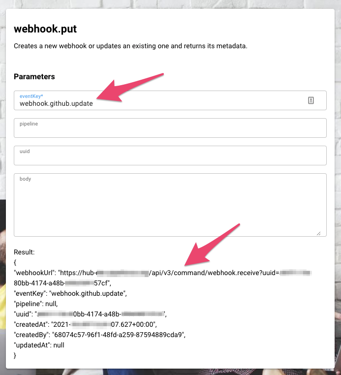

# Webhooks

A webhook is a unique url pointing from outside to PIPEFORCE. When called, produces an internal event message which in turn can be consumed by a pipeline using the command `event.listen`.

Note: If an url in this article contains `<NS>`, replace it by the namespace of your PIPE|FORCE instance.

# Quick guide to create a webhook

1.  Create a new incoming webhook endpoint by using the command `webhook.put`.
    
2.  Set the `eventKey` to the name of an event to be fired internally every time after this webhook has been received.
    
3.  **Remember the url or uuid of the webhook (is returned after it was created).**
    
4.  Create a pipeline which listens for the `eventKey` fired by the webhook using the `event.listen` command and store it to the property store (this automatically triggers the registration of the listener). This pipeline then will be executed every time this webhook is called.
    
5.  To call a webhook from outside use the command `webhook.receive` and the webhook uuid, example:  
    `https://hub-<NS>.pipeforce.net/api/v3/command/webhook.receive?uuid=<uuid>`
    
6.  To trigger a webhook from inside a pipeline to an external system, use the command `webhook.send`.
    

# Incoming webhook

An incoming webhook is an url endpoint created inside PIPEFORCE which can be called by an external system to trigger a pipeline inside PIPEFORCE. The url of such an incoming webhook has a format similar to this:

```
https://hub-<NS>.pipeforce.net/api/v3/command/webhook.receive?uuid=<uuid>
```

Whereas:

*   Replace `<NS>` by your namespace.
    
*   Replace `<uuid>` by the UUID of your webhook.
    

## Setup incoming webhook via CLI

1.  In order to create and setup a new incoming webhook, you can simply use the command `webhook.put` and the CLI:
    
    ```
    pi command webhook.put eventKey=<ID>
    ```
    
2.  Replace `<ID>` by the name of the event which must be fired when this webhook gets triggered.  
    Note: Its good practise to name event keys always lower case and separate it in groups separated by a dot with `webhook.` as the root group. For example:
    
    ```
    pi command webhook.put eventKey=webhook.github.update
    ```
    
3.  After you have executed this command, a new webhook was created and the details about it will be returned as a JSON or YAML which looks similar to this:
    
    ```
    {
      "eventKey": "salesforce.lead.created",
      "webhookUrl": "https://hub-<NS>.pipeforce.net/api/v3/webhook.receive?uuid=885d...",
      "uuid": "885d...",
      ...
    }
    ```
    

Since a webhook is secured by its uuid which is a secret and hard to detect, make sure the **webhookUrl** is kept secure between the two systems.

**Note: PIPEFORCE scans regularly the internet for this secret and if it finds it, the according webhooks will be deactivated for security reasons. So never make it public available!**

## Setup incoming webhook via portal

Only: ENTERPRISE CORPORATE

You can also use the command form LOW CODE → Commands → `webhook.put` in the portal to create a webhook without the CLI:



## Trigger incoming webhook message from outside

After you have setup successfully the webhook, it can be triggered (called) from outside.

To do so, send a GET or POST HTTP request to the webhook url which was returned when you created it:

`https://hub-<NS>.pipeforce.net/api/v3/command/webhook.receive?uuid=abcdef`

In order to secure the **webhookUrl** you should always prefer a **HTTPS connection** between the two systems and send the uuid parameter in the body of a **POST** request instead of GET. PIPEFORCE supports both methods. But it mainly depends on the caller of the webhook whether this external system supports **POST** calls.

## Consuming incoming webhook

After you have successfully setup the webhook, any time the webhook url is called from outside, a new message is produced internally inside PIPEFORCE which then can be consumed by any pipeline. To do so, use the `event.listen` command to listen for such new event messages. Here’s an example which sends an email whenever a new lead in Salesforce was created using a webhook with the `eventKey` =`webhook.salesforce.lead.created`:

```
pipeline:
 - event.listen:
     eventKey: webhook.salesforce.lead.created
 - mail:
     to: name@company.tld
     subject: "New lead was created!"
     body: "#{convert.fromBase64(body.origin)}"
```

The input body of the `event.listen` command is the payload of the event message submitted from the outside caller.

In case the sender has sent some payload in the body of the webhook request, this payload is made available for you as base64 encoded string in the `origin` field of the event. To access this data you have to convert this value as shown in this example:

```
#{convert.fromBase64(body.origin)}
```

For security reasons, by default the webhook pipeline is executed with very limited `anonymousUser` privileges. So make sure that you use only commands in your pipeline which can be executed by this user. In case you need more privileges, you can use the `iam.run.as` command to switch to the privileges of the given user before executing the command. See the IAM portal for the permissions (=roles) of a given user. Also see [Groups, Roles, Permissions](https://pipeforce.github.io/docs/guides/permissions) for more details on user privileges / permissions.

**Some words about security and webhooks**

Since webhooks allow to execute pipelines, they can be very powerful. This power also comes with **additional responsibility** to you, the pipeline engineer. Make sure you have sufficient security testings in place and you have secured your webhook pipelines accordingly.

## List existing incoming webhooks via CLI

To list all existing webhooks, you can use the `webhook.get` command:

```
pi command webhook.get
```

You will get a JSON / YAML list with details about all existing webhooks.

In order to get the details of a single webhook, use the `webhook.get` with the param `uuid` whereas uuid is the id of the webhook you want to list:

```
pi command webhook.get uuid=<yourWebhookUuid>
```

## List existing incoming webhooks via portal

Only: ENTERPRISE CORPORATE

In the portal go to LOW CODE → Commands → webhook.get and execute the form:


## Edit or delete incoming webhook via CLI

In order to edit an existing webhook, you can use the `webhook.put` command and set the uuid of the webhook to edit. For example:

```
pi command webhook.put uuid=abcdef eventKey=webhook.changed.key
```

In order to delete an existing webhook, you can use the command `webhook.delete`:

```
pi command webhook.delete uuid=abcdef
```

And then set the uuid of the webhook you want to delete.

## Edit or delete incoming webhook via portal

Only: ENTERPRISE CORPORATE

To edit or delete a webhook using the portal, go to Commands → `webhook.put` or Commands -> `webhook.delete` and execute the form accordingly.

## Receiving multiple files with incoming webhook

Its also possible to send a playload like multiple files with a webhook. To do so, execute the request as multipart POST with the body formatted as `multipart/form-data`. For example:

```
POST /api/v3/command/webhook.receive?uuid=abcdef HTTP/1.1 
Host: hub-<NS>.pipefore.net
Content-Type: multipart/form-data;boundary="boundary" 

--boundary 
Content-Disposition: form-data; name="file"; filename="fileA.pdf" 

<CONTENT FILE fileA.pdf GOES HERE...>
--boundary 
Content-Disposition: form-data; name="file"; filename="fileB.pdf" 

<CONTENT FILE fileB.pdf GOES HERE...>
--boundary--
```

More information about multipart POST requests can be for example found here: [https://developer.mozilla.org/en-US/docs/Web/HTTP/Methods/POST](https://developer.mozilla.org/en-US/docs/Web/HTTP/Methods/POST)

# Outgoing webhook

An outgoing webhook is a url to be called from inside a pipeline in order to trigger something at an external system.

## Send outgoing webhook

To send a webhook to an external system, you can use the command `webhook.send` as this pipeline example shows:

```
pipeline:
  - webhook.send:
      url: https://hostname/webhook/id
      message: "{\"text\": \"hello world\"}"
```

When this pipeline is called it sends the `message` (must be a valid JSON string) as POST body to the given `url`.

How the webhook url looks like and what format the webhook supports as message depends on the target system. Consult its documentation for more details.

Note: The same can also be reached using the `http.get` and `http.post` commands.
