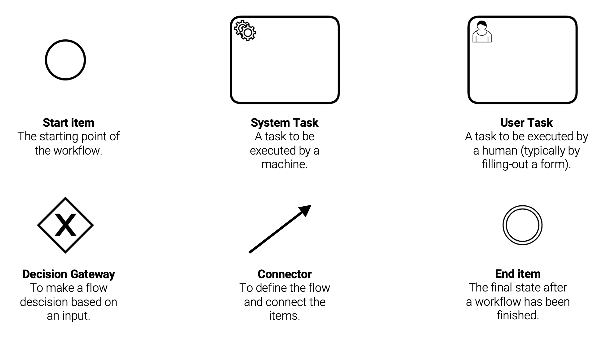
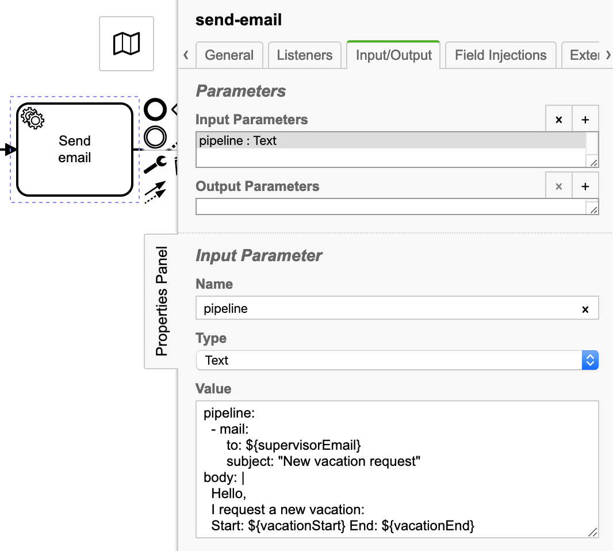
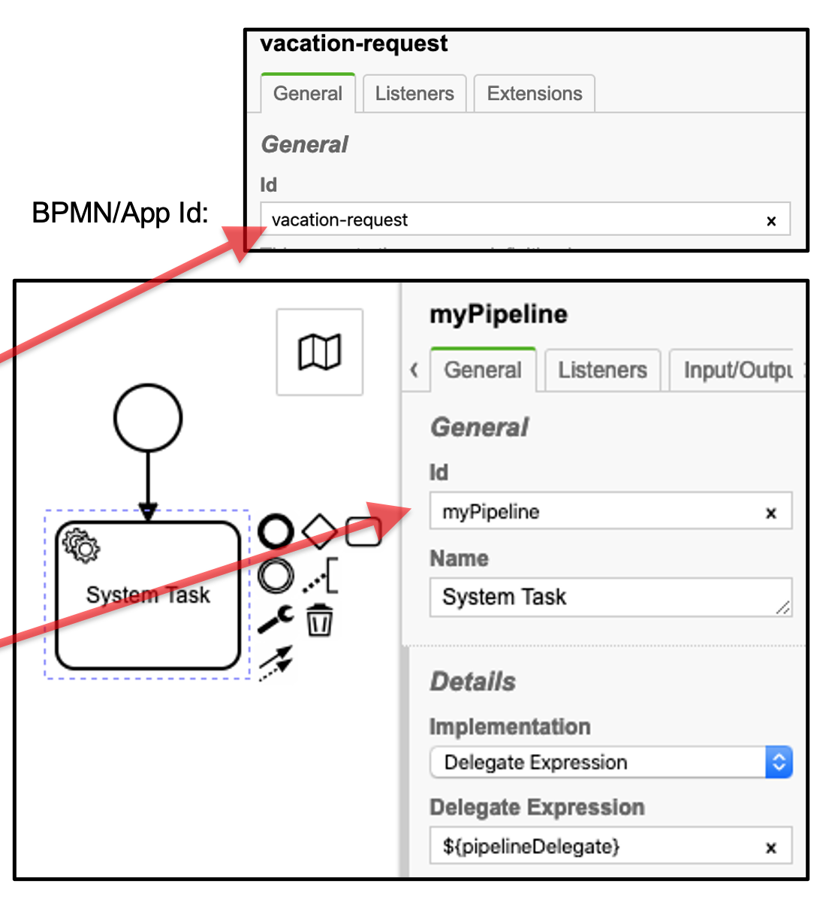

A workflow in PIPEFORCE is a stateful business process, where one or more humans are involved. Workflows can be modelled using a graphical interface and they can optionally trigger the execution of pipelines.

## Workflow design with BPMN

In PIPEFORCE, workflows can be designed using BPMN (Business Process Model and Notation), which is a worldwide ISO standardization to describe business processes in a formalized (graphical) way. Also, most non-technicals can understand BPMN diagrams. If you’re not familiar with BPMN so far, we highly recommend you to learn more about it before you dive deeper into this chapter. Here you can find a first introduction on Wikipedia: [https://en.wikipedia.org/wiki/Business\_Process\_Model\_and\_Notation](https://en.wikipedia.org/wiki/Business_Process_Model_and_Notation).

Below is a very simple example of such a BPMN diagram, which shows a vacation approval process where the employee must fill-out a request form, and the supervisor can then approve or decline the vacation request:


BPMN digrams are designed using a BPMN designer tool. You can use your own local software to design such a diagram and then upload them to PIPEFORCE, or you can use the built-in online BPMN designer from PIPEFORCE. With the latter, you can:

*   Create BPMN diagrams online in your web browser and save them
    
*   Discuss a BPMN diagram with your team
    
*   Link BPMN tasks with pipeline
    
*   Directly execute and review BPMN diagrams as workflows
    

In order to draw a BPMN diagram, the most important elements are these, that you should be aware of:



## User Task

The user task is the part of a workflow in case an input from a user is required. The workflow waits at this point until the user has finished this task by clicking “Complete”.

The input of the user is typically given by filling-out a form.

The form can be defined using the “Forms” tab in the modeller.

Note: The input in the form fields have a length limit of 4000 characters 


User tasks can also be assigned in the workflow to specific users and user groups, by using the general tab. This can be done in the "Assignment" section below the "Description" field. You have to fill out these fields for this: Assignee, Candidate Users, and Candidate Groups. Here, multiple users and user groups can also be given by adding commmas in between their user-names and group-names respectively. 


## System Task

If a task in the workflow must be executed by a “machine”, for example, sending an email, doing a conversion, or creating a new dataset, typically a System Task is used for this.

By default, a pipeline is used to execute such a system task.

To configure a system task to execute such a pipeline, you need to make sure, that you have these settings in place:

1.  The task type is set to a System Task.
    
2.  The Implementation is set to `Delegate Expression`.
    
3.  The Delegate Expression is set to `${pipelineDelegate}`.
    


To execute a pipeline, you have two configuration options:

1.  Calling a pipeline **embedded** into the User task as a parameter.
    
2.  Calling a pipeline **stored in the property store**.
    

### Call an embedded pipeline

In order to trigger an embedded pipeline whenever the system task is executed, you can define a new input parameter with the name `pipeline` of type `Text`, and add the pipeline directly as a value:



### Call a pipeline stored in the property store

Lets assume, a pipeline is stored in the property store under this key path:

```bash
global/app/vacation-request/pipeline/myPipeline
```

Then, you need to configure your System Task like this to automatically pick-up and execute this pipeline, in case the system task is executed by the workflow:

1.  Make sure the Id of the BPMN workflow has the same name as the app: `vacation-request`.
    
2.  Make sure the Id of the System Task, which should execute the pipeline, has the same name as the pipeline: `myPipeline`.
    
3.  **Do not** define any pipeline parameter in the System Task.
    

When executed, the System Task automatically searches for a pipeline in the given app folder and executes it.



## How to start a workflow in PIPEFORCE?

The design and execution of a workflow in PIPEFORCE is always a 3-steps task:

1.  **Design** the workflow in the BPMN modeler, and save the result. When you work locally with the pi tool, save it at: `app/myApp/workflow/myWorkflow.bpmn`.
    
2.  **Deploy** by pushing the **DEPLOY** button in the online designer, or upload the BPMN file using the pi tool by calling the command: `pi publish`.
    
3.  **Execute** the workflow using the command `workflow.start` in a pipeline, and set the Id of your process as the parameter key (see BPMN file). You can use, for example, the pi tool to start a workflow:  
    `pi uri ”workflow.start?key=<ID>”`
    

Then, you can login to your portal at `https://<NAMESPACE>.pipeforce.net`, and complete the workflow.


## How to create a trigger pipeline

A pipeline, executed when an app is started, is called a trigger pipeline. Each pipeline is written in YAML format.

1.	This pipeline listens to the new form entry.
2.  Sets the variables
3.	Maps the form data to workflow model (workflow data).
4.	Perform different operations on file / directories if needed.
5.	Save the data in variables,  which we can use later in our next steps / pipelines.

Let's create a simple trigger pipeline:

### 1.	Headers

The headers section is optional in our trigger pipeline. It is used to configure any global variable which is used to execute the pipeline e.g. description of the pipeline, auto execute pipelines, manage versions, user authorization, etc. Headers can be used in pipeline like following: 

```yaml
headers:
  description: "A010 listens for a new form entry, maps form data to workflow model + starts the workflow"
```

Note: To get more details regarding this feature, please see: [Headers](../../api/headers)

### 2.	Vars

This section is also optional in our trigger pipeline. This helps to initialize the variables and set those variables later in the other steps in the same pipeline.

```yaml
vars:
  workflowModelInstanceKey: null # To be set by the workflow when calling this pipeline
  workflowModel: "#{@property.lazy(vars.workflowModelInstanceKey)}"
```

### 3.	Pipeline

Pipeline section is mandatory for execution of any application. It includes all the commands which are executed in the sequential order. We use the Pipeline Expression Language (PEL) to write the expressions in pipeline. Scope of pipeline is defined as follows: 


1.	Listen to events: 

       Every time an event is fired after matching the given criteria, all commands after the event.listen, will be executed. It executes commands like creation of property, copy property, delete property, error handling on login, etc. For example, creation of a new property store every time the pipeline is executed.

       ```yaml
       pipeline:
         - event.listen:
             key: "property.created"
             filter: "#{body.target.key.contains('global/app/travelexpense/object.travelexpense/v1/instance')}"
       ```

       Note: To get more details regarding this feature, please see: [Events](../../api/events)

2.	Capture the data: 

       Data, which is entered in start form entry, is captured and converted into the required format e.g. converting the form values (object) into a map.    

       ```yaml
       pipeline:
         - event.listen:
             key: "property.created"
             filter: "#{body.target.key.contains('global/app/travelexpense/object.travelexpense/v1/instance')}"
         - set.var:
             key: "formData"
             value: "#{@convert.toMap(body.target.value)}"
       ```                                                                                
       Note: To get more details regarding this feature, please see: [Convert](../../api/functions#convert)
	
3.	Initialize the variables: Set the values of variables and update / save them e.g. 

       ```yaml
       pipeline:
         - event.listen:
             key: "property.created"
             filter: "#{body.target.key.contains('global/app/travelexpense/object.travelexpense/v1/instance')}"
         - set:
             value: "#{@user.firstName()?: ''}"
             output: "#{vars.creatorFirstName}"
         - set:
             value: "#{@user.lastName()?: ''}"
             output: "#{vars.creatorLastName}"     
       ```

4.	Manage attachments: It helps to manage files / attachments uploaded from the entry-form and save them to a particular path / directory. Here is the bifurcated example to do this task:

    1. Create Directory / Folder
       
       ```yaml
       vars:
         basePath: "global/app/appname/data"

       pipeline:
         - iam.run.as:
             username: "systemuser"
         - drive.mkdir:
             path: "#{vars.basePath}"
             recurse: "true"     
        ```

        Note: To get more details regarding this feature, please see: [drive.archive.save](../../api/commands#drivearchivesave-v1)

        Here, to create a directory, we need to run the pipeline as the system user, because only that user has the folder creation rights.

    2. Get Attachment and Get Content

        Get file from entry-form and save into a variable

        ```yaml
        - set.var:
            key: "invoiceFileName"
            value: "#{vars.formData.formAttachment.filename}"
        ```

        Get content of file

        ```yaml
        - property.attachment.content:
            key: "#{body.target.key}"
            value: "#{vars.formData.formAttachment.content}"
        ``` 

        Note: To get more details regarding this feature, please see: [property.attachment.chunk.get](../../api/commands#propertyattachmentchunkget-v1) 

    3. Save the file into drive

        ```yaml
        - drive.save:
            path: "global/app/appname/data/#{vars.FileName}"
        ``` 

5.	Create roles or groups : You can also create your own role or group of roles. e.g. 

    ```yaml
    pipeline:
      - iam.run.as:
          username: "systemuser"
      - iam.role.create:
          name: "CAN_APP_APPNAME"
    ``` 
  
Roles / Groups are created only by running the pipeline with system user only.

Note: To get more details regarding this feature, please see: [property.attachment.chunk.get](../../api/commands#iamgroupcreate-v1)
        
6.	Give permissions for accessing files to a role or a group.

    ```yaml
    pipeline:
      - iam.run.as:
          username: "systemuser"
      - drive.share:
          to: "invoice-controller"
          type: "group"
          path: "global/app/accountspayable"
          permission: 1
    ``` 

7.	Evaluate any expressions.

    ```yaml
      - eval:
          expr: "#{body.name = 'assignedvalue'}"
    ``` 

### 4.	Workflow Model

Workflow model enables you to map your data from entry-form to your application workflow. It allows us to use the inputted data throughout the application. The workflow model can be defined as follows: 

```yaml
- workflow.model:
    mappings: "
    uuid: vars.uuid,
    createrFirstName: vars.createrFirstName,
    createrLastName: vars.createrLastName,
    createrEmail: vars.createrEmail,
    createrUsername: vars.createrUsername,
    createrDate: vars.createrDate
    "
    output: "#{vars.workflowModel}"      
``` 

Here, we define all the variables in key:value pair and store it in our workflow model.

Note: To get more details regarding this feature please see: [Workflow Model](../../api/commands#workflowmodel-v1)

### 5.	Save Workflow Model Into Schema

It enables you to save the entry-form data into a schema. Schema is a file where we define all the fields that are there in entry-form with their data types. The file is in JSON format. e.g. 

```yaml
- property.schema.put:
    key: "global/app/appname/object/workflowmodel/v1/instance/#{vars.uuid}"
    value: "#{vars.workflowModel}"
    type: "application/json"      
``` 

Note: To get more details regarding this feature, please see: [property.schema.put](../../api/commands#propertyschemaput-v1)

### 6.	Start Workflow

In this section, we define those variables which we process and use them in the subsequent steps. We use workflow.start to start processing the fields from the entry-form and map them in key:value pair and then use later in different pipelines  e.g.

```yaml
- workflow.start:
    key: "appname_V1"
    businessKey: "#{vars.uuid}"
    workflowModelInstanceKey: "global/app/appname/object/workflowmodel/v1/instance/#{vars.uuid}"
    variables: "#{{
    'fname': (vars.formDatap['firstname']),
    'email': @user.email(),
    'account': (vars.formData['account']),
    'comment': (vars.formData['comment'])
    }}"
- body.delete:
``` 

Note: To get more details regarding this feature, please see: [workflow.start](../../api/commands#workflowstart-v1)

You can access these process variables in the next pipeline as following: 

vars.fname,
vars.email,
vars.account,
vars.comment


