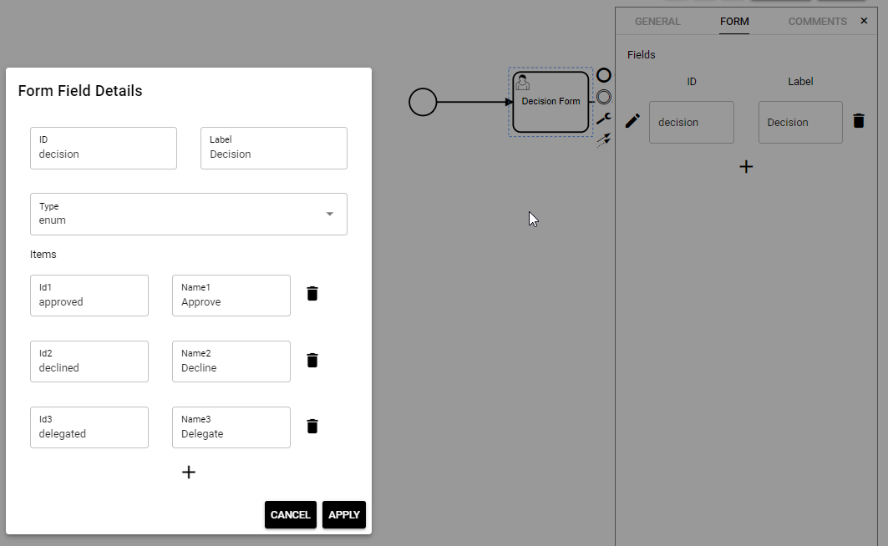
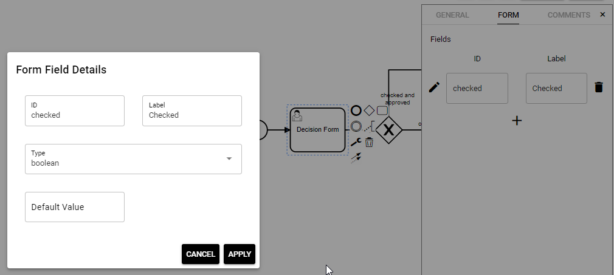
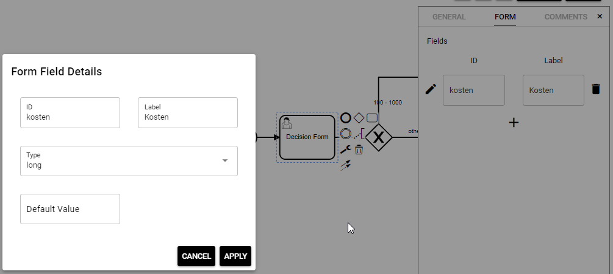

# Gateways

A gateway in BPMN is a branch of the workflow. Depending on a condition, the flow of the process can branch into different directions.

## Where to define gateways conditions?

In this example, depending on whether the supervisor has approved or declined the vacation request, the workflow should execute the “Send declined email” or the “Send approved email” task. For this, we need to define rules on the gateway edges:

1.  To define the rule for the decline gateway, select the **declined** edge of the gateway and fill-in this condition: `${vacationApproved == false}`:  
    
    
2.  This makes sure that this branch is executed in case the supervisor set `vacationApproved` to false in the task form.
    
3.  Repeat these steps for the task “Send approved email”, and set the condition to  
    `${vacationApproved == true}`.
    
4.  Click `SAVE` to save the current state of the BPMN workflow.
    

## How to design gateways

The gateway design is defined by a specific expression language named _JUEL_. Below, you will find that the most important operators are:

*   **Arithmetic**: `+`, `-` (binary), `*`, `/` and `div`, `%` and `mod`, `-` (unary)
    
*   **Logical**: `and`, `&&`, `or`, `||`, `not`, `!`
    
*   **Relational**: `==`, `eq`, `!=`, `ne`, `<`, `lt`, `>`, `gt`, `<=`, `ge`, `>=`, `le`. Comparisons can be made against other values, or against boolean, string, integer, or floating point literals.
    
*   **Empty**: The `empty` operator is a prefix operation, that can be used to determine whether a value is `null` or empty.
    
*   **Conditional**: `A ? B : C`. Evaluate `B` or `C`, depending on the result of the evaluation of `A`.
    

For more details see [https://docs.oracle.com/javaee/5/tutorial/doc/bnahq.html](https://docs.oracle.com/javaee/5/tutorial/doc/bnahq.html)

## Examples of gateway conditions

### Condition for dropdown

*   Condition refers to a field named “decision”
    
*   Field provides a dropdown list for the user (Approve, Decline, or Delegate)  
    
    
*   Gateway should represent the “Approve” selection
    
*   Condition looks like this:
    
    

### Condition for checkbox

*   Condition refers to a field named “checked”
    
*   Field provides a checkbox  
    
    
*   Gateway should represent the situation that the checkbox is ticked
    
*   Condition looks like this:  
    
    

${ checked } works as well. Similarly, ${ !checked } can be used in place of ${ checked == false }

### Condition for value

*   Condition refers to a field named “Kosten”  
    
    
*   Field provides the option to type in numbers
    
*   Gateway should represent the situation that the value is > 100, but < 1000
    
*   Condition looks like this:  
    
    

### Multiple conditions

*   Condition refers to the fields: “decision” and “checked”
    
*   Field “decision” provides a dropdown list for the user (Approve, Decline, or Delegate)
    
*   Field “checked” provides a checkbox
    
*   Gateway should represent the situation that:
    
    *   “Approved” is selected from dropdown
        
    *   Tick is set for “checked”
        
*   Condition looks like this:  
    
    

## Report an Issue
:::tip Your help is needed!
In case you're missing something on this page, you found an error or you have an idea for improvement, please [click here to create a new issue](https://github.com/pipeforce/pipeforce.github.io/issues/new). Another way to contribute is, to click **Edit this page** below and directly add your changes in GitHub. Many thanks for your contribution in order to improve PIPEFORCE!
:::
