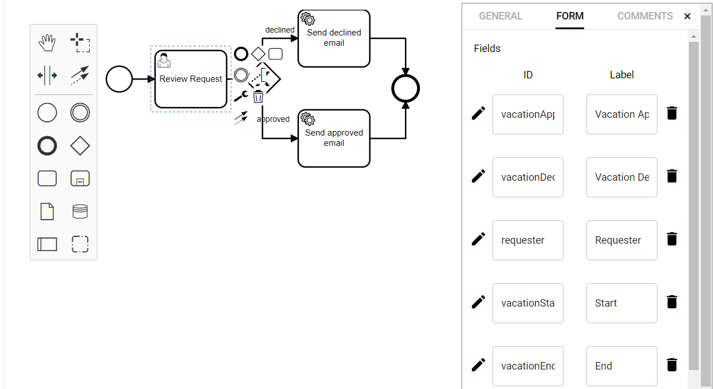

# Emails

## 1 - Create the email pipeline

1.  Login to the portal https://**NAMESPACE**.pipeforce.net
    
2.  Navigate to LOW CODE → Workbench
    
3.  Select the node of your app or [create a new one](../../tutorials/create-app).
    
4.  Click the plus icon at the top of the tree.
    
5.  The new property view opens:
    
    1.  As property key, use: `global/app/vacation-request/pipeline/myPipeline`
        
    2.  As mime type, use: `application/yaml; type=pipeline`
        
6.  Click `SAVE`
    
7.  The new property has been created, and the content editor was opened for you.
    
8.  Now copy and paste this content into the editor, and overwrite any existing data there by this:
    
    ```yaml
    pipeline:
      - mail.send:
          to: "your@domain.tld"
          subject: "Test email"
          message: "This is a simple email, sent from a pipeline."
    ```
    
9.  Replace `your@domain.tld` by your real email address.
    
10.  Click `SAVE` and then `RUN` to execute the pipeline.
    
11.  After a while, you should have received an email similar to this, decorated with the default layout:  
    
    

## 2 - Send a simple email using workflow

Lets assume, a pipeline is stored in the property store under this key path:

```bash
global/app/vacation-request/pipeline/myPipeline
```

Then, you need to configure your System Task like this to automatically pick-up and execute this pipeline, in case the system task is executed by the workflow:

1.  Make sure the Id of the BPMN workflow has the same name as the app: `vacation-request`.
    
2.  Make sure the Id of the System Task, which should execute the pipeline, has the same name as the pipeline: `myPipeline`.
    
3.  **Do not** define any pipeline parameter in the System Task.
    

When executed, the System Task automatically searches for a pipeline in the given app folder and executes it.


## 3 - Add an attachment

In this step, you will learn how to add attachments to such an email pipeline. For this, we will upload a PDF document to drive first, which will be used as an attachment.

1.  Login to the portal https://**NAMESPACE**.pipeforce.net
    
2.  Open Files / Drive.
    
3.  Upload a file with name `invoice.pdf` into the root folder.
    
4.  Change your pipeline `send-email` to this:
    
    ```yaml
    pipeline:
      - drive.read:
          path: "invoice.pdf"
      - mail.send:
          to: "your@domain.tld"
          subject: "Test email"
          message: "This is a simple email, sent from a pipeline."
          attachments: "#{body}"
    ```
    
5.  As you can see, we added the command `drive.read` to read the PDF from drive into the body of the pipeline (which happens automatically for you). Additionally, we added the parameter `attachments` to the `mail.send` command. As value, the PEL expression `#{body}` is used. This expression points to the body of the current pipeline where the PDF document was loaded to. You can add multiple attachments by adding them separated by a comma. You can also point to resources inside the property store by using the uri format `uri:property:path/to/resource`.
    
6.  Execute it on workflow.
    
7.  After a while, you should receive again an email, but this time with the PDF as an attachment
    
8.  Done.

## 4 - Set dynamic text in emails

Sometimes it is necessary to put dynamic text to emails. The easiest way in PIPEFORCE to do so, is by using the [Pipeline Expression Language (PEL)](../../api/pel). In this step, we will simply add the currently logged-in user as the from email field, so that the recipient can easily reply to you with the current date and time in the email text using PEL:

1.  Change your pipeline send-email to this:
    
    ```yaml
    pipeline:
      - drive.read:
          path: "invoice.pdf"
      - mail.send:
          to: "your@domain.tld"
          replyTo: "#{@user.email()}"
          fromName: "#{@user.displayName()}"
          subject: "Test email"
          message: "This is a simple email, sent on #{@date.now('dd.MM.YY, HH:mm')}"
          attachments: "#{body}"
    ```
    
2.  As you can see, we did several changes in the pipeline:
    
    1.  We added the parameter `replyTo: "#{@user.email()}"`. Its value will be replaced by the email address of the currently logged-in user, so the recipient can simply press the reply button to reply to this email.
        
    2.  We added the parameter `fromName: "#{@user.displayName()}"`. Its value will be replaced by the display name of the currently logged in user.
        
    3.  Finally, we added the PEL expression `#{@date.now('dd.MM.YY, HH:mm')}` to the email message, in order to display the current date and time dynamically inside the email.
        
3.  Click `SAVE` and then `RUN`.
    
4.  After a while you should receive an email similar to this:  
    
    

5.  Done.

## 5 - Use dynamic email receiver

Currently, the email is sent always to the address you have entered in the pipeline. However, in case the form is deployed for multiple users, the emails should be sent always to the person who submitted the vacation request (i.e. Requester). To enhance the workflow accordingly, follow these steps:

Your new workflow should look like this (go ahead and add the respective tasks and form fields in the workflow):




In your trigger pipeline, you can directly add the values you would like to define as process variables. With those process variables, you can work in subsequent steps of the workflow. In our example, we define the logged in user, who is starting the workflow as the Requester. To do so, follow these steps:

1.  Go to LOW CODE → Workbench and create your trigger pipeline `global/app/vacation-request/pipeline/trigger-vacation-request`.
    
2.  Copy and paste this pipeline snippet to the pipeline (replace any existing content):
    

```yaml
pipeline:

  - event.listen:
      key: "property.created"
      filter: "#{body.target.key.contains('global/app/YOUR_APP/object/vacationrequest/v1/instance')}"

  - set.var:
      key: "formData"
      value: "#{@property.lazy(body.target.key)}"

  - workflow.start:
      key: "YOUR_APP_vacation-request"
      workflowModelInstanceKey: "#{body.target.key}"
      variables: "#{{
        'vacationStartDate': @date.parseToInstant(vars.formData['vacationStartDate']),
        'vacationEndDate': @date.parseToInstant(vars.formData['vacationEndDate']),
        'requester': @user.email()
      }}"
```

As you can see at the bottom of the pipeline, in addition to the `vacation start date` and the `vacation end date`, you have now defined a new process variable `requester`, and matched the email of the user who started the workflow to this variable.

### Modify your email pipeline

You can now modify your email pipelines to sent notifications about approved and declined emails accordingly:

1.  Go to LOW CODE → Workbench and create your approved email pipeline `global/app/vacation-request/pipeline/send-approved-email`.
    
2.  Copy and paste this pipeline snippet to the pipeline (replace any existing content):
    

```yaml
pipeline:
 - mail.send:
    to: "#{vars.requester}"
    subject: "Vacation Request Approved"
    message: |
        Hello, your vacation request from #{@date.format(vars.vacationStartDate, 'dd/MM/YYYY')} 
        to #{@date.format(vars.vacationEndDate, 'dd/MM/YYYY')} was approved.
```

Adapt your declined email in the same way.

1.  Go to LOW CODE → Workbench and create your approved email pipeline `global/app/YOUR_APP/pipeline/send-declined-email`
    
2.  Copy and paste this pipeline snippet to the pipeline (replace any existing content):
    

```yaml
pipeline:
 - mail.send:
    to: "#{vars.requester}"
    subject: "Vacation Request Declined"
    message: |
        Hello, your vacation request from #{@date.format(vars.vacationStartDate, 'dd/MM/YYYY')} 
        to #{@date.format(vars.vacationEndDate, 'dd/MM/YYYY')} was declined.
```

The new task form of the Reviewer should now look like this:


If you now start the workflow, you are able to see the requester email in the task form of the Reviewer.

For more guide on email pipelines and templates, please see: **[Email Pipelines](../email)**

## Report an Issue
:::tip Your help is needed!
In case you're missing something on this page, you found an error or you have an idea for improvement, please [click here to create a new issue](https://github.com/pipeforce/pipeforce.github.io/issues). Another way to contribute is, to click **Edit this page** below and directly add your changes in GitHub. Many thanks for your contribution in order to improve PIPEFORCE!
:::