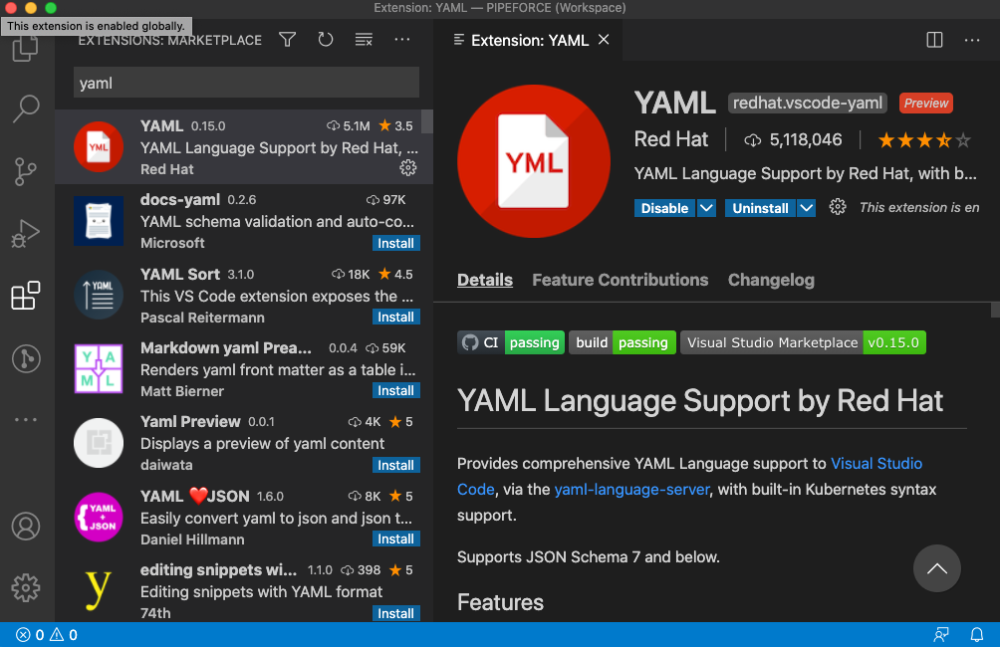

# Setup CLI and Local Workspace

**Estimated time:** 30 min.

**Prerequisites for this tutorial:**

*   You have a valid PIPEFORCE Developer account
    
*   You have executed all basic tutorials
    
*   You know how to work with the terminal of your operating system
    
:::tip
This tutorial is for advanced users who want to develop in source code locally. If you want to test just the low code features, try out the [online workbench](https://trial.pipeforce.org/#/propertyeditor) first.
:::

## 1 - Setup your local environment

At first, before you can setup your local workbench, you have to make sure that you have these local toolings installed on your computer:

*   [**Java 8 runtime or higher**](https://www.java.com/de/download/)
    
*   [**Visual Studio Code**](https://code.visualstudio.com/download)  Or any similar IDE which supports YAML, JSON and XML editing. We highly recommend VS Code since it has good integration with all required toolings.  


### Install Java 8


Open your terminal and verify that you have a Java runtime version >= 1.8 installed:

```
$> java -version
```

You should see an output similar to this:

```
java version "1.8"
```

If there is a version number 1.8 or higher shown, then you have installed “Java 8” or higher.

In case you see an output like “command not found” then you probably have no Java environment installed yet. So go to the next step and download and install the environment.

If you have not Java runtime yet, follow these steps to download and install:

1.  Go to [https://www.java.com/de/download/](https://www.java.com/de/download/) and download the latest Java runtime.
    
2.  Install the downloaded package.
    
3.  Open **a new console window** and try out that this command now shows the installed Java version:
    
4.  ```
    $> java -version
    ```
    
    In case the Java version is shown. You’re done.  
    Otherwise make sure, the `java` command was added to your path variable.
    

### Install Visual Studio Code

The VS Code editor will be used to edit configurations for your workflow apps. You can download and install it for free from here:

**[https://code.visualstudio.com/download](https://code.visualstudio.com/download)**

:::note UTF-8 Encoding 
Regardless which editor you’re using, it is very important to make sure the editor handles all files with UTF-8 encoding which is the default for Visual Studio Code. You can check this here: `Preferences → Settings → file.encoding`.
:::

### Install YAML editor plugin

Since we will create and edit a lot of configuration files in the YAML format, we recommend you to install the YAML editor plugin in VS Code. With this you will get YAML editor with text completion as shown here:


To do so, open this link in your browser and click on “Install”:

[https://marketplace.visualstudio.com/items?itemName=redhat.vscode-yaml](https://marketplace.visualstudio.com/items?itemName=redhat.vscode-yaml)

As an alternative you can go to Preferences → Extensions in VS Code and then search for YAML and then click on install on the plugin found:



## 2 - Setup the CLI

In order to create and publish resources like apps, workflows, forms, lists or pipelines in your low-code workspace, we provide a command line tool which simplifies these steps a lot.

### Check Java

In order to install this tool, first make sure you have a working Java version installed locally by opening up a terminal window and typing in this command:

```
$> java -version
```

In case the current Java version is shown, everything is fine. Otherwise you need to install Java first. To do so, please refer to the setup section at the beginning of this guide.

### Install pipeforce-cli

After you have made sure that Java is installed and runs correctly, you can download the latest version of the cli tool by clicking this link:

**[https://downloads.pipeforce.io/pipeforce-cli/](https://downloads.pipeforce.io/pipeforce-cli/)**

Select the jar file with latest version and download it to your computer.

After this, open a new terminal / command line window and change to the folder where you downloaded the file to. Usually this is the Download folder as shown in this example for Mac and could differ for your operating system:

```
$> cd /Users/username/Downloads
```

Now install the cli tool by executing this command:

```
$> java -jar pipeforce-cli-latest.jar setup
```

Replace `latest` by the version number of the downloaded file.

You will then be asked to install the tool. Select `yes`.

Also a setup wizard is started automatically with these questions:

```
$> Namespace:
```

Type in your customer namespace and press enter. This is the prefix name of your instance when you open it in your web browser. For example:


You got this link after with your trial or production instance. If unsure, ask your sales manager for your namespace.

```
$> Username:
```

Type in your PIPEFORCE username and press enter.

```
$> Password:
```

Type in your PIPEFORCE password and press enter.

Done.

Finally the PIPEFORCE CLI tool was successfully installed to your home folder `$USER_HOME/pipeforce` and you can start creating your workflow apps. To do so, see the next steps in this guide.

## 3 - Open the PIPEFORCE workspace

After successful installation, you can find the PIPEFORCE workspace folder under `$USER_HOME/pipeforce` whereas `$USER_HOME` depends on your underlying operating system and username.


Inside this folder a file called `PIPEFORCE.code-workspace` is placed. Double click it in order to start the VS Code with the PIPEFORCE workspace folder pre-selected for you.

You should then see a VS Code window similar to this:


At the left you can see all the files and folders from your `$USER_HOME/pipeforce` folder. The meaning of these files and folders are:

*   **conf** = Contains the configuration files for your local environment.
    
*   **log** = Contains the log files of your local environment.
    
*   **src** = Will contain the workflow apps you gonna create. This will be typically the place where you gonna create and maintain all of your workflow and integration configurations.
    
*   **tool** = Contains any tools like the cli for example.
    
*   **pi** (or pi.bat on Windows) = Starts the PI CLI.
    
*   PIPEFORCE.code-workspace = The VS Code workspace file to open the workspace in VS Code (by default hidden in this view).
    

**Congratulations! You have successfully setup your local low-code workbench. Now you can start and create your first app.**
