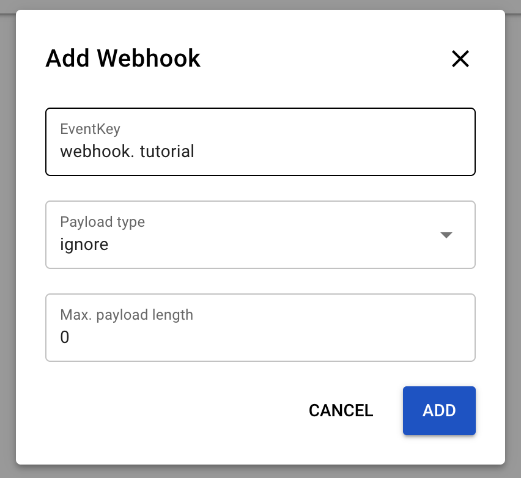

# Tutorial 10: Create a Webhook

**Estimated time:** 15 min.

## Prerequisites

*   PIPEFORCE Enterprise 7.0 or higher.
    
*   You have a valid PIPEFORCE Developer account.
    
*   You have executed tutorial [Tutorial: Create a new app](../tutorials/create-app).
    

## Webhook - Intro

Webhooks are a very essential concept for connecting with external systems. A webhook is a URL with a unique token, external systems can call. In PIPEFORCE, if such a webhook URL is called, it is linked to a pipeline internally, which then gets executed.

In this tutorial, you will learn how to setup and execute such a webhook.

Since a webhook could potentially trigger any kind of logic, double check who can create webhooks, what exactly webhooks are doing, and which external systems can call it!  
  
:::tip 
You can restrict who can create and manage webhooks by removing the roles CAN\_PIPE\_webhook\_\* from the developers and groups, who are not allowed to do so. By default any developer can create and manage webhooks.
:::

## 1 - Create the webhook pipeline


In this step, we are going to create the pipeline which will be executed whenever the webhook is called externally. To do so, follow these steps:

1.  Login to your portal https://YOUR\_NAMESPACE.pipeforce.net.
    
2.  Navigate to LOW CODE → Workbench.
    
3.  Select the node of the app you created in the previous tutorial.
    
4.  Click the plus icon at the top of the tree.
    
5.  The **new property** view opens:
    
    1.  As a property key, use the value `global/app/MY_APP/pipeline/mywebhook`. Replace `MY_APP` with the name of the app you created before, for example `myapp24`. **Do use only lower case letters and don’t use special characters or spaces!**
        
    2.  As mime type, select `application/yaml; type=pipeline`.
        
6.  Click SAVE.
    
7.  A new pipeline has been created with an hello world example in it.
    
8.  Replace its content by this pipeline:
    
    ```yaml
    pipeline:
      - mail.send:
          to: "you@domain.tld"
          subject: "Webhook executed"
    ```
    
9.  Make sure to replace you@domain.tld by your email address. Whenever the webhook is executed, an email will be send to this address.
    
10.  Click SAVE to save the pipeline.
    
11.  In order to test it, run the pipeline by clicking the RUN button at the top.
    
12.  The pipeline should be successfully executed. After a few seconds, you should receive an email in your inbox with subject `Webhook executed`.
    
13.  Now add the command `event.listen` to the pipeline as shown in this listing:
    
    ```yaml
    pipeline:

      - event.listen:
          key: "webhook.tutorial"

      - mail.send:
          to: "you@domain.tld"
          subject: "Webhook executed"
    ```
    
14.  The command `event.listen` makes sure that this pipeline is executed whenever a webhook has been received with event key `webhook.tutorial`. So, it listens only to this specific webhook.
    

:::tip TIP 
You can define as webhook event key any string you want. As best practise, we suggest you to use always lower case letters and prefix the key with `webhook.`. Furthermore, use the period `.` as separator, for example `webhook.sendmail`, `webhook.order.create`, and so on.
:::

## 2 - Create the webhook

Now you will link the external caller to your pipeline by creating a webhook configuration. To do so, you have two options:

 1. Using the command [`webhook.put`](/docs/api/commands#webhookput-v1) 
 2. Using the Portal

In this tutorial we will use the latter one: Creating a webhook configuration using the Web Portal.

1.  Login to your PIPEFORCE portal.
2.  Navigate to **LOW CODE → Webhooks**.
3.  Click **ADD WEBHOOK**. A dialog should open, similar to this:
    
4.  Use these values to create a webhook configuration and click **ADD** afterwards:
    1. EventKey: `webhook.tutorial`
    2.  Payload type: `ignore` 
    3.  Max. payload length: `0`
    
5.  A new entry was created in the list of webhooks. Click on it and copy the URL for the next step.
    

## 3 - Execute the webhook

1.  Copy the webhook url with the token parameter from the result of the previous step.
    
2.  Open your browser or Postman, paste this url and execute it.
    
3.  After a few seconds, you should receive an email to your inbox.
    
   
The webhook url is the url you can register in external systems to call your pipeline externally. Since this url calls your system, make sure that only you and the external system knows it.
    

**Congrats, you have created your first webhook with PIPEFORCE!**

## Report an Issue
:::tip Your help is needed!
In case you're missing something on this page, you found an error or you have an idea for improvement, please [click here to create a new issue](https://github.com/pipeforce/pipeforce.github.io/issues/new). Another way to contribute is, to click **Edit this page** below and directly add your changes in GitHub. Many thanks for your contribution in order to improve PIPEFORCE!
:::
