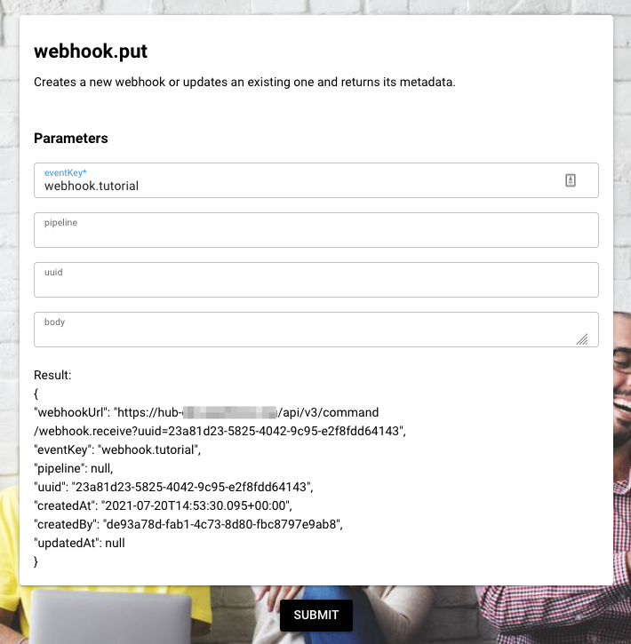

# Tutorial 10: Create a Webhook

**Estimated time:** 15 min.

## Prerequisites

*   PIPEFORCE Enterprise 7.0 or higher.
    
*   You have a valid PIPEFORCE Developer account.
    
*   You have executed tutorial [Tutorial: Create a new app](../tutorials/create-app).
    

## Intro

Webhooks are an essential part for connecting with external systems. A webhook is a unique URL external systems can call. In PIPEFORCE when a webhook URL is called, it is linked to a pipeline internally which gets executed then.

In this tutorial you will learn how to setup and execute such a webhook.

Since a webhook could potentially trigger any kind of logic, double check who can create webhooks, what exactly webhooks are doing and which external systems can call it!  
  
:::tip 
You can restrict who can create and manage webhooks by removing the roles CAN\_PIPE\_webhook\_\* from the developers and groups not allowed to do so. By default any developer can create and manage webhooks.
:::

## 1 - Create the webhook pipeline


In this step we gonna create the pipeline which will be executed whenever the webhook is called from external. To do so, follow these steps:

1.  Login to your portal https://YOUR\_NAMESPACE.pipeforce.net.
    
2.  Navigate to LOW CODE → Workbench.
    
3.  Select the node of the app you created in the previous tutorial.
    
4.  Click the plus icon at the top of the tree.
    
5.  The **new property** view opens:
    
    1.  As a property key use the value `global/app/MY_APP/pipeline/webhook`. Replace `MY_APP` with the name of the app you created before, for example `myapp24`. **Do use only lower case letters and don’t use special characters or spaces!**
        
    2.  As mime type select `application/yaml; type=pipeline`.
        
6.  Click SAVE.
    
7.  A new pipeline has been created with an hello world example in it.
    
8.  Replace its content by this pipeline:
    
    ```yaml
    pipeline:
      - mail.send:
          to: you@domain.tld
          subject: Webhook executed
    ```
    
9.  Make sure to replace you@domain.tld by your email address. Whenever the webhook is executed, an email will be send to this address.
    
10.  Click SAVE to save the pipeline.
    
11.  In order to test it, run the pipeline by clicking the RUN button at the top.
    
12.  The pipeline should be successfully executed. After a few seconds you should receive an email in your inbox with subject `Webhook executed`.
    
13.  Now add another command to the pipeline as shown in this listing:
    
    ```yaml
    pipeline:
      - event.listen:
          key: webhook.tutorial
      - mail.send:
          to: you@domain.tld
          subject: Webhook executed
    ```
    
14.  As you can see, the command event.listen has been added. This command makes sure that this pipeline is executed whenever a webhook has been received with event key `webhook.tutorial`. So it listens only to this specific webhook.
    

:::note 
You can define as webhook event key any string you want. As best practise we suggest you to use always lower case letters and prefix the key with `webhook.`. Furthermore use the period `.` as separator, for example `webhook.sendmail`, `webhook.order.create` and so on.
:::

## 2 - Create the webhook

Now you will link the external caller with your pipeline by creating a webhook object. To do so, follow these steps:

1.  Navigate to LOW CODE → Commands.
    
2.  Search for webhook.put here and click it.
    
3.  In the form set the field key to `webhook.tutorial` and click submit. The result should look similar to this screenshot:  
    
    
4.  Now a new webhook was created and linked using the event key `webhook.tutorial`. Every pipeline which listens to this event key will be executed when the webhook is called.
    
5.  Copy the webhook url for the next step.
    

## 3 - Execute the webhook

1.  Copy the webhook url from the result of the previous step.
    
2.  Open your browser, paste this url and open it.
    
3.  You should see a blank page without any error message.
    
4.  After a few seconds you should receive an email to your inbox.
    
5.  The webhook url is the url you can register in external systems to call your pipeline from external. Since this url calls your system, make sure that only you and the external system knows it.
    

:::tip

*   **Edit an existing webhook**  
    To edit a webhook, get the uuid of this webhook and execute the command `webhook.put` again with this uuid as parameter.
    
*   **List all webhooks or a single one**  
    To list all existing webhooks, execute the command `webhook.get`. To list a single webhook, use its uuid as filter.
    
*   **Delete a webhook**  
    To delete a webhook, execute the command `webhook.delete`.

:::
    

**Congrats, you have created your first webhook with PIPEFORCE!**
