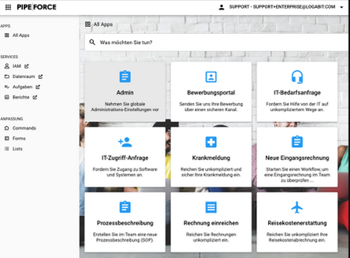

# Tutorial 1: Basics

**Estimated time:** 10 min.

## Intro

PIPEFORCE is the first workflow automation and integration platform that runs entirely cloud-native (i.e. 100% inside Kubernetes using microservices and messaging) and is very extensible through microservices. It helps companies to achieve automation superpowers and enables non-technical employees and partners to create, deploy and operate digital services, workflow apps and data mappings. One can cover the entire journey from planning to implementation on a single platform using low-code.

Below you can find short descriptions of the most important topics of PIPEFORCE, just to give you a fast overlook. We will discuss all of these concepts in detail in different guides and the documentation.

## 1 - Platform

The PIPEFORCE platform is built with Kubernetes as its base framework. On this platform, different digital services are available out-of-the-box, so you can start developing your solutions right from the beginning. Moreso, there is no need for Kubernetes or Microservices know-how. You can create your first business application with low-code. The built-in services are:

*   User and Identity Management
*   LDAP / AD Service
*   Reporting Service
*   Sync & Share Service
*   Archiving Service
*   Forms and List Builder
*   BPMN Workflow engine
*   RPA
*   Integration Pipelines
*   And more…
    

With these built-in services you can start very quickly to build your own business/data pipeline apps. It is also possible to add additional services via (Docker) containers if required.

## 2 - Self Service Portal

The portal is the single point of access for employees and customers. Whenever you have created and published a new business app, it becomes visible on the portal. Employees, customers and partners will get a list of their available apps after login, and then they can execute them easily.

## 3 - App

An app in PIPEFORCE is typically the smallest unit to build a business workflow application. It can consist of many different elements like forms, lists, workflows or integration pipelines to just name a few.

Once the app has been published, it can be used by customers, employees or partners.

## 4 - Pipeline

A pipeline in PIPEFORCE is the “glue” between all elements of an business application, that is typically written in an easy YAML DSL. It connects data from forms and APIs. It can calculate, normalize, map or convert data from other systems and interfaces. It can also  execute business logic if required. All of this is done using low-code. So there is no need for deep development.

On the other hand, for more advanced users, there is always the option to “open-up” and create more complex solutions, in case the low-code approach isn’t enough. 

You can learn more about pipelines here: [Pipelines](../guides/pipeline)

## 5 - Command

Every pipeline consists of one or more commands. A command is a single function service, which can be called to do a simple operation like returning the current date, up to more complex executions like scanning documents for keywords or starting an RPA bot to automate something.

Commands can start a microservice in PIPEFORCE or trigger an external cloud service.

You can learn more about commands here: [Commands](../guides/Command)

## 6 - Workflow

More complex and stateful human interactions are defined in so called BPMN 2.0 workflows in PIPEFORCE. This is an official ISO standard to define business processes with a standardized graphical way. Once you have created a BPMN 2.0 workflow, you can feed it into PIPEFORCE, and bring it to life by connecting the BPMN tasks with pipelines.

You can learn more about workflows here: [Workflows](../guides/workflows/basics)

## 7 - Low Code Workbench

The workbench is an online section where you can create forms, lists, data mappings, workflows, and many more. Everything can be done without deep development i.e. just low code or no code.

## 8 - Command Line Interface (CLI)

The command line interface is a little command line tool, which can be used to automate tasks from your local command line and to manage a workspace. However, this is recommended only for advanced users. If you’re new to PIPEFORCE, consider starting with the online workbench first.

You can learn more about the CLI here: [Command Line Interface (CLI)](../api/cli)

## 9 - Property Store

This is a key-value distributed database, which stores all resources related to a business app. Whenever you submit form data, store configurations for apps, want to temporarily cache data, or need just a persistent storage, the property store is here for you.

You can learn more about the property store here: [Property Store](../guides/propertystore)

## 10 - Pipeline Engineer / The Low Coder

And last but not least, the most important part: It’s **you**, the pipeline engineer (or “Low Coder”). Every user who develops business applications based on PIPEFORCE, we call a pipeline engineer. A pipeline engineer mainly uses low-code and the low-code workbench for most rapid implementation cycles. In some rare cases, he can also program/develop additional features.