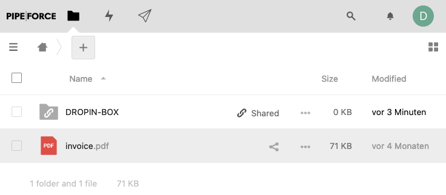
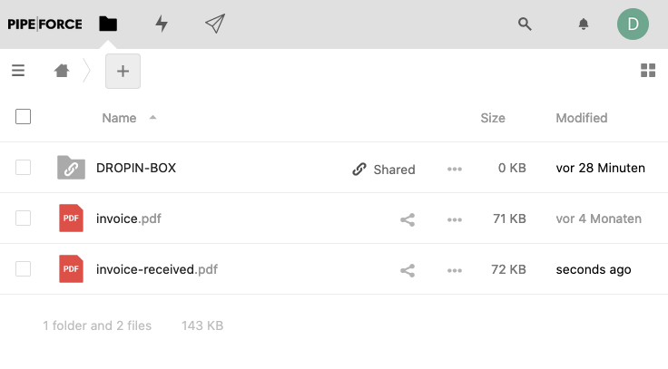
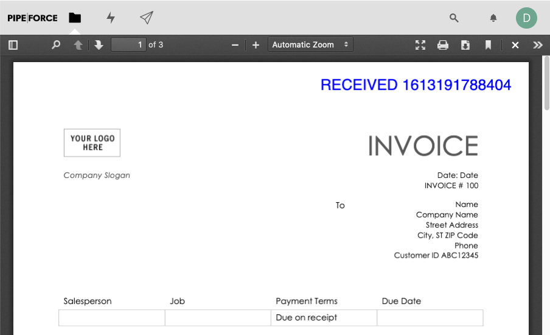

# Tutorial 11: Create a PDF stamp

**Tutorial 11 Estimated time:** 10 min.

## Tutorial 11 - Prerequisites

*   PIPEFORCE Enterprise 7.0 or higher + DMS module
    
*   You have a valid PIPEFORCE Developer account
    
*   You have completed tutorial: [Tutorial: Create a new app](../tutorials/create-app)
    
*   You have completed tutorial: [Tutorial: Create and execute a pipeline](../tutorials/create-pipeline)
    

## PDF stamp - Intro

In this tutorial, you will learn how you can put text stamps on PDF files. With this, you can put incoming date stamps or watermarks on PDFs.

## 1 - Provide the invoice PDF

In the first step, you need to upload a sample PDF which can be used for this tutorial.

If you don’t have a sample invoice PDF at hand, you can use this one:

[invoice.pdf](../../static/sample-invoice.pdf)

1.  Login to the portal https://**NAMESPACE**.pipeforce.net
    
2.  Click on Files / Drive. The Drive WebUI opens.
    
3.  Upload the sample invoice PDF in the root folder of your drive. Keep the name `invoice.pdf`:  
    
    

## 2 - Create the stamp pipeline

In the next step, you will create a pipeline which loads the PDF, puts a stamp on it, and saves the stamped PDF back to drive:

1.  Login to the portal https://**NAMESPACE**.pipeforce.net
    
2.  Navigate to LOW CODE → Workbench
    
3.  Select the node of your app or [create a new one](../tutorials/create-app).
    
4.  Click the plus icon at the top of the tree.
    
5.  The new property view opens:
    
    1.  As property key, use: `global/app/YOUR_APP/pipeline/pdf-stamp`
        
    2.  As mime type, use: `application/yaml; type=pipeline`
        
6.  Click `SAVE`
    
7.  The new property has been created, and the content editor was opened for you.
    
8.  Now copy and paste this content into the editor, and overwrite any existing data there by this:
    
    ```yaml
    pipeline:
      - drive.read:
          path: "invoice.pdf"
      - pdf.stamp:
          text: "RECEIVED #{@date.timestamp()}"
      - drive.save:
          path: "invoice-received.pdf"
    ```
    
9.  Your pipeline now consists of three commands:
    
    1.  Load the PDF document from drive using the command `drive.read`.
        
    2.  Put a PDF stamp on this loaded invoice using the `pdf.stamp` command. Additionally, we use the `@date` PEL util here to return the current date and time.
        
    3.  Store the stamped PDF document back to drive under a new name `invoice-received.pdf` using the command `drive.save`.
        
10.  Click `SAVE` and then `RUN` to execute the pipeline.
    
11.  After a refresh of the drive page, you should see a new PDF invoice-received.pdf:  
    
    
12.  Open the `invoice-received.pdf`. You should see the generated stamp at the top right corner:  
    
    
13.  **Done. Congratulations!**
    

## 3 - Extra: Send PDF inline via email

A very often use case is, to put a stamp to a PDF, and then send it via email to one or more recipients. Because of this, we will show you here how to do so with the stamped PDF in the same pipeline:

1.  Open your pipeline `pdf-stamp` and change it to this:  
    
    ```yaml
    pipeline:
      - drive.read:
          path: "invoice.pdf"
      - pdf.stamp:
          text: "RECEIVED #{@date.timestamp()}"
      - drive.save:
          path: "invoice-received.pdf"
          cleanupBody: false
      - mail.send:
          to: "you@domain.tld"
          subject: "Invoice received"
          message: "Hello, we received your invoice. Thanks!"
          attachments: "#{body}"
    ```
    
2.  As you can see, we did several adjustments to this pipeline:
    
    1.  We added the parameter `cleanupBody: false` to `drive.save`. This keeps the final PDF in the body for use of the next command.
        
    2.  We added `mail.send` as next command, which will take the PDF from the body as an attachment and send it via email to the given recipient. Note the `#{body}` expression in the attachment parameter, which points to the body of the pipeline where the PDF resides temporarily.
        
3.  Replace `you@domain.tld` by your real email address.
    
4.  Click `SAVE` and then `RUN`.
    
5.  After a while, you should receive an email with the stamped PDF as an attachment.
    
6.  Done.

## Report an Issue
:::tip Your help is needed!
In case you're missing something on this page, you found an error or you have an idea for improvement, please [click here to create a new issue](https://github.com/pipeforce/pipeforce.github.io/issues/new). Another way to contribute is, to click **Edit this page** below and directly add your changes in GitHub. Many thanks for your contribution in order to improve PIPEFORCE!
:::