# Tutorial 14: Create a BPMN Workflow

In order to graphically design and automate user workflows and discuss them with internal and external teams, we believe that it is inevitable to rely on official standards, everybody can easily understand and which are accepted in industries worldwide.

This is the reason why PIPEFORCE uses [BPMN](https://en.wikipedia.org/wiki/Business_Process_Model_and_Notation) as such an standard to design and execute stateful workflows. With this approach it is easy to communicate and design in a standardized format between development, departments and externals since everybody can refer to the official BPMN standard in explaining processes.

**With the new online workbench in PIPEFORCE it is possible to discuss such BPMN workflows and design them collaboratively in the team.**

Lets see in this tutorial how you can design, discuss and run such workflows.

## 2 - The vacation request workflow

The workflow we gonna create in this tutorial will look like this:

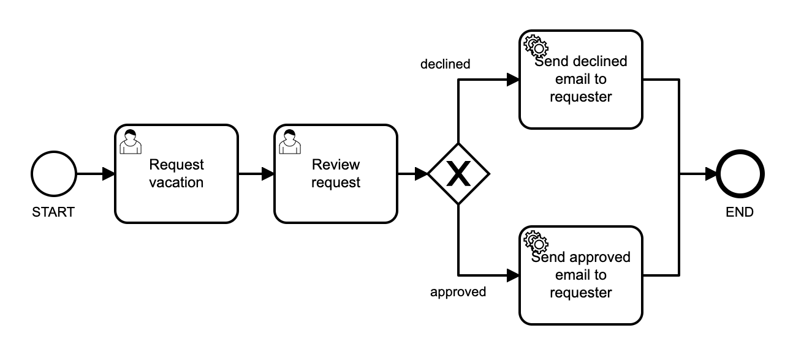

It is a simple vacation request workflow: The first task is a form which is filled-out by the employee requesting a vacation. The second task is also a form which is filled-out by the reviewer which is typically a supervisor. He approves or declines the vacation request. Depending on the decision of the supervisor a declined or an approved email will be send to the requester.

Even if this workflow is a simple one, it contains already many of the most important items of a BPMN workflow:

*   A start task
    
*   User tasks “Request vacation” and “Review request”
    
*   A gateway to branch the workflow depending on input
    
*   Service tasks to send emails
    
*   An end task
    
*   Connectors between items
    

With these elements you can already create many different types of workflows and run them immediately in PIPEFORCE.

## 3 - Create the pipelines

As you could see in the workflow picture above, there are two **service tasks** both of which will send an email. A service tasks is a task which is typically not executed by a human but by a system (which is typically called a “service”). In PIPEFORCE this is done by mapping to a persisted pipeline. Whenever the service task is executed it delegates to this pipeline, executes it and then returns. So lets create first the two pipelines we need later to map with the two service tasks:

1.  Login to the portal https://YOUR\_NAMESPACE.pipeforce.net
    
2.  Go to `LOW CODE → Workbench` and select the app node in the tree you would like to create the workflow inside or create a new app first (see [Tutorial: Create a new app](../tutorials/create-app) how to do it).
    
3.  Click the plus icon at the top of the tree.
    
4.  The new property creation view opens:
    
    1.  As property key use: `global/app/YOUR_APP/pipeline/send-approved-email`
        
    2.  As mime type use: `application/yaml; type=pipeline`
        
5.  Click `SAVE`
    
6.  The property has been created and the content editor opens.
    
7.  Copy and paste this pipeline snippet (replace any existing content of the pipeline):  
    
    ```yaml
    pipeline:
     - mail.send:
        to: "requester@email.tld"
        subject: "Vacation Request Approved"
        message: "Hello, your vacation request was approved."
    ```
    
8.  Replace the `requester@email.tld` by your preferred email address.
    
9.  Click `SAVE`.
    
10.  Now we create another pipeline like this: Select your app and click the plus icon at the top of the tree.
    
11.  The new property creation view opens:
    
    1.  As property key use: `global/app/YOUR_APP/pipeline/send-declined-email`
        
    2.  As mime type use: `application/yaml; type=pipeline`
        
12.  Click `SAVE`
    
13.  The property has been created and the content editor opens.
    
14.  Copy and paste this pipeline snippet (replace any existing content of the pipeline):  
    
    ```yaml
    pipeline:
     - mail.send:
        to: "requester@email.tld"
        subject: "Vacation Request Declined"
        message: "Hello, your vacation request was declined."
    ```
    
15.  Replace the `requester@email.tld` by your preferred email address.
    
16.  Click `SAVE`
    
17.  Hint: Its also possible to work with a single pipeline and use parameters, but to keeps things simple here and to focus on the workflow not the pipeline, we will use two pipelines for now.
    

## 3 - Create a new BPMN workflow

The next step is to create the BPMN workflow design. To do so, follow these steps:

1.  Go to LOW CODE → Workbench and select the root node of your app.
    
2.  Click the plus icon at the top of the tree.
    
3.  The new property creation view opens:
    
    1.  As property key use: `global/app/YOUR_APP/workflow/vacation-request`
        
    2.  As mime type use: `application/xml; type=workflow`
        
4.  Click `SAVE`
    
5.  The property was saved and the BPMN online designer has been opened for you.
    
6.  **Tip**: In order to have more space in the designer, you can hide the very left menu by clicking on the top left grid icon. Clicking it again will bring back the menu:  
    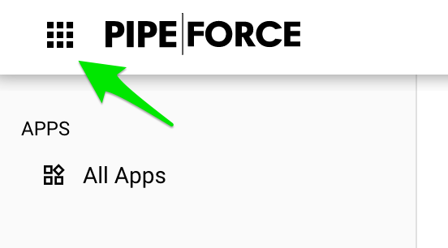
7.  Now lets create the user task “Request vacation”. Add a new task, then click the wrench icon and then select “User Task” from the list:  

    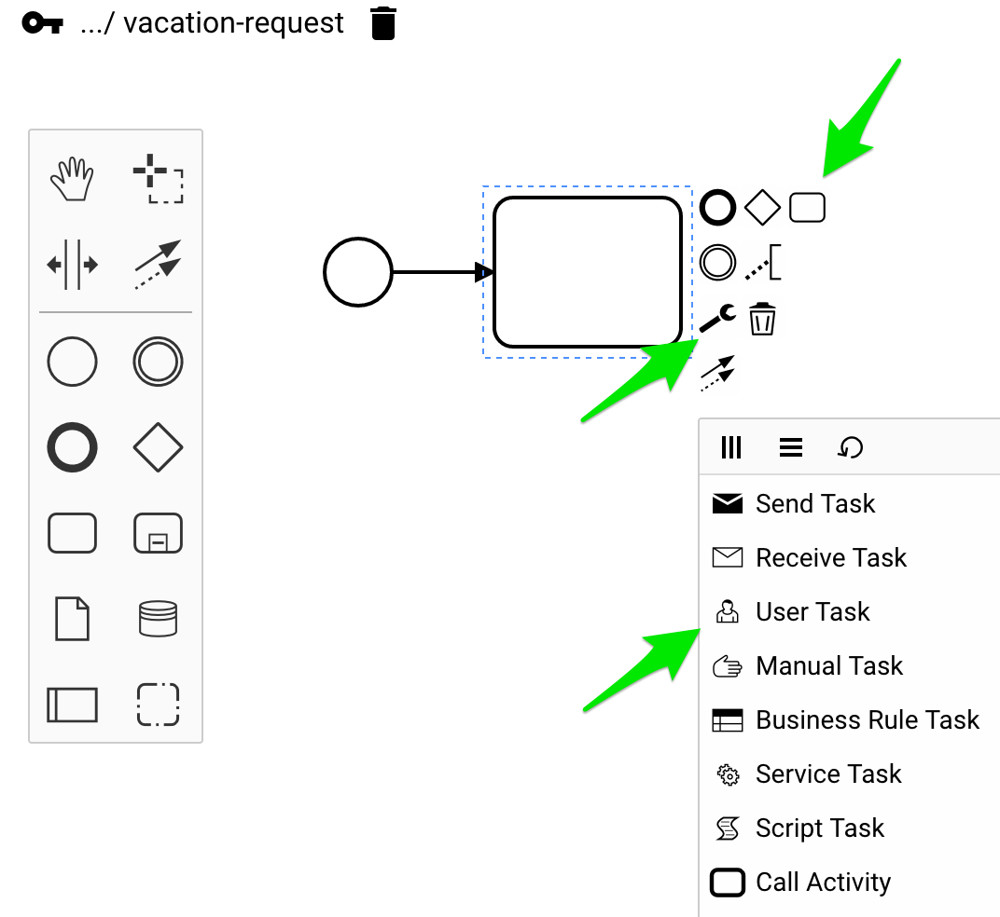    
8.  Repeat these steps with the next task “Review request” to have two user tasks like this:  

    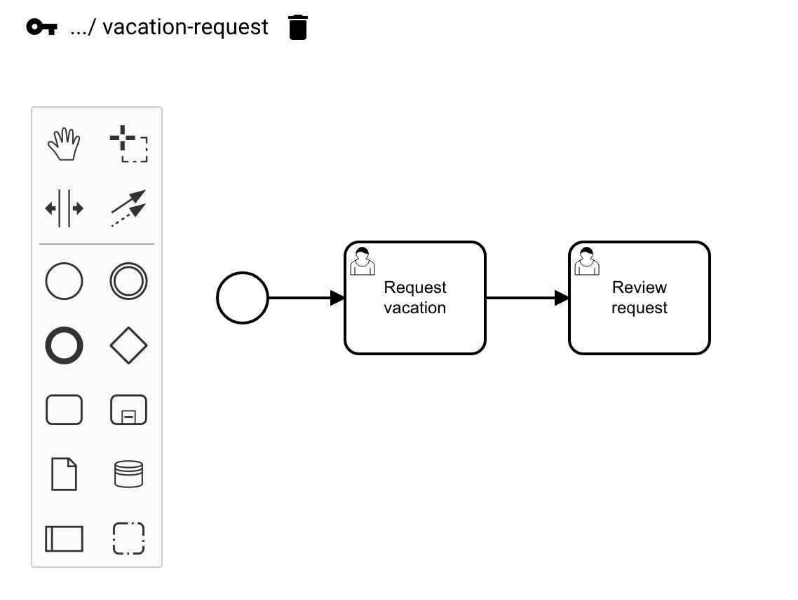
9.  Now lets add the gateway and a service task:  
    
    
    
10.  Repeat these steps to create the second service task and to add an end task. Finally your BPMN diagram should look like this:  
    
    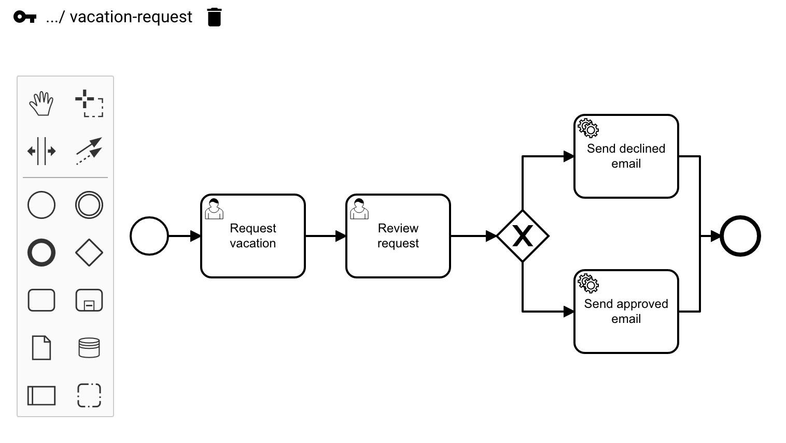
11.  Click `SAVE`.
    

## 4 - Link service tasks with pipelines

1.  In the next step we will link the service tasks with the pipelines. To do so, select the “Send declined email” service task, in the details view click the PIPELINE tab and from the dropdown select the `send-declined-email` pipeline we created before:  
    
    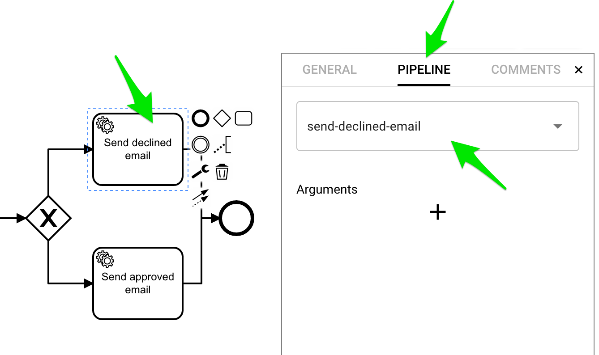
    
2.  Repeat these steps with the “Send approved email” service task and the `send-approved-email` pipeline.
    

**Tip:** In case you have already created a BPMN locally, you can also upload this file to your online BPMN editor. To do so, follow the subsequent steps:

1.  Go to your local BPMN model
    
2.  Change BPMN digram view to XML view
    
3.  Copy the XML information
    
4.  Navigate to your workflow in the Low-Code Workbench
    
5.  Open the Online BPMN Editor and change view to “Content Editor”
    
6.  Paste the XML information and click “save”.
    

Your BPMN diagram is now available in the Online Low-Code Workbench.

## 5 - Add form fields

In the next step we will add input fields for the user forms.

1.  Select the `Request vacation` task and go to the `FORM` tab.
    
2.  Click the plus icon to add a new field.
    
3.  Click the pencil icon on the field to open the field details.
    
4.  Set the values for the vacationStartDate like this and click `APPLY`:  
    
    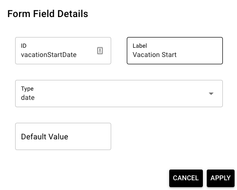
    
5.  Repeat this step for the field “Vacation End”:
    
    1.  ID = `vacationEndDate`
        
    2.  Label = `Vacation End`
        
    3.  Type = `date`
        
6.  Click `SAVE` to save the current state of the BPMN workflow.
    
7.  Now select the Review request task and add this field:
    
    1.  ID = `vacationApproved`
        
    2.  Label = `Vacation Approved`
        
    3.  Type = `boolean`
        
8.  Click `SAVE` to save the current state of the BPMN workflow.
    
9.  Repeat those steps to create the decline field.
    

## 6 - Add gateway conditions

Depending on whether the supervisor has approved or declined the vacation request, the workflow should execute the “Send declined email” or the “Send approved email” task. For this, we need to define rules on the gateway edges:

1.  Select the **declined** edge of the gateway and fill-in this condition: `${vacationApproved == false}`:  
    
    
2.  This makes sure that this branch is executed in case the supervisor set `vacationApproved` to false.
    
3.  Repeat these steps for the task “Send approved email” and set the condition to  
    `${vacationApproved == true}`.
    
4.  Click `SAVE` to save the current state of the BPMN workflow.
    

## 7 - Deploy and run the workflow

Now its time to activate the workflow and execute it. To do so, follow these steps:

1.  Click `DEPLOY` to deploy the current state of the BPMN to the workflow engine.
    
2.  In the left main menu go to SERVICES → Tasks.
    
3.  Click on Start process in the upper right corner.
    
4.  A dialog opens where your workflow should be listed as `appname_workflowname`, for example `myapp42_vacation-request`:  
    
    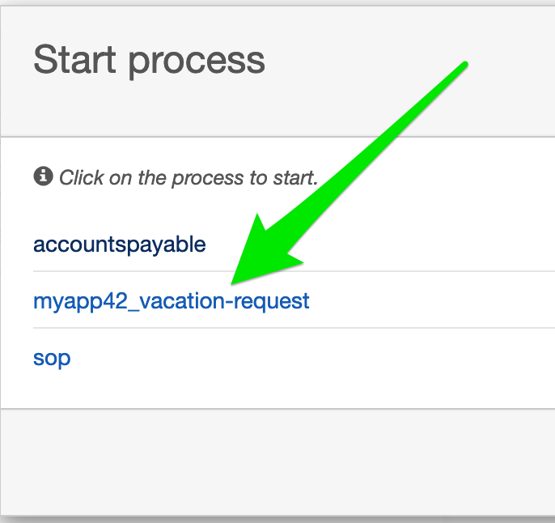
    
5.  Click on your process and then on `Start` to start it.
    
6.  Your process has been started in the workflow engine.
    
7.  To see the tasks, you need to add a task filter: Click on `Add a simple filter`.
    
8.  Now you should see the first task in the list `Request vacation`. Click it to show the form.
    
9.  Then click on Claim to assign this task to you:  
    
    
    
10.  Select a vacation start and a vacation end date and click `Complete`.
    
11.  In the next step, select the `Review request` from the tasks list.
    
12.  Click on `Diagram` in the tabs list to see the current flow state:
    
    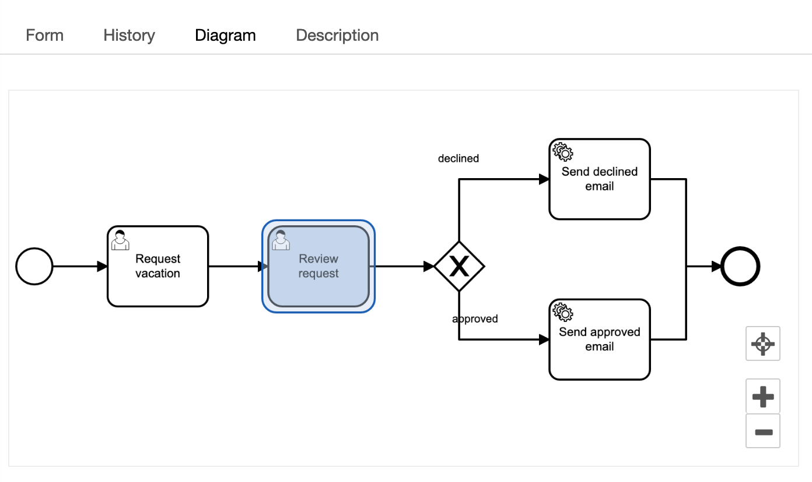
13.  Go back to the Form tab and click again `Claim`.
    
14.  Now you are in the role of the supervisior. You can approve or decline the request.
    
15.  Depending on your decision you will get a approval or declined email.
    

**Congratulations you have created your first BPMN workflow and executed it!**

## 8 - Improvement: Use workflow variables inside a pipeline

Currently the pipelines are static. Now we gonna change this and use the `vacationStartDate` and `vacationEndDate` variables inside the pipeline and pass them into our email messages. All workflow variables like form fields in a workflow are automatically passed to a pipeline. Inside the pipeline you can easily access it using the `vars.` context, for example  
`#{vars.vacationStartDate}`, `#{vars.vacationEndDate}` and `#{vars.vacationApproved}`:

1.  Open your `pipeline send-declined-email`
    
2.  Change the email message like shown below:  
    
    ```yaml
    pipeline:
     - mail.send:
        to: "requester@email.tld"
        subject: "Vacation Request Declined"
        message: |
            Hello, your vacation request from #{@date.format(vars.vacationStartDate, 'dd/MM/YYYY')} 
            to #{@date.format(vars.vacationEndDate, 'dd/MM/YYYY')}  was declined.
    ```
    
3.  As you can see, we use the `@date.format` util to format the date and place it in the message template.
    
4.  Click `SAVE` to save the pipeline.
    
5.  Repeat the steps with the pipeline `send-approved-email`
    
6.  Now execute the workflow again and you should receive emails with the `vacationStartDate` and `vacationEndDate` dynamically set like this example shows:  
    
    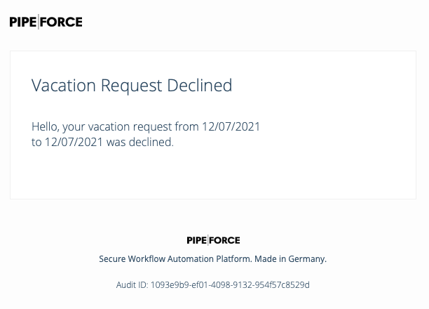

## 9 - Improvement: Use a form as start trigger

Currently the process is started manually by accessing the task section and starting the workflow. However, in many cases a workflow should be started by submitting a form which is located in the online portal. How to create such a form in general is explained here: [Tutorial: Create a new form](../tutorials/create-form). For the current example, follow these steps:

### Create a schema

1.  Go to LOW CODE → Workbench and select the root node of your app.
    
2.  Click the plus icon at the top of the tree.
    
3.  The new property creation view opens:
    
    1.  As property key use: `global/app/YOUR_APP/object/vacationrequest/v1/schema`
        
    2.  As mime type use: `application/json; type=schema`
        
4.  Click `SAVE`
    
5.  The new schema was created
    
6.  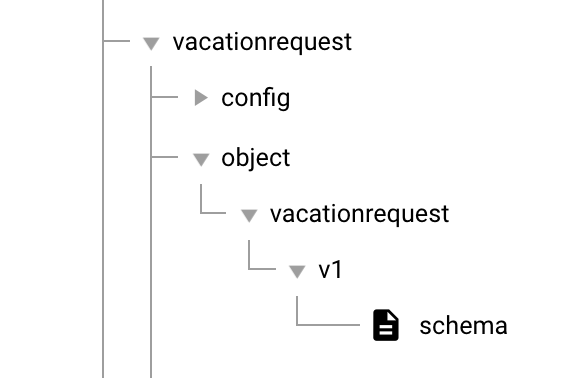
7.  Copy and paste this snippet to the schema (replace any existing content):
    

```json
{
  "type": "object",
  "properties": {
    "vacationStartDate": {
      "type": "string",
      "format": "date",
      "title": "From",
      "description": "The requested vacation start."
    },
    "vacationEndDate": {
      "type": "string",
      "format": "date",
      "title": "To",
      "description": "The requested vacation end."
    },
    "comment": {
      "type": "string",
      "title": "Comment",
      "description": "The comment for reviewer."
    }
  }
}
```

7\. Klick `SAVE`

### Create a form

1.  Go to LOW CODE → Workbench and select the root node of your app.
    
2.  Click the plus icon at the top of the tree.
    
3.  The new property creation view opens:
    
    1.  As property key use: `global/app/YOUR_APP/form/vacationrequest`
        
    2.  As mime type use: `application/json; type=form`
        
4.  Click `SAVE`
    
5.  The new form was created
    
6.  Navigate to the form
    
7.  Copy and paste this snippet to the form (replace any existing content):
    

```json
{
  "title": "Start vacation request",
  "description": "For vacation approval you can request here.",
  "schema": "property.list?filter=global/app/YOUR_APP/object/vacationrequest/v1/schema",
  "output": "global/app/YOUR_APP/object/vacationrequest/v1/instance/%23%7Bvar.property.uuid%7D"
}
```

**Tip:** Make sure to replace YOUR\_APP by the name of your app.

### Add a starting pipeline

1.  Go to LOW CODE → Workbench and select the root node of your app.
    
2.  Click the plus icon at the top of the tree.
    
3.  The new property creation view opens:
    
    1.  As property key use: `global/app/YOUR_APP/pipeline/trigger-vacation-request`
        
    2.  As mime type use: `application/yaml; type=pipeline`
        
4.  Click `SAVE`
    
5.  The new pipeline has been created
    
6.  Copy and paste this pipeline snippet to the pipeline (replace any existing content):
    

```yaml
pipeline:

  - event.listen:
      key: "property.created"
      filter: "#{body.target.key.contains('global/app/YOUR_APP/object/vacationrequest/v1/instance')}"

  - set.var:
      key: "formData"
      value: "#{@property.lazy(body.target.key)}"

  - workflow.start:
      key: "YOUR_APP_vacation-request"
      workflowModelInstanceKey: "#{body.target.key}"
      variables: "#{{
        'vacationStartDate': @date.parseToInstant(vars.formData['vacationStartDate']),
        'vacationEndDate': @date.parseToInstant(vars.formData['vacationEndDate'])
      }}"
```

**Tip:** Make sure to replace YOUR\_APP by the name of your app.

As you can see in the pipeline above we introduced in this section the concept of Workflow Model with: `workflowModelInstanceKey: "#{body.target.key}"`. We recommend to use this approach to work with values and variables of an workflow in a more structured way.

### Adapt the workflow model

Since you have now a new start trigger for your workflow, you don’t need the first step in your BPMN-Workflow Model any longer. To adapt your workflow model, go to the BPMN Modeler and remove the first step (“Request Vacation”).

Your new workflow should look like this:

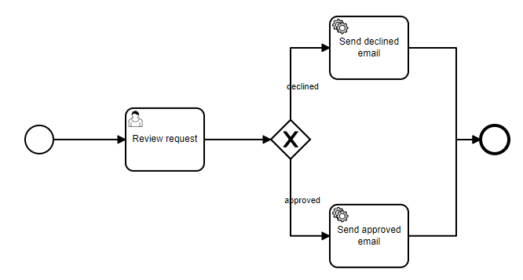

After you have updated the BPMN-Workflow, press `DEPLOY` .

Test your new workflow by selecting your form in the Online Portal and entering some values. After submitting the form you can directly see the new task for the Reviewer in the task view.

## 10 - Improvement: Use dynamic email receiver

Currently the email is sent always to the address you have entered in the pipeline. However, in case the form is deployed for multiple users, the emails should be sent always to the person who submitted the vacation request (Requester). To enhance the workflow accordingly, follow these steps:

### Modify your trigger pipeline

In your trigger pipeline, you can directly add the values you would like to define as process variables. With those process variables you can work in subsequent steps of the workflow. In our example we define the logged in user, who is starting the workflow, as the Requester. To do so, follow these steps:

1.  Go to LOW CODE → Workbench and select your trigger pipeline `global/app/YOUR_APP/pipeline/trigger-vacation-request`
    
2.  Copy and paste this pipeline snippet to the pipeline (replace any existing content):
    

```yaml
pipeline:

  - event.listen:
      key: "property.created"
      filter: "#{body.target.key.contains('global/app/YOUR_APP/object/vacationrequest/v1/instance')}"

  - set.var:
      key: "formData"
      value: "#{@property.lazy(body.target.key)}"

  - workflow.start:
      key: "YOUR_APP_vacation-request"
      workflowModelInstanceKey: "#{body.target.key}"
      variables: "#{{
        'vacationStartDate': @date.parseToInstant(vars.formData['vacationStartDate']),
        'vacationEndDate': @date.parseToInstant(vars.formData['vacationEndDate']),
        'requester': @user.email()
      }}"
```

As you can see at the bottom of the pipeline, in addition to the `vacation start date` and the `vacation end date`, you have now defined a new process variable `requester` and matched the email of the user who started the workflow to this variable.

### Modify your email pipeline

You can now modify your email pipelines to sent notifications about approved and declined emails accordingly:

1.  Go to LOW CODE → Workbench and select your approved email pipeline `global/app/YOUR_APP/pipeline/send-approved-email`
    
2.  Copy and paste this pipeline snippet to the pipeline (replace any existing content):
    

```yaml
pipeline:
 - mail.send:
    to: "#{vars.requester}"
    subject: "Vacation Request Approved"
    message: |
        Hello, your vacation request from #{@date.format(vars.vacationStartDate, 'dd/MM/YYYY')} 
        to #{@date.format(vars.vacationEndDate, 'dd/MM/YYYY')} was approved.
```

Adapt your declined email in the same way.

1.  Go to LOW CODE → Workbench and select your approved email pipeline `global/app/YOUR_APP/pipeline/send-declined-email`
    
2.  Copy and paste this pipeline snippet to the pipeline (replace any existing content):
    

```yaml
pipeline:
 - mail.send:
    to: "#{vars.requester}"
    subject: "Vacation Request Declined"
    message: |
        Hello, your vacation request from #{@date.format(vars.vacationStartDate, 'dd/MM/YYYY')} 
        to #{@date.format(vars.vacationEndDate, 'dd/MM/YYYY')} was declined.
```

## 11 - Improvement: Work with form inputs in subsequent steps

Currently the Reviewer can see the inputs (`vacation start date` and `vacation end date`) made by the Requester. We now improve this task view of the Reviewer so that he can see the user email who have sent the vacation request. To do so, follow these steps:

1.  Navigate to the Online Workflow Editor of your app and select the User Task “Review Request”
    
2.  Navigate to the “Form” section
    
3.  Add a new form field; Use the ID `requester` and Label `Requester`
    
4.  Adapt type of `vacationStartDate` and `vacationEndDate` to `string`
    
5.  Click `SAVE`
    

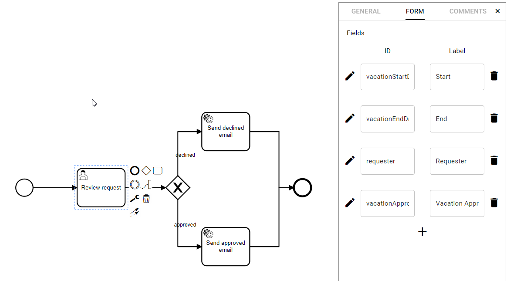

**Tip:** Since the requester was already defined as process variable in previous steps, you can work with this value by just referring to the ID. In case you have skipped some previous steps, you have to go back and define the Requester as a process variable.

The new task form of the Reviewer should now look like this:

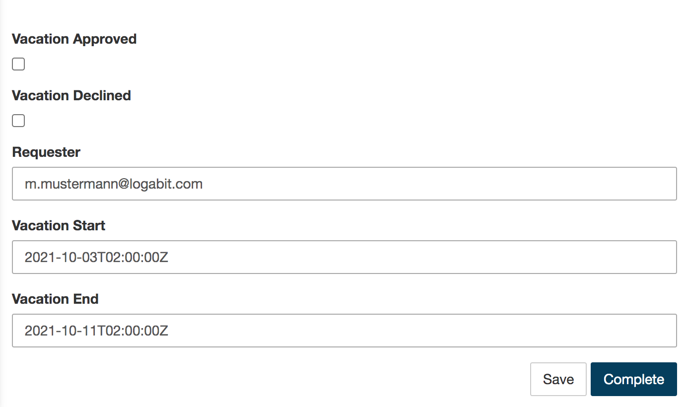

If you now start the workflow new, you are able to see this additional information (requester email) in the task form of the Reviewer.
