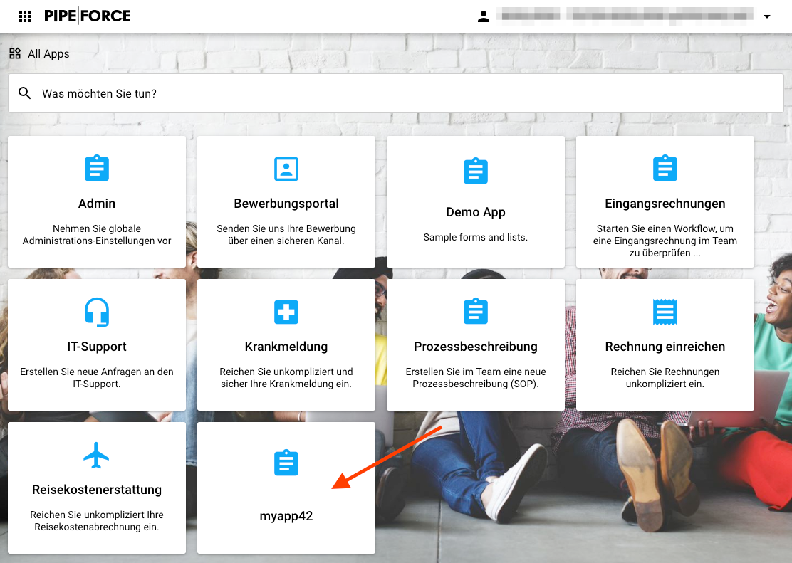
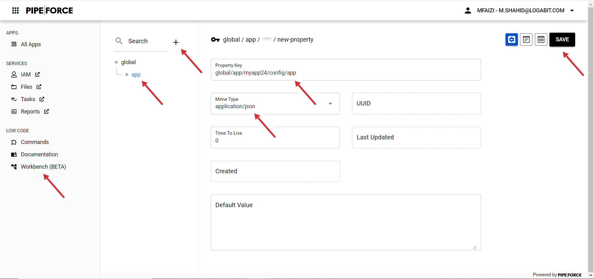

# Tutorial 2: Create an App

**Tutorial 2 Estimated time:** 15 min.

## Tutorial 2 - Prerequisites

*   PIPEFORCE Enterprise 7.0 or higher
    
*   You have a valid PIPEFORCE Developer account
    

## App Creation - Intro

In PIPEFORCE, an app groups together resources like scripts, templates, configurations and others to solve a certain business task. Any pipeline, form or workflow etc. are part of exactly one app.

For each app, certain access rules can be specified. Apps can be installed, uninstalled, exported and imported. Furthermore, it is also possible to use staging and versioning for apps. They can be developed online using the workbench or offline using source code files. You can think of apps also like “plug-ins” for PIPEFORCE.

Typically, all apps reside in the property store under the key path `global/app/..`, e.g. `global/app/myapp`.

In this tutorial, you will learn how to create and publish an app using the online workbench in a few simple steps.

## 1 - Create a new app with the online workbench

The easiest way to create a new app is by using the online workbench. To do so, follow these steps:

1.  Login to your portal https://YOUR\_NAMESPACE.pipeforce.net.
    
2.  Navigate to LOW CODE → Workbench.
    
3.  Select the node `app` in the tree and click the plus icon at the top.
    
4.  The new property view opens:
    
    1.  As a property key, use the value `global/app/MY_APP/config/app`. Replace `MY_APP` with the name of the app you would like to create, e.g. `myapp24`. **Do use only lower case letters and don’t use special characters or spaces!**
        
    2.  As mime type, select `application/json`.
        
5.  Click SAVE:  
    
    
6.  The new property configuration was created and pre-filled with some data.
    
7.  Here, you can make later changes to configure your app.
    
8.  For now, don’t do any changes and leave it as it is.
    
9.  Navigate to `All Apps` in order to show the apps' overview page.
    
10.  Here, your app should also be listed now.
    
11.  Congrats, you’ve created your first custom app!
    

If you click your app now, nothing happens, since we did not add any business logic to it yet. This will change in the next tutorials.

## 2 - Release your app

For security and productivity reasons, any app created this way is by design only visible to developers, but not to other users. It is automatically staged in **development** mode in the beginning.

In order to show this app also to other users (and therefore move to **production** stage), follow the steps shown below.

**Note:** You should switch to production mode only in case you really want to make this app visible to other users, like the employees for example. This is usually the case when you’re finished with creating and testing your app. At the time the app is in production mode, other users can **see and execute** it!

1.  Login to portal https://YOUR\_NAMESPACE.pipeforce.net as admin or developer.
    
2.  Go to IAM.
    
3.  Select the single user or the group you want to give access to your app.
    
4.  Select tab `Role Mappings`.
    
5.  In the `Available Roles` list, select the role `CAN_APP_YOURAPP` (replace `YOURAPP` by the app name you used in section 1), and click `Add selected`. Note that the role name is with prefix `CAN_APP_` and with suffix as upper case of your app name by convention: So for example if you named your app `myapp` then the role for the app is `CAN_APP_MYAPP`. This role was automatically created for you. A role can also be seen as a permission to view and execute your app.
    
6.  After this role was added to the user or group, these users can now see and execute your app.
    

:::tip
You can create custom staging groups for example `app-testing`, `app-qa` and `app-review` and then assign your `CAN_APP_` role to the corresponding group, depending on the stage your app currently is in. With this approach, the users of the different groups can see and work with your app, depending on the stage of the app. This way, you can also easily work with different versions of an app.
:::

**Staging**  
Staging is the process of hiding an application from the production context until it was fully tested and approved for production. After this approval, it will be switched to a production context, so that it will be visible and usable by the target users. PIPEFORCE has two different concepts of staging:

*   **Staging by permission (soft staging)**  
    An app can be switched to production by changing its permission. The advantage here is that it is very quick and easy to do so. The downside is that other apps in the same namespace are already in production mode and their side effects could potentially harm this app. Therefore, you have to be careful in development, since apps in development and production stage reside side by side in the same namespace.
    
*   **Staging by namespace**  
    There are two separate namespaces: development and production. In the development namespace, apps are developed. Also services like databases or other microservices can be seen in this namespace. Once development and testing is finished, the app will copied to the production namespace. The advantage here is that the two namespaces separate each app and its environment from each other. Chances are very low that development on an app will affect the apps in production. The downside is that there is much more effort to put such an app from development to production stage. Staging by namespace requires at least two Enterprise instances or a Corporate license.

## Report an Issue
:::tip Your help is needed!
In case you're missing something on this page, you found an error or you have an idea for improvement, please [click here to create a new issue](https://github.com/pipeforce/pipeforce.github.io/issues/new). Another way to contribute is, to click **Edit this page** below and directly add your changes in GitHub. Many thanks for your contribution in order to improve PIPEFORCE!
:::
