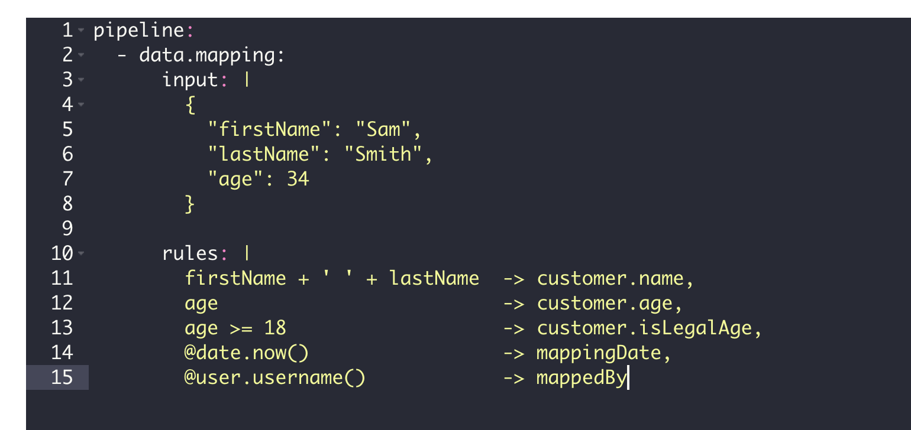

# Tutorial 6: Data Mapping

**Estimated time:** 10 min.

## Prerequisites

*   PIPEFORCE Enterprise 7.0 or higher
    
*   You have a valid PIPEFORCE Developer account
    
*   You have completed tutorial: [Tutorial: Create a new app](../tutorials/create-app)
    
*   You have completed tutorial: [Tutorial: Create and execute a pipeline](../tutorials/create-pipeline)
    
*   You have a basic understanding of the PEL: [Pipeline Expression Language (PEL)](../api/pel)
    

## Intro

As you should already know, a pipeline in PIPEFORCE is an easy to learn **low code script**, which can do many different things for you. One very important thing is the mapping, conversion and normalization of (JSON) data.

Lets assume this example: You got a customer dataset from the sales system, and you need to make sure, that this data set perfectly fits into the structure of the ERP system. For this, you need some way of converting the source data from the CRM system to target format of the ERP system. To do so, you can use the data mapping power of a pipeline.

Lets assume the customer dataset from the CRM system looks like this:

```json
{
  "firstName": "Sam",
  "lastName": "Smith",
  "age": 34
}
```

And we want to convert this input dataset into an output format for the ERP system, which expects the customer dataset to have a structure like this:

```json
{
  "customer": {
    "name": "Sam Smith",
    "age": 34,
    "isLegalAge": true
  }
  "mappingDate": "01.01.2022",
  "mappedBy": "someUsername"
}
```

As you can see, we have to do some steps to transform from the source to target format:

*   We have to nest every customer data inside the `customer` field.
    
*   We have to combine the first and last name into the single `name` field.
    
*   The target system expects the additional field `isLegalAge`, which doesn’t exist in the source system. The value of this field must be set to `true` in case age of the customer is > 18, otherwise it must be set to `false`.
    
*   Finally, let's assume the target system expects a new field `mappingDate`, which contains the date of mapping, and `mappedBy` to contain the username of the user who did the mapping, just for compliance reasons.
    

Let's see in this tutorial, how to implement this conversion task by using a pipeline script and the **[Pipeline Expression Language (PEL)](../api/pel)** .


## 1 - Create a new data mapping pipeline


1.  Login to the portal https://NAMESPACE.pipeforce.net
    
2.  Navigate to LOW CODE → Workbench
    
3.  Select the node of your app or create a new one.
    
4.  Click the plus icon at the top of the tree.
    
5.  The new property view opens:
    
    1.  As property key, use: `global/app/YOUR_APP/pipeline/data-mapping`
        
    2.  As mime type, use: `application/yaml; type=pipeline`
        
6.  Click SAVE
    
7.  The new property has been created and the content editor was opened for you.
    
8.  Now copy and paste this content into the editor, and overwrite any existing data there by this:
    
    ```yaml title="global/app/YOUR_APP/pipeline/data-mapping"
    pipeline:
      - data.mapping:
          input: |
            {
              "firstName": "Sam",
              "lastName": "Smith",
              "age": 34
            }
            
          rules: |
            firstName + ' ' + lastName  -> customer.name,
            age                         -> customer.age,
            age >= 18                   -> customer.isLegalAge,
            @date.now()                 -> mappingDate,
            @user.username()            -> mappedBy
    ```
    
9.  In this snippet, we created a very simple data mapping configuration:
    
    1.  We used the `data.mapping` command, which allows to map from one structure to another.
        
    2.  The `input` parameter defines the source data as a static JSON string in this example. Besides a static string, this value could also be a [pipeline expression (PEL)](../api/pel) pointing to some dynamic data in the `vars` section or external services. In this example, we want to focus on the data mapping, and keep the rest simple. If the parameter `input` is not specified, the current value from the body would be expected as input. Note the handy pipe symbol `|` here, which is specific to the YAML syntax and allows a multi-line value without additional annotations, ticks or quotes.
        
    3.  The `rules` parameter (or `mappingRules` in versions < 8.0) defines the mapping rules, which will read from the input data and write to the output data. You can define as many mapping rules as you want. Each mapping rule ends with a comma and a line break at the very end. They will be applied from top to down. The input expression is defined at the left hand side, and selecting + prepares the input data for the mapping. At the right hand side, the output expression is defined. It specifies the location where to write the data in the output structure. Both expressions are separated by an arrow `->` . Each side can use the [pipeline expression language (PEL)](../api/pel), and therefore, the full power of this language. It's not necessary to wrap a pipeline expression inside `#{` and `}`. So the format on each line should look like this:
        
        ```
        inputExpression -> outputExpression,
        ```
        
    4.  As a first rule, we simply concat (= combine) the first and last name separated by a space from input and write the result into the output to the location `customer.name`:
        
        ```
        firstName + ' ' + lastName  -> customer.name,
        ```
        
    5.  The second mapping rule simply copies the age field from the input to the nested `customer.age` field on the output:
        
        ```
        age                         -> customer.age,
        ```
        
    6.  The third rule is an expression, which detects whether the age field on the input contains a value >= 18. Then, it writes the result to the output at the location `customer.isLegalAge`:
        
        ```
        age >= 18                   -> customer.isLegalAge,
        ```
        
    7.  The fourth rule executes the pipeline util [`@date`](../api/utils#@date), in order to return the current date. Then, it writes this value to the new field `mappingDate` at top level of the output:
        
        ```
        @date.now()                 -> mappingDate,
        ```
        
    8.  The last rule is similar to the previous one and calls the pipeline util [`@user`](../api/utils#@user), in order to return the username of the currently logged-in user. Then, it writes the result to the new field `mappedBy` at the top level of the output:
        
        ```
        @user.username()            -> mappedBy
        ```
        
    9.  Not mentioned here because it is optional: The `output` parameter for the command `data.mapping`. Its value must be a [pipeline expression language (PEL)](../api/pel), which points to the location (or a sub-path) to write the mapping result to (for example a variable inside the `vars` scope). If not specified, it will be written to the body by default. That is the case for our example.
        
10.  Click SAVE to save the pipeline.
    
11.  Then click RUN to execute the pipeline which should look like this:
    
    
12.  You should then see a result similar to this:
    
    ```json
    {
    	"customer": {
    		"name": "Sam Smith",
    		"age": 34,
    		"isLegalAge": true
    	},
    	"mappingDate": "16.01.2022 08:54:17",
    	"mappedBy": "yourUsername"
    }
    ```
    
13.  This data now can be used and send to an ERP system for example using an additional command.
    

**Congrats, you have created your first data mapping rules in PIPEFORCE!**
