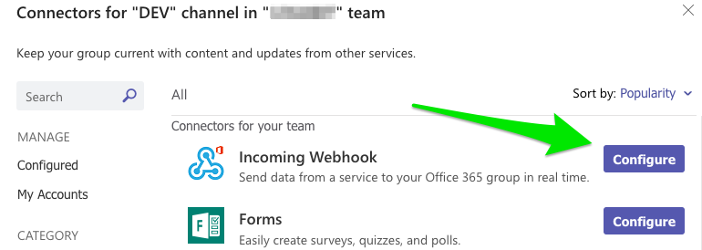
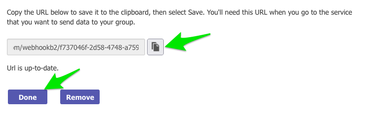
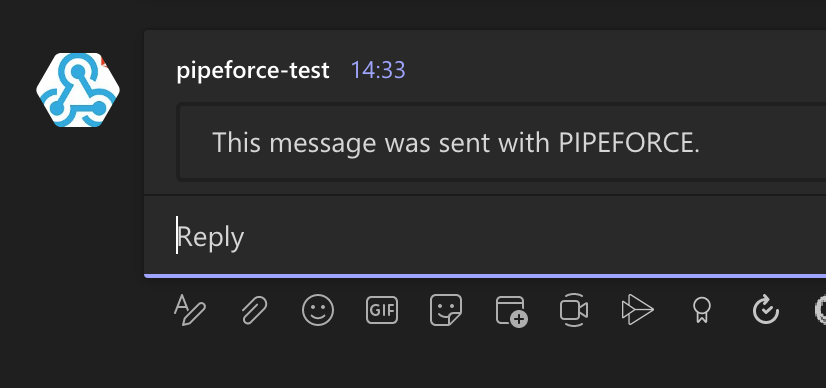

# Tutorial 9: Send Teams Message

**Estimated time:** 10 min.

## Prerequisites

*   PIPEFORCE Enterprise 7.0 or higher
    
*   You have a valid PIPEFORCE Developer account
    
*   You have completed tutorial: [Tutorial: Create a new app](../tutorials/create-app)
    
*   You have completed tutorial: [Tutorial: Create and execute a pipeline](../tutorials/create-pipeline)
    
*   You have an Office 365 / Teams account
    

## Intro

Sending messages from PIPEFORCE to external systems is very easy when there is an API or webhook available. This tutorial will demonstrate that by sending a message to Office 365 / Teams.

## 1 - Create a webhook in Microsoft Teams

In the first step, you need to create a webhook in Teams, so we can send data to it. To do so, follow these steps:

1.  Login to your Office 365 account: [https://office.com](https://office.com)
    
2.  Open the Teams app
    
3.  Navigate to Teams → Your Teams → Select the channel you want to send messages to → Connectors:  
    
    
    
4.  In the upcoming list click `Configure` of **Incoming Webhook**:  
    
    
    
5.  Give the webhook a meaningful name and then click `Create`:  
    
    
    
6.  Copy the generated webhook url into your clipboard, then click `Done`:  
    
    

## 2 - Send a message from a pipeline

1.  Login to the portal https://NAMESPACE.pipeforce.net
    
2.  Navigate to LOW CODE → Workbench
    
3.  The ad-hoc pipeline editor is shown
    
4.  Copy and paste this content into the editor, and overwrite any existing data there by this:  
    
    ```yaml
    pipeline:
       - http.post:
          url: "https://yourname.webhook.office.com/..."
          body: |
            {
              "text": "This message was sent with PIPEFORCE."
            }
    ```
    
5.  Replace the `url` param by the webhook url you have copied to clipboard before.
    
6.  As you can see, we set the `url` and the `body` for the HTTP message, which will be used by the `http.post` command, in order to send it to the Teams webhook using the given url. Note the pipe `|` character of parameter body. This is specific to YAML and allows to define a multi-line value without additional “line encodings” or “escapes”. We can write a JSON string straight here.
    
7.  Click `RUN`.
    
8.  **Done**. After a few seconds, you should receive a new message in the Teams channel:  
    
    
9.  If you want, you can persist this pipeline in an app to keep it for later use.
    

References:  
[https://docs.microsoft.com/en-us/outlook/actionable-messages/send-via-connectors](https://docs.microsoft.com/en-us/outlook/actionable-messages/send-via-connectors)
