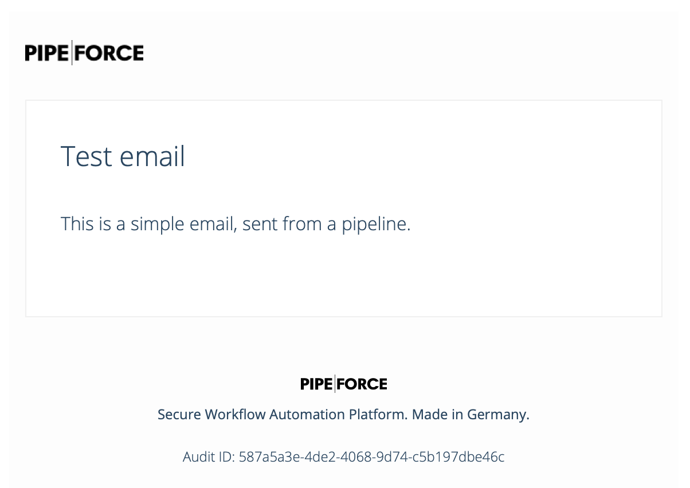

# Send an Email

**Estimated time:** 10 min.

## Prerequisites

*   PIPEFORCE Enterprise 7.0 or higher + DMS module (optional)
    
*   You have a valid PIPEFORCE Developer account
    
*   You have completed tutorial: [Tutorial: Create a new app](create-app)
    
*   You have completed tutorial: [Tutorial: Create and execute a pipeline](create-pipeline)
    

## Intro

In this tutorial you will learn, how you can send emails from a pipeline with and without attachments.

## 1 - Create the pipeline and send simple email

1.  Login to the portal https://**NAMESPACE**.pipeforce.net
    
2.  Navigate to LOW CODE → Workbench
    
3.  Select the node of your app or [create a new one](create-app).
    
4.  Click the plus icon at the top of the tree.
    
5.  The new property view opens:
    
    1.  As property key use: `global/app/YOUR_APP/pipeline/send-email`
        
    2.  As mime type use: `application/yaml; type=pipeline`
        
6.  Click `SAVE`
    
7.  The new property has been created and the content editor was opened for you.
    
8.  Now copy and paste this content into the editor and overwrite any existing data there by this:
    
    ```yaml
    pipeline:
      - mail.send:
          to: "your@domain.tld"
          subject: "Test email"
          message: "This is a simple email, sent from a pipeline."
    ```
    
9.  Replace `your@domain.tld` by your real email address.
    
10.  Click `SAVE` and then `RUN` to execute the pipeline.
    
11.  After a while, you should have received an email similar to this, decorated with the default layout:  
    
    

## 2 - Extra: Add attachments

In this step you will learn how to add attachments to such an email pipeline. For this, we will upload a PDF document to drive first, which will be used as attachment.

1.  Login to the portal https://**NAMESPACE**.pipeforce.net
    
2.  Open Files / Drive.
    
3.  Upload a file with name `invoice.pdf` into the root folder.
    
4.  Change your pipeline `send-email` to this:
    
    ```yaml
    pipeline:
      - drive.read:
          path: "invoice.pdf"
      - mail.send:
          to: "your@domain.tld"
          subject: "Test email"
          message: "This is a simple email, sent from a pipeline."
          attachments: "#{body}"
    ```
    
5.  As you can see, we added the command `drive.read` to read the PDF from drive into the body of the pipeline (which happens automatically for you). Additionally we added the parameter `attachments` to the `mail.send` command. As value the PEL expression `#{body}` is used. This expression points to the body of the current pipeline where the PDF document was loaded to. You can add multiple attachments by adding them separated by a comma. You can also point to resources inside the property store by using the uri format `uri:property:path/to/resource`.
    
6.  Click SAVE and RUN.
    
7.  After a while you should receive again an email, but this time now with the PDF as attachment
    
8.  Done.
    

## 3 - Extra: Set from + dynamic text in emails

Sometimes it is necessary to put dynamic text to emails. The easiest way in PIPEFORCE to do so is by using the [Pipeline Expression Language (PEL)](https://pipeforce.github.io/docs/guides/pel). In this step we will simply add the currently logged-in user as the from email field so that the recipient can easily reply to you and the current date and time in the email text using PEL:

1.  Change your pipeline send-email to this:
    
    ```yaml
    pipeline:
      - drive.read:
          path: "invoice.pdf"
      - mail.send:
          to: "your@domain.tld"
          replyTo: "#{@user.email()}"
          fromName: "#{@user.displayName()}"
          subject: "Test email"
          message: "This is a simple email, sent on #{@date.now('dd.MM.YY, HH:mm')}"
          attachments: "#{body}"
    ```
    
2.  As you can see, we did several changes in the pipeline:
    
    1.  We added the parameter `replyTo: "#{@user.email()}"` those value will be replaced by the email address of the currently logged-in user so the recipient can simply press the reply button in order to reply to this email.
        
    2.  We added the parameter `fromName: "#{@user.displayName()}"` those value will be replaced by the display name of the currently logged in user.
        
    3.  Finally we added the PEL expression `#{@date.now('dd.MM.YY, HH:mm')}` to the email message in order to display the current date and time dynamically inside the email.
        
3.  Click `SAVE` and `RUN`.
    
4.  After a while you should receive an email similar to this:  
    
    
5.  Done.
    

:::tip Auto-completion in online editor 
In order to get auto-completion for available PEL utils in the online editor, simply start typing in the parameter value fields `#{@` and then press Ctrl + Space. Then you should be presented with the list and short description of all available PEL utils. After you have selected a util, type a period `.` + Ctrl + Space and you will be presented with all available methods of this util.
:::

References:

[PEL Utils Reference](../../guides/pel-reference.md)
